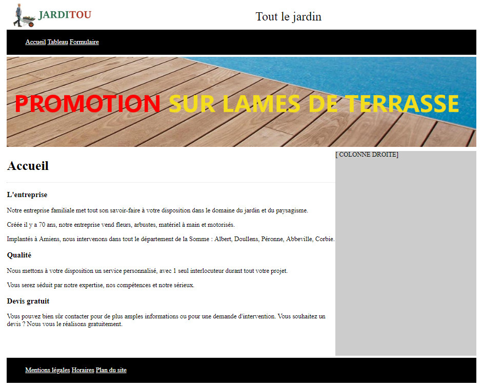

# CSS - Cascading Style Sheets

## Objectifs
* Connaître le principe de CSS
* Savoir réaliser des présentations simples avec CSS
* Savoir utiliser les sélecteurs
* Connaître le fonctionnement des polices
* Comprendre les modèles de boîtes
* Comprendre le système de positionnement
* Utiliser un système de grille

## Cheminement

Lire les ressources indiquées pour chaque phase et réalisez <b>les exercices</b> présents.  

### Phase 1 - Présentation du CSS
Assistez à la <a href="reveal_css/index.html" title="Présentation sur le CSS">présentation sur le CSS</a> par votre formateur. 

Lisez le document [présentation CSS](CSS_01_Presentation.html "Présentation CSS").

### Phase 2 - Sélecteurs
Lisez le document [les sélecteurs](CSS_02_Selecteurs.html "les sélecteurs").

### Phase 3 - couleurs et polices de caractères

Lire les ressources sur la gestion des polices de caractères en CSS :

* Le document [Polices et couleurs](CSS_03_Polices_Couleurs.html "Polices et couleurs")
* <a href="https://developer.mozilla.org/fr/docs/Web/CSS/CSS_Fonts" title="MDN" target="_blank">Les propriétés de la balise font</a>

### Phase 4 - Modèles de boîtes
* [Les modèles de boîtes](CSS_04_Modeles_boites.html "Les modèles de boîtes").

### Phase 5 - Positionnement
Le positionnement en CSS permet d'agencer les éléments (balises HTML) et donc construire la structure de votre page web (par exemple aligner les colonnes de votre design). 

* [Le positionnement](CSS_05_Positionnement.html "Le positionnement").

### Phase 6 : Exercices 
Reprenez les 3 pages HTML ( _index.html_ _contact.html_ et _tableau.html_ ) créées à la fin de la séquence HTML et utilisez une seule feuille de style CSS afin d'obtenir le résultat suivant (habillez également les pages _tableaux.html_ et _formulaires.html_) :

### Phase 7 : Le web responsive
Utilisez le responsive design avec les Media Queries
* [Le web responsive](CSS_07_Responsive.html "Le web responsive")

### Ressources
* [Bonnes Pratiques CSS](https://www.youtube.com/watch?v=t8Up7GiNIoU "Bonnes Pratiques CSS")
* [Références CSS](Référence_CSS.pdf "Références CSS")
* [Références CSS [EN]](https://www.w3schools.com/cssref/default.asp "Références CSS [EN]")
* [Résumé CSS [EN]](Résumé_CSS.pdf "Résumé CSS [EN]")
* [Alsacreations](https://www.alsacreations.com/tuto/liste/2-css.html)