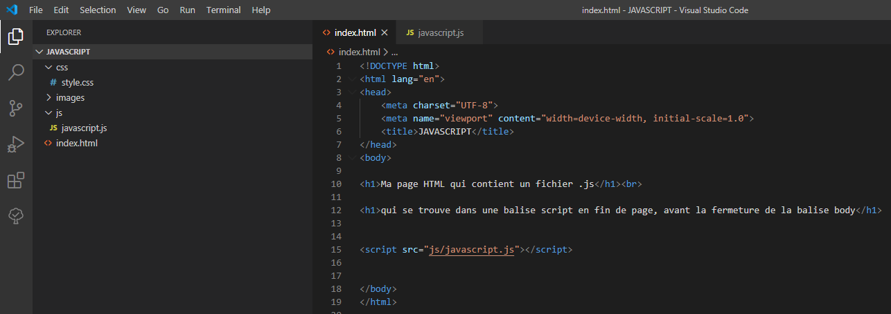

# JS 01 : Structure d'un programme

## Objectifs

* Comprendre les généralités de la programmation et savoir créer un premier programme.
* Connaître les règles et les conventions de syntaxe et de présentation d’un programme.
* Comment déclarer des variables et des constantes, comment les utiliser dans le corps d’un programme.
* Ajouter des commentaires à vos programmes

<!-- TODO à valider par le STAFF ! -->

## Première Approche

Si vous lisez ce paragraphe, c'est que vous avez cotoyé le HTML, le CSS et vous avez manipulé le framework BOOTSTRAP.

Désormais, vous allez dynamiser vos pages Web grâce au langage JAVASCRIPT.

Pour exécuter votre **programme Javascript** dans vos pages HTML, vous devrez, soit l'inclure dans le `<head>` entre 2 balises `<script>` comme montré ci-dessous :

```html
<!DOCTYPE html>
<html lang="en">
<head>
    <meta charset="UTF-8">
    <meta name="viewport" content="width=device-width, initial-scale=1.0">
    <link rel="stylesheet" href="https://stackpath.bootstrapcdn.com/bootstrap/4.1.3/css/bootstrap.min.css" integrity="sha384-MCw98/SFnGE8fJT3GXwEOngsV7Zt27NXFoaoApmYm81iuXoPkFOJwJ8ERdknLPMO" crossorigin="anonymous">
    <title>JAVASCRIPT</title>
    <!-- JAVASCRIPT entre les 2 balises script dans le <head> :-->
    <script>alert("mon premier script en javascript !");</script>
</head>
```
ou **importer** un fichier **.js**, pour une bonne pratique, en indiquant son chemin avec la synthaxe :

```html
<script src="js/javascript.js"></script>
```
qui doit s'écrire à la fin de votre page HTML avant la fermeture de la balise `</body>`

```html
<!-- du code ... -->

<script src="js/javascript.js"></script>

</body>
</html>
```
[Démo JAVASCRIPT](demojavascript/index.html)

Voici  à quoi la structure de vos pages HTML devront ainsi ressembler; à celle de démo **JAVASCRIPT** :





Avec index.html :

```html
<!DOCTYPE html>
<html lang="en">
<head>
    <meta charset="UTF-8">
    <meta name="viewport" content="width=device-width, initial-scale=1.0">
    <link rel="stylesheet" href="https://stackpath.bootstrapcdn.com/bootstrap/4.1.3/css/bootstrap.min.css" integrity="sha384-MCw98/SFnGE8fJT3GXwEOngsV7Zt27NXFoaoApmYm81iuXoPkFOJwJ8ERdknLPMO" crossorigin="anonymous">
    <title>JAVASCRIPT</title>

    <script>alert("mon premier script en javascript !");</script>
</head>
<body>

<div class="container">

    <div class="row">   
        <div class="col-12">
            <h1 style="text-align: center;">JAVASCRIPT</h1>
            <p> Ma page HTML qui contient un fichier <strong>.js</strong></p>
            <p>qui se trouve dans une balise <strong>script</strong> en fin de page, <strong>avant</strong> la <strong>fermeture</strong> de la <strong>balise body</strong></p> 
        </div>        
    </div>

    <div class="row">
        <div class="col-5">
            <button id="Id_btn1" type="button" class="btn btn-primary">Alert()</button>
            <button id="Id_btn2"type="button" class="btn btn-primary">Prompt()</button>
            <button id="Id_btn3"type="button" class="btn btn-primary">Confirm()</button>
            <button id="Id_btn4"type="button" class="btn btn-primary">Console()</button>        
        </div>
    </div>

    <div class="row">
        <div class="col-12">
            <h3><p id="texte1"></p></h3>
            <p id="texte2"></p>                
        </div>        
    </div>

</div>

<script src="js/javascript.js"></script>

</body>
</html>
```
et javascript.js
```js

var bouton1= document.getElementById("Id_btn1");
bouton1.addEventListener("click",clickbtn1);

function clickbtn1(){

    alert("Vous avez cliqué sur :\n Alert()");
}

var bouton2= document.getElementById("Id_btn2");
bouton2.addEventListener("click",clickbtn2);

function clickbtn2(){

    var prenom = prompt("Veuillez saisir votre prénom");
    if(prenom==null){
    alert("Vous avez cliqué sur Annuler");
    return;
    }

    var age= parseInt(prompt("Veuillez saisir votre age"));
    if(isNaN(age)){
    alert("Vous n'avez pas saisi un age correct !\nVeuillez recommencer.");
    return;
    }  

    alert("Voici ce que vous avez saisi :\n\nVotre prénom : "+prenom+"\nVotre age : " +age);
}

var bouton3= document.getElementById("Id_btn3");
bouton3.addEventListener("click",clickbtn3);

function clickbtn3(){

    var reponse = confirm("Veuillez cliquer sur OK ou bien Annuler");
    if (reponse == true) {
        alert("Vous avez cliqué sur OK");
    } 
    else {
        alert("Vous avez cliqué sur Annuler");
    }
    
}

var bouton4= document.getElementById("Id_btn4");
bouton4.addEventListener("click",clickbtn4);

function clickbtn4(){

    var prenom = prompt("Veuillez saisir votre prénom");
    if(prenom==null){
        alert("Vous avez cliqué sur Annuler");
    }
    else{
        console.log("Voici le prénom que vous avez saisi: "+prenom);
        alert("Vérifiez en Console (F12), ce que vous venez de saisir...");
    }
}
```

## Les variables

Les données en mémoire sont stockées dans des variables. Il peut par exemple s'agir de données saisies par l'utilisateur ou de résultats obtenus par le programme, intermédiaires ou définitifs.

Pour employer une image, une variable est une boîte, que le programme (l'ordinateur) va repérer par une étiquette. Pour avoir accès au contenu de la **boîte**, il suffit de la désigner par son étiquette.

Les noms de variables peuvent être choisis librement par le programmeur (sauf parmi les mots-clés). La liste des mots-clés se trouve dans la documentation en ligne, mais dans un problème, une variable est choisie pour jouer un rôle. Il est souhaitable que l'auteur de l'algorithme s'en souvienne en choisissant des noms évocateurs et en respectant, autant que possible, l'unicité du rôle pour chaque variable.

Les caractères suivants peuvent être utilisés :

* lettres majuscules : de `A` à `Z`
* lettres minuscules : de `a` à `z` (les minuscules sont considérées comme des caractères différents des majuscules)
* chiffres, de 0 à 9
* les caractères trait souligné (underscore) : `_` et arobase : `@`

Exemple : nom des variables à retenir dans un problème de calcul de moyenne de notes :

* `totalNotes` : total des notes d'un(e) élève
* `nombreNotes` : nombre des notes de cet(te) élève
* `moyenneNotes` : moyenne des notes de cet(te) élève

> Remarquez le style de nommage des variables : le premier mot est entièrement en lettre minuscules, le second mot commence par une majuscule; on appelle ça la convention _camelCase_.

Une variable est typée, c'est-à-dire qu'elle possède **un type** : elle peut représenter, par exemple :  

* une chaîne de caractères : _Bonjour_
* un nombre entier : _123_
* un nombre décimal : _1.23_
* d'autres types, que nous verrons plus tard

> Les chapitres suivants vous donneront plus de détails sur l'ensemble des types de données en Javascript.

Une variable peut être déclarée à tout moment à l'intérieur du corps du programme. Cependant, la déclaration et l'initialisation d'une variable doivent impérativement précéder la première utilisation de celle-ci. Il est également et généralement préférable de déclarer les variables en début de bloc (juste après l'accolade ouvrante) pour une question de lisibilité.

Chaque déclaration de variable est construite sur le modèle suivant :

    type nomDeLaVariable ;
    
Exemple : déclarer la variable `prenom` de type chaîne de caractère (`var`) :

	var prenom;

Une variable peut être initialisée lors de sa déclaration :

    type nomDeLaVariable = valeurInitiale;

Exemple : déclarer la variable `prenom` de type chaîne de caractère (`var`) avec pour valeur _Dave_ :

	var prenom = 'Dave';

> On remarque ici qu'il y a des guillemets pour la valeur : ils sont obligatoires. Ces guillemets (ou _quotes_ en anglais) peuvent être simples : _'_ ou doubles : _"_ 

Exemple : déclarer la variable `age` de type entier (`var`) avec pour valeur _18_ :
	var age = 18;

> On remarque ici qu'il n'y a pas de guillemets pour la valeur : il n'y en a pas besoin pour les nombres, qu'ils soient entiers ou décimaux.  
    
<!--
Les variables ne sont visibles que dans le bloc d'instructions - bloc défini par des accolades `{` et `}` - dans lequel elles sont définies.


Comme toutes les instructions du langage Javascript, chaque déclaration de variable DOIT absolument être terminée par un point-virgule `;`.

Le point-virgule ne constitue pas un séparateur, mais plutôt un terminateur d'instructions.
-->

## Les instructions

Une instruction est une ligne de traitement.

Le caractère point-virgule `;` est un terminateur. TOUTES les instructions doivent se terminer par un `;`.

Les différents identificateurs sont séparés par un séparateur.

Les séparateurs peuvent être indifféremment l'espace, la tabulation et le saut de ligne.

## Les commentaires

Les commentaires dans un programme servent :

* à donner aux développeurs des indications sur le fonctionnement d'un programme
* à désactiver (temporairement) des blocs de code

**Les parties de code mises en commentaires ne sont pas exécutées.**

Commentaires sur une seule ligne : on utilise les signes `//` :
    
        // Demande le nom de famille
        var nom = "Loper";

Dans cet exemple, on fournit une information complémentaire au code (1ère ligne); le code de la seconde ligne sera exécuté (la variable `nom` aura pour valeur _Loper_.

* Commentaires sur plusieurs lignes : les caractères compris entre `/* et`\*/\` ne seront pas interprétés. On utilise cette notation quand il y a plusieurs lignes à commenter.
    
        /* Demande le nom de famille
        var nom = "Loper";
        */

Dans cet exemple, les 2 lignes sont en commentaires, cette fois le code de la seconde ligne ne sera **pas exécuté**.

## Les conventions d'écriture

Ces conventions ne sont pas des contraintes de syntaxe des langages informatiques. Elles n'existent que pour en faciliter la lecture et font partie d'une sorte de norme implicite que tous les bons développeurs s'obligent à respecter :

* Une seule instruction par ligne, et ce même si tout un programme peut-être écrit sur une seule ligne.
* Les délimiteurs d'un bloc `{` et `}` doivent se trouver sur des lignes différentes et être alignés sur la première colonne de sa déclaration.
* A l'intérieur d'un bloc `{}` les instructions sont indentées (décalées) par un caractère tabulation ou un espace.
* A l'intérieur d'un bloc `{}` la partie déclaration des variables et la partie instructions sont séparées par une ligne vide.

Exemple : 

	if (age > 18) 
	{
		var nom = 'Loper';
		var prenom = 'Dave';
    }

    
* L'instruction `if` est une condition
*  


