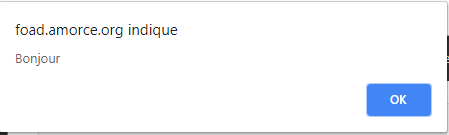
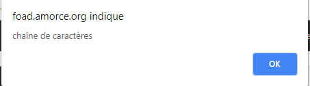
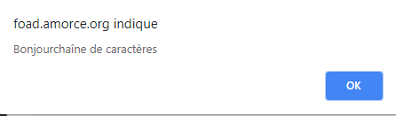
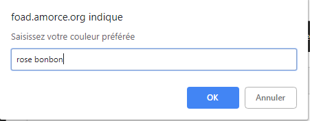
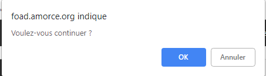
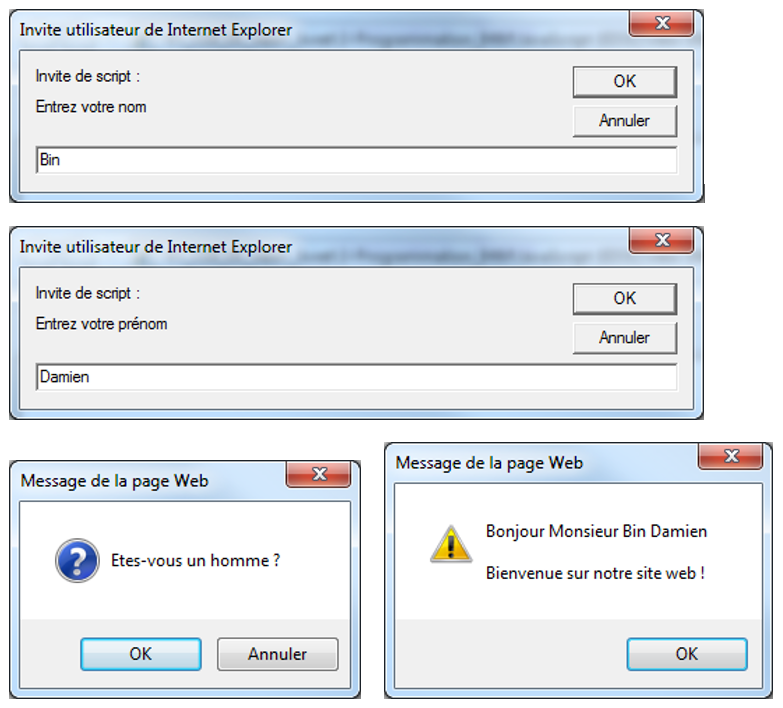

# JS 05 : Afficher du texte

## Les méthodes de l'objet document 

JavaScript a la possibilité d'accéder aux différents éléments de la page HTML comme des objets. La partie du code HTML qui s'affiche dans la fenêtre du navigateur est un objet de type document (nous décrirons la notion d'objet  dans un autre cours). 

A chaque objet JavaScript, le concepteur du langage a prévu un ensemble de méthodes (ou fonctions dédiées à cet objet) qui lui sont propres. A l'objet document, JavaScript a dédié la méthode _écrire dans le document_, c'est la méthode `write()`.

L'appel de la méthode se fait selon la notation :

	nom_de_l'objet.nom_de_la_méthode()

Pour appeler la méthode `write()` du document, on note :

	document.write(); 

### La méthode `write()` 

La syntaxe est assez simple soit :

	document.write("votre âge");

On peut aussi écrire une variable, soit la variable `age` :

	var age = 35;
	document.write(age);

Pour mixer du texte (chaînes de caractères) avec des variables, on utilise ce que l'on appelle la concaténation : un signe "+" va indiquer au programme que la chaîne de caractère doit être interrompue pour afficher la valeur d'une variable. Une fois cette variable affichée, il faut indiquer, par le même signe, la reprise de l'affichage de la chaîne de caractères.

	document.write("Votre âge est : " + age + "ans"); 

On peut utiliser les balises HTML pour agrémenter ce texte :

	document.write("<b>Votre âge est </b>" + age); 
	document.write("<b>" + " Votre âge est " + "</b>" + age); 
 
## Les boîtes de dialogue 

JavaScript a la possibilité, via les méthodes de l'objet `window`, d'appeler des boîtes de dialogues avec l'utilisateur.

> Précision : contrairement à `document.write()`, le code HTML n'est pas supporté par les méthodes de l'objet `window`.

### La méthode `alert()` 

La méthode `alert()` affiche une boîte de dialogue dans laquelle est reproduite la valeur (variable et/ou chaîne de caractères) de l'argument qui lui a été fourni. Cette boîte bloque le programme en cours tant que l'utilisateur n'aura pas cliqué sur "OK".

	MyVar = "Bonjour";
	window.alert(myVar);
	window.alert("chaîne de caractères");
	window.alert(myVar + "chaîne de caractères");

Ligne 2 :

Ligne 3 : 

Ligne 4 : 

> Pour écrire sur plusieurs lignes, utiliser un saut de ligne qui se fait avec le signe `\n`.
 
### La méthode `prompt()` 

JavaScript vous propose une autre boîte de dialogue, dans le cas présent appelée boîte d'invite, qui est composée d'un champ comportant une entrée à compléter par l'utilisateur. Cette entrée possède aussi une valeur par défaut facultative. 

	var reponse1 = window.prompt("Saisissez votre nom");
	var reponse2 = window.prompt("Saisissez votre couleur préférée");

Ligne 2 :

* En cliquant sur _OK_, la méthode renvoie la valeur tapée par l'utilisateur ou la réponse proposée par défaut 
* Si l'utilisateur clique sur _Annuler_, la valeur `null` est alors renvoyée
 
### La méthode `confirm()` 

Cette méthode affiche une boîte de dialogue avec 2 boutons _OK_ et _Annuler_. 

* En cliquant sur _OK_, la méthode renvoie la valeur `true`, ou `false` si on a cliqué sur _Annuler_. Ce qui peut permettre, par exemple, de choisir une option dans un programme.

		if (window.confirm("Voulez-vous continuer ?") == true) 
		{ 
		   …
		}

 
## Afficher des informations dans la console

L'objet _console_ est un élément essentiel lors de vos développements. Il permet d'afficher des informations de débogage (avertissements et erreurs de code, affichage de la valeur des variables etc.), précieuses pour la mise au point des scripts.

La console permet aussi de visualiser le code HTML qui n'est pas interprété dans les méthodes de l'objet `window`.

> La  console est un outil conçu uniquement pour les développeurs; on ne doit pas y afficher d'informations pour dialoguer avec l'internaute (utiliser `alert()` ou `prompt()`).

### La méthode `log`

La console est incluse dans les outils de développement des navigateurs Chrome et Firefox, pour l'afficher faire touche `F12` puis cliquer sur l'onglet _console_.

Ensuite, pour y afficher quelque chose, il faut utiliser la méthode `log` de permet d'afficher des informations dans la console.

	console.log("texte affiché dans la console");

## Exercice

* Créer un script qui demande successivement à l'utilisateur son nom puis son prénom.
* La page demande ensuite à l'utilisateur s'il est un homme ou une femme.
* Enfin, la page affiche les informations sur l'utilisateur.

Résultats à obtenir :

 