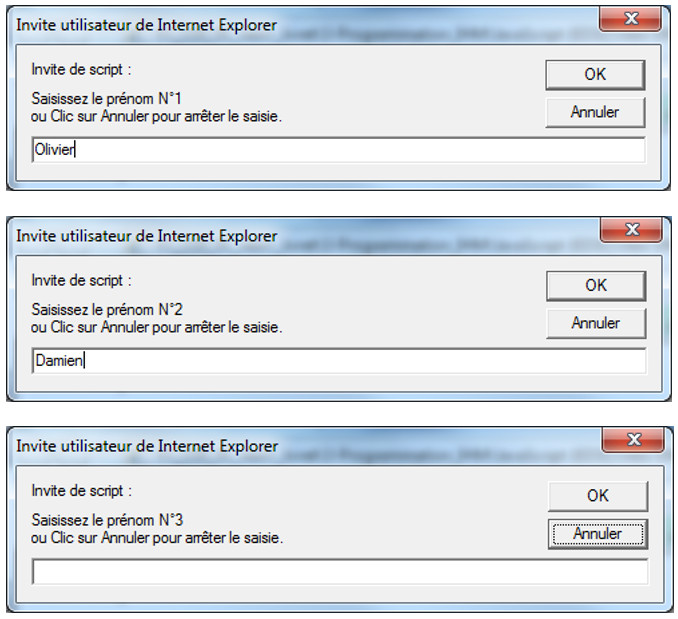

# JS 08 : Les boucles

## La nécessité des structures répétitives 

L'itération, ou structure répétitive ou encore boucle, permet d'obtenir une action composée par la répétition d'une action élémentaire ou composée, répétition qui continue tant qu'une condition n'est pas remplie, ou cesse lorsqu'une condition donnée est remplie.
  
Il existe plusieurs types de structures répétitives, chacune répondant à un usage distinct.

**Exemple : table de multiplication par 5**

Avec les instructions définies à ce stade, la seule possibilité d'écrire la table en totalité est donnée par le programme ci-dessous :

	console.log("Table de multiplication par 5");
	console.log("=============================");
	console.log("5 * 0 = 0");
	console.log("5 * 1 = 5");
	console.log("5 * 2 = 10");
	console.log("5 * 3 = 15");
	console.log("5 * 4 = 20");
	console.log("5 * 5 = 25") ;
	console.log("5 * 6 = 30");
	console.log("5 * 7 = 35");
	console.log("5 * 8 = 40");
	console.log("5 * 9 = 45");
	console.log("5 * 10 = 50");

* A la lecture de ce programme, on s'aperçoit vite que la même action élémentaire est répétée un certain nombre de fois. 
* On remplace le nombre 5 par une variable, nommée `i` (par exemple).   
* En généralisant, on peut écrire l'instruction suivante :

		  console.log(i+" * 0 = 0");

Se répète pour une valeur de `i`, variant de 1 à 10, la condition d'arrêt pouvant s'énoncer :

	Pour i variant de 1 à 10

ou bien :

	Tant que i <= 10

ou encore :

	Jusqu'à i > 10

## Boucles avec `for` 

L'expression `for` permet d'exécuter un bloc d'instructions un certain nombre de fois en fonction de la réalisation d'un certain critère. Sa syntaxe est :

	for (valeur initiale; condition; actualisation) 
	{
   		instructions;
	}

* _valeur initiale_ représente l'initialisation des itérateurs;
* _condition_ représente la condition d’itération;
* _actualisation_ représente l'actualisation des itérateurs;

Reprenons l'exemple de la table de multiplication :

	console.log("Table de multiplication par 5");
	console.log("=============================");

	for (i=0; i<=10; i++)
	{
   		resultat = 5 * i;
  
   		console.log("5 * "+i+" = "+resultat);
	}

	// instructions exécutées après le for (i vaut 10)
	console.log("fin de la boucle");

Déroulement de l'exécution :

* Lors de la première exécution de l'instruction `for`, `i` est initialisée à 0,
* A chaque exécution, la condition d'itération (`i <= 10`) est évaluée ; si `i > 10`, la boucle s'arrête et les instructions suivant l'accolade fermante est exécutée (la suite du code donc),
* Lorsque la condition d'itération est vraie, les instructions entre accolades sont exécutées, 
* Sur l'accolade fermante, `i` est incrémenté de 1, 	
* Retour sur l'instruction for : un 2ème passager est effectué, cette fois `i` vaut 1 
 
## Boucles avec `while`

L'instruction `while` permet d'exécuter un bloc d'instructions un certain nombre de fois.

	while (condition vraie) 
	{
   		// instructions
	}

* condition est une expression booléenne (type booléen). Les instructions sont exécutées plusieurs fois tant que le résultat de l'expression condition est vraie (valeur `true`).
* La condition doit pouvoir être évaluée à la première exécution de l'instruction `while`, ce qui nécessite toujours l'initialisation de la (des) variable(s) intervenant dans la condition.
* Si à la première exécution du while, le résultat de l'expression condition est faux (valeur `false`), les instructions ne sont jamais exécutées.

Les instructions seront donc exécutées de 0 à n fois.

Aussi longtemps que la condition entre parenthèses est vérifiée, JavaScript continue à exécuter les instructions entre les accolades. Une fois que la condition n'est plus vérifiée, la boucle est interrompue et on continue le script (exécutions des instructions situées après la fermeture du `while`). 

**Exemple :**

	var i = 0;

	console.log("Table de multiplication par 5");
	console.log("=============================");

	while (i <= 10) 
	{   
   		// Exécute le calcul et stocke le résultat   
   		// dans une variable nommée ‘resultat’  
   		resultat = 5 * i;
    
   		// A chaque tour, on affiche le résultat courant à l’utilisateur
   		console.log("Le résultat de 5 x "+i+" est : "+resultat);

   		// A chaque tour, on ajoute +1 à la variable i  
   		i++; 
	}

	// instructions exécutées après le for (i vaut 10)
	console.log("fin de la boucle");

_Déroulement de l'exécution_

* A chaque exécution de l'instruction `while`, la condition d'itération (`i <= 10`) est évaluée,
* si `i` est supérieur à 10 (noté `i > 10`), la boucle s'arrête, et les instructions suivant l'accolade fermante sont exécutées, 
* Lorsque la condition d'itération est vraie, les instructions entre accolades sont exécutées. 
* Sur l'accolade fermante, retour sur l’instruction `while` 

_Avertissements_ 

L'instruction `while` nécessite une attention soutenue : sa syntaxe complète est :

	initialisation

	while ( condition )
	{
		// Instructions

		// Actualisation 
	}

Dans notre exemple, 

	i = 1;

	while (i <= 10)
	{
        // Instructions :
		console.log("Le résultat de 5 x "+i+" est : "+resultat);
		
        // Actualisation :
        i++;
	}

Surtout, ne pas oublier les parties initialisation (ce qui produirait une erreur de variable non initialisée de toute manière) et actualisation.

> Attention : avec cette structure de boucle, le risque existe, si la condition est toujours vérifiée, de boucler indéfiniment, ce qui finit par un plantage du navigateur. 

_Intérêt du while_

L'instruction `while` par rapport à l'instruction `for` présente l'intérêt de pouvoir évaluer une condition d'itération complexe, par exemple :

	while (i <= 10 && j!= 2){ … } 

ou bien :

	while (!trouve) {…}	// bool trouve
 
## L'instruction break

L'instruction `break` permet d'interrompre prématurément une boucle `for` ou `while`. 

Pour illustrer ceci, reprenons notre exemple :

	cpt = 1;

	while (cpt<5) 
	{
   		if (cpt==4) 
        {
     		break;
        } 

    	console.log("ligne : "+cpt);
    	cpt++;
	}

	console.log("fin de la boucle");

Le fonctionnement est semblable à l'exemple précédent sauf lorsque le compteur vaut 4. A ce moment, par le `break`, on sort de la boucle et la chaîne "fin de boucle" est affichée.
Ce qui donne à l'écran :

	ligne : 1
	ligne : 2
	ligne : 3  
	fin de la boucle

## L'instruction `continue`

L'instruction `continue` permet de sauter une instruction dans une boucle `for` ou `while` et de passer à l'itération suivante de la boucle (sans sortir de celle-ci comme le fait `break`).
Reprenons notre exemple :

	var cpt = 1;

	while (cpt < 5) 
	{
   		if (cpt == 3)
   		{
			cpt++
			continue;
   		}

   		console.log("ligne : "+cpt);
   		cpt++;
	}

	console.log("fin de la boucle");

Ici, la boucle démarre. Lorsque le compteur vaut 3, par l'instruction continue, on saute l'instruction `console.log()` (la chaîne "ligne : 3" n'est pas affichée) et on continue la boucle. Notons qu'on a dû ajouter `cpt++` avant `continue` pour éviter un bouclage infini et un plantage du navigateur (`cpt` restant à 3).

Ce qui donne à l'écran :

	ligne : 1
	ligne : 2
	ligne : 4  
	fin de la boucle

## Boucles avec do … while

L'instruction `do … while` crée une boucle qui exécute une instruction jusqu'à ce qu'une condition de test ne soit plus vérifiée. La condition est testée après que l'instruction soit exécutée, l'instruction définie dans la boucle est donc exécutée au moins une fois :

	do 
	{
   		instructions;
	} while (condition);

* condition est une expression booléenne (type bool). Les instructions sont exécutées plusieurs fois tant que le résultat de l'expression condition est vraie (valeur `true`).
* L'instruction `do` est toujours accompagnée d’une instruction `while`.
* Elle est similaire à l'instruction `while`, sauf que l'évaluation de la condition d'itération s'effectue en fin de boucle, et non pas au début, ce qui signifie que, contrairement à l'instruction `while` qui est exécutée de 0 à n fois, une instruction `do` est exécutée au moins une fois.

> Attention à la syntaxe : bloc `do` entre accolades, `while` situé après l'accolade fermante et le tout se termine par un point-virgule (après la parenthèse fermante de la condition). 

Reprenons encore une fois l'exemple de la table de multiplication :  

	var i=0

	console.log("Table de multiplication par 5");
	console.log("=============================");

	do 
	{   
   		resultat = 5 * i;
  
   		console.log("5 * "+i+" = "+resultat);

   		i++;
	} while (i <= 10) ;

	// instructions exécutées après le for (i vaut 10)
	console.log("fin de la boucle");

## Boucles avec `for ... in`

Cette structure conditionnelle est spécifique au Javascript, contrairement à `for`, `while` ou `do… while` que l'on peut rencontrer dans d'autres langages. 

L'expression `for..in` permet de simplifier l'usage de la boucle `for`, notamment pour récupérer les éléments d’un tableau :

	var tableau = ["Paul", "Pierre", "Anne", "Sophie"];
	
	for (var i in tableau) 
	{
   		console.log(tableau[i]);
	}

## Exercices

### Exercice 1 - Saisie 

* Créer une page HTML qui demande à l'utilisateur un prénom.
* La page doit continuer à demander des prénoms à l'utilisateur jusqu'à ce qu'il laisse le champ vide.
* Enfin, la page affiche sur la console le nombre de prénoms et les prénoms saisis.

Résultat à obtenir :
 
 
 
### Exercice 2 - Entiers inférieurs à N

Ecrire un programme qui affiche les nombres inférieurs à N.

### Exercice 3 - Somme d'un intervalle

Ecrire un programme qui saisit deux nombres `n1` et `n2` et qui calcul ensuite la somme des entiers de `n1` à `n2`.

### Exercice 4 - Moyenne

Ecrire un programme qui saisit des entiers et en affiche la somme et la moyenne (on arrête la saisie avec la valeur 0).

### Exercice 5 - Multiples

Ecrire un programme qui calcule les N premiers multiples d'un nombre entier X, N et X étant entrés au clavier.

Exemple pour N=5 et X=7 :

	1 x 7 = 7
	2 x 7 = 14
	3 x 7 = 21
	4 x 7 = 28
	5 x 7 = 35

Il est demandé de choisir la structure répétitive (`for`, `while`, `do...while`) la mieux appropriée au problème.

<!--
On ne demande pas pour le moment de gérer les débordements (overflows) dus à des demandes de calcul dépassant la capacité de la machine.
-->

### Exercice 6 - Nombre de voyelles.

Ecrire le programme qui compte le nombre de voyelles d’un mot saisi au clavier, en utilisant :

* `myVar.length` : retourne le nombre de lettres de la chaîne `myVar`.
* `myVar.substr(p,n)` : extrait d'une chaîne donnée une sous-chaîne de n caractères à partir de la position p (attention, en Javascript, le 1er caractère se trouve à la position 0) 
* `myVar.indexOf(chaine)` : retourne le rang de la première occurrence de chaîne dans la variable `myVar` donnée (si non trouvé : -1).

### Exercice 7 - Un nombre est-il premier

Ecrivez un programme qui permet de tester si un nombre est premier.

### Exercice 8 - Nombre magique 

 Ecrire un programme qui met en œuvre le jeu du nombre magique :

* L'ordinateur choisit un nombre aléatoire 
* L'utilisateur doit trouver ce nombre. 
* A chaque fois que l'utilisateur saisit une valeur, il reçoit une indication lui indiquant _plus petit_ ou _plus grand_.

Vous aurez besoin de générer un nombre aléatoire avec la fonction `random` de l'objet `Math` : 

	var magic = parseInt(Math.random()*100);

<!--
Utilisez `alert` pour afficher les messages _Trop grand_ ou _Trop petit_, `prompt()` pour demander une valeur à l'utilisateur et `confirm` pour lui demander de rejouer.
-->
