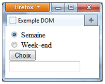
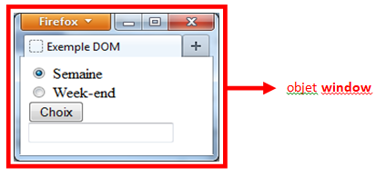
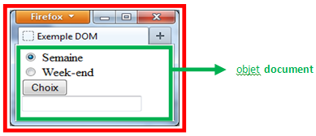
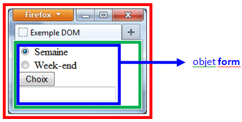
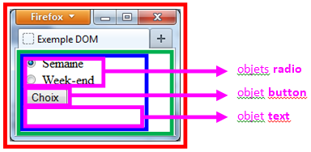
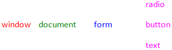
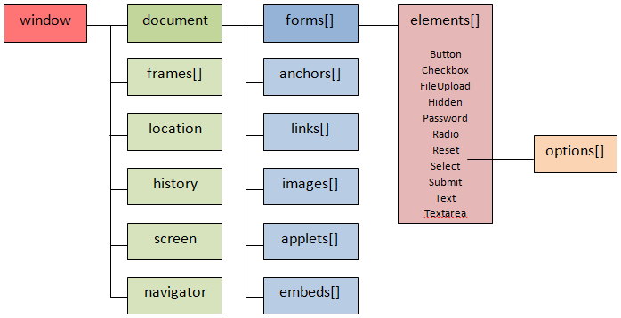

# JS 12 : Le D.O.M. et l'objet.

## Présentation
Javascript est un langage orienté objet*.

Pour Javascript une page web est un « document » et chaque élément (balises et attributs HTML, mais aussi la fenêtre du navigateur) de ce document est un objet.

Cette représentation objet est appelée le « **Document Objet Model** », en abrégé **D.O.M**.

Le D.O.M. représente donc l’arborescence d’une page web, une hiérarchie est établie où chaque niveau est un nœud qui possède éventuellement des éléments parents et/ou fils (enfants). 

L'objet par défaut (le parent de tous les autres éléments) est l’objet `document`.

Ensuite, tout est donc un objet, par exemple :

* Les chaînes de caractères, nombres et booléens peuvent être des objets (ou des valeurs primitives traitées comme des objets)

* Les fonctions

* Les tableaux 

* Les dates

* Le navigateur (objet Navigator)

* La fenêtre (objet Window)

* L'écran (objet Screen)

* L'écran (objet Location)

* L'historique de navigation (objet History)

* Les expressions régulières (objet Regexp)

> \* pour les puristes, JavaScript n'est pas à proprement parler un langage orienté objet tel que C++ ou encore Java. On dira plutôt que JavaScript est un langage basé sur les objets.

## Les objets et leur hiérarchie 

JavaScript va diviser une page web en objets issus des éléments HTML et surtout va vous permettre d'accéder à ces objets, d'en retirer des informations et de les manipuler.

Voyons d'abord une illustration des différents objets qu'une page peut contenir.

Vous avez chargé la page suivante :



 
Cette page s'affiche dans une fenêtre. C'est l'objet `window`.



Dans cette fenêtre, il y a un document HTML : il s'agit de l'objet `document`.

Autrement dit (et c'est là que l'on voit apparaître la notion de la hiérarchie des objets JavaScript), l'objet `window` contient l'objet `document`.

 

Dans ce document, on trouve un formulaire au sens HTML. C'est l'objet `form`.

Autrement dit, l'objet `window` contient un objet `document` qui lui contient un objet `form`.




Dans ce formulaire, on trouve trois types d'objets. Deux boutons radio, un bouton classique et une zone de texte. Ce sont respectivement l'objet **radio**, l'objet **button**, l'objet **text**.

Autrement dit, l'objet `window` contient l'objet `document` qui contient l'objet `form` qui contient à son tour l'objet `radio`, l'objet `button` et l'objet `text`.




La hiérarchie des objets de cet exemple est donc :



Pour accéder à un objet, il faudra donner le chemin complet de l'objet en allant du contenant le plus extérieur à l'objet à l'objet référencé.

Cependant, les objets situés dans un formulaire sont ciblés par un tableau d’éléments : `elements[]`.

Soit par exemple pour le bouton `radio` "semaine" :	 

Exemple :

```js
var radio = document.forms[0].elements[0] ; 
```

Pour récupérer un objet dont vous connaissez l’ID (attribut HTML `id`) :

```js
var elt = document.getElementById("ID de l’élément"); 
```

Pour récupérer une liste d’objets qui portent le même nom (attribut HTML `name`) :

```js
var elt = document.getElementsByName("nom de l’élément"); 
```

Testez l'exemple ci-dessous :

```html
	<!DOCTYPE html>
	<html>
	<body>
		<form action="" id="form1" name="form1">
			<input type="text" name= "nom" value="Mozart">
			<input type="text" name= "prenom" value="Ella">
			<input type="submit" id="idSubForm1" name="subForm1" value="Connection">
		</form>
	
		<script>
			console.log("La 2nde zone de texte a pour nom : ");
			console.log(document.forms['form1'].elements[1].name);
			console.log("La 1ère zone de texte a pour valeur : '");
			console.log(document.forms['form1'].elements['nom'].value);
			console.log("Le bouton Submit a pour identifiant unique : ");
			console.log(document.getElementById('idSubForm1').id);
			console.log("Le bouton Submit a pour valeur : ");
			console.log(document.getElementsByName('subForm1')[0].value);
		</script>
	</body>
	</html>
```
Vous pouvez aussi utiliser la fonction `querySelector`, elle permet d’attraper le premier élément HTML qui correspond au sélecteur CSS spécifié.
Pour récupérer le premier élément qui porte la classe example.

	var elt1 = document.querySelector(".example"); 

Pour récupérer l’élément `<body>` :

	var content = document.querySelector("body"); 

La fonction `querySelector` utilise la même syntaxe que le CSS pour sélectionner les éléments HTML.

## Les propriétés des objets

Une propriété est un attribut, une caractéristique, une description de l'objet. 

Par exemple, l'objet _volant_ d'une voiture a comme propriétés qu'il peut être en bois ou en cuir. 

L'objet livre a comme propriétés son auteur, sa maison d'édition, son titre, son numéro ISBN, etc.
De même, les objets JavaScript ont des propriétés personnalisées. Dans le cas du bouton radio, une de ses propriétés est sa sélection ou sa non-sélection (`checked` en anglais).

En JavaScript, pour accéder aux propriétés, on utilise la syntaxe :

> nom_objet.nom_propriete 

Dans le cas du bouton radio "semaine", pour tester la propriété de sélection, on écrira

```js
document.forms[0].elements[0].checked
```

### La propriété `innerHTML`

Cette propriété est particulière. Elle permet de récupérer le code HTML fils de tout élément HTML. 

Par exemple, elle permet de modifier le contenu d’une balise `<div>` …

```html
	<div id="idDiv">
	<p>Je suis un paragraphe dans une div</p></div>
	<script>
	document.getElementById('idDiv').innerHTML = "<h3>Titre</h3>";
	</script>
```

### La propriété `value`

Elle permet de récupérer le contenu d'un champ de formulaire. Par exemple, elle permet de modifier le contenu d'une balise `<div>`

```html

	<input type="text" id="txtBox">
	
    <script>
		document.getElementById('txtBox').value = 53;
	</script>
```

## Le DOM

Le DOM ou Document Object Model sert de référence comme modèle organisationnel des différents objets qui constituent une page.

Le W3C a défini un DOM standard, nommé DOM Level 0, pour tous les navigateurs depuis Internet Explorer 5.

Les navigateurs offrent ainsi un ensemble de fonctions pour permettre à JavaScript d'accéder à aux éléments du DOM. JavaScript sert d'interface vers les objets internes du navigateur.

Le DOM du W3C permet d’accéder à tous les éléments du document. Le DOM du navigateur ne permet pas d’accéder à tout le contenu du document.

## Le modèle Objet du navigateur



* `Anchors[]` : tableau des ancres (balises `<a>`)
* `Links[]` : tableau des liens (attributs `href` dans les balises `<a>` et `<area>`)
* `Embeds[]` : tableau des objets multimedia (balises `<embed>`)

Testez l'exemple ci-dessous :

```html
	<!DOCTYPE html>
	<html>
	<head>
	<title>Exemple DOM</title>
	
    <script>
	function testerRadio() 
	{
		var radio = document.getElementsByName("btnRadChoix");
				
				for (var i=0; i<radio.length;i++) 
                {
					if (radio[i].checked) 
                    {
						document.getElementById("txtBox1").value = radio[i].value;
					}
		    	}
			}
		</script>
	</head>
	
	<body>
		<form name="frmChoix">
			<input type="radio" name="btnRadChoix" value="semaine" checked> Semaine
			<br>
			<input type="radio"  name="btnRadChoix" value="week end"> Week-end 
			<br>
			<input type="button" name="btn" value="Choix" on-click="testerRadio();">
			<br>
			<input id="txtBox1" type ="text" name="txtChoix" value="">
		</form>
	</body>
	</html>
```
## L'objet `window`

L'objet `window` fait référence à la fenêtre du navigateur.

On crée un nouvel objet window avec la syntaxe suivante :

```js
var maFenetre = [window.]open(url [, nom [, caracteristiques[, replace]]]);
```

* **url** est l'URL de la page que l'on désire afficher dans la nouvelle fenêtre. Si on ne désire pas afficher un fichier html existant, on mettra simplement ''".
* **nom** est le nom de la nouvelle fenêtre.
* **caracteristiques** (facultatif) est une liste de certaines ou de toutes les caractéristiques de la nouvelle fenêtre que l'on note à la suite, séparées par des virgules et sans espaces ni passage à la ligne.
* **replace** (facultatif) précise si oui ou non (`true`, `false`) la nouvelle fenêtre sera ajoutée dans l'historique du navigateur.

<table>
<thead>
	<tr>
		<th>Caractéristique</th>
		<th>Description</th>
	</tr>
</thead>
<tr>
	<td>toolbar=yes ou no
	</td>
	<td>Affichage de la barre d'outils
	</td>
</tr>

<tr>
	<td>location=yes ou non
	</td>
	<td>Affichage de champ d'adresse (ou de localisation)
	</td>
</tr>

<tr>
	<td>directories=yes ou no
	</td>
	<td>Affichage des boutons d'accès rapide
	</td>
</tr>

<tr>
	<td>status=yes ou no
	</td>
	<td>Affichage de la barre d'état
	</td>
</tr>

<tr>
	<td>menubar=yes ou no
	</td>
	<td>Affichage de la barre de menus
	</td>
</tr>

<tr>
	<td>scrollbars=yes ou no
	</td>
	<td>Affichage des barres de défilement.
	</td>
</tr>

<tr>
	<td>resizable=yes ou no
	</td>
	<td>Dimensions de la fenêtre modifiables
	</td>
</tr>

<tr>
	<td>width=x en pixels
	</td>
	<td>Largeur de la fenêtre en pixels
	</td>
</tr>

<tr>
	<td>height=y en pixels
	</td>
	<td>Hauteur de la fenêtre en pixels
	</td>
</tr>

</table>

On peut aussi utiliser 1 ou 0 au lieu de yes ou no.

**Précision** : Si on ne précise aucune caractéristique, la nouvelle fenêtre les comportera toutes !

On ferme la nouvelle fenêtre avec la méthode `close()`, comme la syntaxe suivante :

```js
maFenetre.close();
```


<table>
<thead>
<tr>
	<th>Instruction</th>
	<th>Description</th>
</tr>
</thead>

<tr>
	<td>closed
	</td>
	<td>Propriété de type booléen qui précise si la fenêtre est fermée ou non.
	</td>
</tr>

<tr>
	<td>defaultStatus
	</td>
	<td>Propriété qui indique le texte par défaut de la barre d’état.
	</td>
</tr>

<tr>
	<td>opener
	</td>
	<td>Cette propriété donne une référence de la fenêtre appelante c.-à-d. la fenêtre d’où a été créée la nouvelle fenêtre.
	</td>
</tr>

<tr>
	<td>self
	</td>
	<td>Propriété qui référence la fenêtre courante.
	</td>
</tr>

<tr>
	<td>status
	</td>
	<td>Propriété qui indique le texte courant de la barre d’état.
	</td>
</tr>

<tr>
	<td>top
	</td>
	<td>Propriété qui référence la fenêtre au sommet de la hiérarchie.
	</td>
</tr>

<tr>
	<td>alert(string)
	</td>
	<td>Méthode qui ouvre une fenêtre d’information.
	</td>
</tr>

<tr>
	<td>blur()
	</td>
	<td>Méthode qui enlève le focus à la fenêtre.
	</td>
</tr>

<tr>
	<td>close()
	</td>
	<td>Méthode qui ferme la fenêtre.
	</td>
</tr>

<tr>
	<td>confirm(string)
	</td>
	<td>Méthode qui ouvre une fenêtre de confirmation.
	</td>
</tr>

<tr>
	<td>focus()
	</td>
	<td>Méthode qui rend active la fenêtre et la met au premier plan.
	</td>
</tr>

<tr>
	<td>moveTo(x, y)
	</td>
	<td>Méthode qui déplace la fenêtre à la nouvelle position (x, y).
	</td>
</tr>

<tr>
	<td>open()
	</td>
	<td>Méthode qui ouvre une nouvelle fenêtre.
	</td>
</tr>

<tr>
	<td>print()
	</td>
	<td>Méthode qui lance une impression de la page en cours.
	</td>
</tr>

<tr>
	<td>prompt(string[, defaut])
	</td>
	<td>Méthode qui ouvre une fenêtre de saisie.
	</td>
</tr>

<tr>
	<td>resizeTo(x, y)
	</td>
	<td>Méthode qui redimensionne la fenêtre.
	</td>
</tr>

<tr>
	<td>scroll(x, y)
	</td>
	<td>Méthode qui positionne le visuel de la page suivant les barres de défilement en position (x ,y) dans la page.
	</td>
</tr>

<tr>
	<td>setTimeout(fct(), n)
	</td>
	<td>Méthode qui appelle la fonction fct() à la fin du compte à rebours de n secondes.
	</td>
</tr>

</table>

L'usage des nouvelles fenêtres est assez sympathique en JavaScript pour afficher des informations complémentaires sans surcharger la page (ou fenêtre) de départ.

Cependant, aussi longtemps que l'utilisateur ne fermera pas ces nouvelles fenêtres, celles-ci resteront ouvertes (lapalissade).

Le pire est lorsqu'on les minimise. 

Pour peu qu'on utilise souvent cette technique, le navigateur se re-trouve avec plusieurs dizaines de fenêtres ouvertes ce qui fait désordre, ralentit le système et peut finir par le planter. 

*Veillez donc à toujours obliger la fermeture de ces nouvelles fenêtres*.

### Une minuterie 

L'objet `window` possède une méthode qui met à votre disposition une minuterie (ou plus précisément un compte à rebours) qui permettra de déclencher une fonction après un laps de temps déterminé.

La syntaxe de mise en route du temporisateur est :

```js
idCompteur = setTimeout("fonction_appelée()", temps en milliseconde);
```

Ainsi, `setTimeout("demarrer()",5000)` va lancer la fonction `demarrer()` après 5 secondes.

Il est possible de récupérer l’identifiant du temporisateur dans une variable (exemple : `idComp-teur`) pour arrêter le temporisateur si besoin avant l'expiration du délai fixé :

```js
clearTimeout(idCompteur);
```
 
## L'objet navigator

L'objet navigator donne la possibilité d'identifier le navigateur et ses propriétés (version …).

Ce qui en maintes occasions sera très utile sinon indispensable pour assurer la compatibilité de vos pages.

Les propriétés sont peu nombreuses mais au combien intéressantes quoique parfois un peu obs-cures.

<table>
<thead>
<tr>
	<th>Instruction</th>
	<th>Description</th>
</tr>
</thead>
<tr>
	<td>appCodeName</td>
	<td>Propriété qui retourne le nom de code du navigateur.</td>
</tr>

<tr>
	<td>appName</td>
	<td>Propriété qui retourne la marque du navigateur.</td>
</tr>

<tr>
	<td>appVersion
	</td>
	<td>Propriété qui renvoie des informations sur la version le système d’exploitation et le code de nationalité de la version.
	</td>
</tr>

<tr>
	<td>userAgent
	</td>
	<td>Propriété qui renvoie des informations sur le header envoyé dans le protocole http.
	</td>
</tr>

</table>	

Exemple pour savoir si le browser tourne sous Windows, on peut employer : 

```js

if (navigator.appVersion.indexOf('Win') > -1) 
{
```

Testez l'exemple ci-dessous

```html
<!DOCTYPE html>
<html>
<head>
<title>Objet Navigator - Exemples</title>
</head>
<body>
<script type="text/JavaScript" language="JavaScript">
var version = navigator.appVersion;
console.log("Le code name de votre browser est :"    + naviga-tor.appCodeName);
console.log("Le nom ou la marque du browser est :"   + navigator.appName); 
console.log("Les informations sur la version sont :" + version); 
console.log("Le browser a comme user-agent :"        + naviga-tor.userAgent);
console.log("");

if (version.indexOf('Win') > -1) 
{ 
	console.log("<br />Vous etes sous l'environnement Windows");
	console.log("<br />");
}
				
if (navigator.userAgent.indexOf('Firefox') > -1) 
{ 
console.log("Vous utilisez un navigateur FireFox");
} 
else if (version.indexOf('Chrome') > -1) 
{ 
	console.log("Vous utilisez un navigateur Chrome");
} 
else if (version.indexOf('MSIE') > -1) 
{ 
	console.log("Vous utilisez un navigateur Microsoft Internet Explorer");
} 
else 
{
	console.log("Vous utilisez un navigateur inconnu");
}
</script>
</body>
</html>
```
 
## L'objet `location`

L'objet `location` fournit les informations sur l’url de la page en cours de visualisation.

<table>
<thead>
	<tr>
        <th>Instruction</th>
       <th>Description</th>
    </tr>
</thead>
<tbody>
<tr>
	<td>reload()</td>
	<td>Méthode qui recharge la page.</td>
</tr>
<tr>
	<td>replace(url)</td>
	<td>Méthode qui charge une nouvelle page définie par url.</td>
</tr>
</tbody>
</table>

L'objet `location` comprend un grand nombre de propriétés comme `hostname`, `href`, `pathname`, `port`, `protocol`.

<!-- TODO : Développer L'objet `location` avec exemple ??? -->

## L'objet `history`

L'objet `history` permet de récupérer l’historique des pages visitées et de naviguer parmi ces pages.

<table>
<thead>
<tr>
	<th>Instruction</th>
	<th>Description</th>
</tr>
</thead>
<tbody>
<tr>
	<td>back()</td>
	<td>Méthode qui charge la page précédente.</td>
</tr>

<tr>
	<td>forward()</td>
	<td>Méthode qui charge la page suivante.</td>
</tr>

<tr>
	<td>go(x)</td>
	<td>Méthode qui charge la page indexée dans l’historique par x.</td>
</tr>
</tbody>
</table>

## L'objet `screen`

L'objet `screen` fournit les informations sur l'écran (sa résolution en taille et en couleurs).

Il possède plusieurs propriétés comme `availHeight`, `availWidth`, `colorDepth`, `height` et `width`.