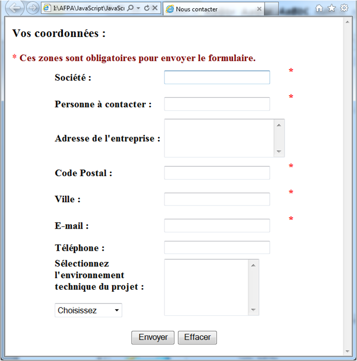
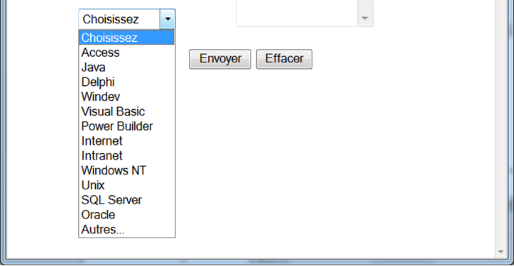
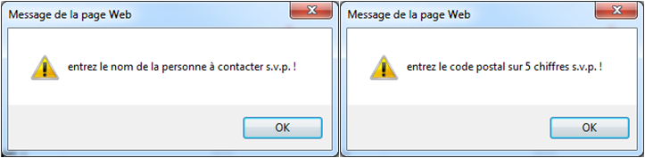

# JS 16 : LES FORMULAIRES

## GENERALITES 

Avec JavaScript, les formulaires Html prennent une toute autre dimension.

N'oublions pas qu'en JavaScript, on peut accéder à chaque élément d'un formulaire pour y aller lire ou écrire une valeur, y associer un gestionnaire d'événement... 

Tous ces éléments renforceront grandement les capacités interactives de vos pages.

## DECLARATION D'UN FORMULAIRE 

Le formulaire est l'élément Html déclaré par les balises 
```html
<form>

</form>
```

Il faut noter qu'en JavaScript, les attributs `name="nom_du_formulaire"` et `id="id_du_formulaire"` ont toute leur importance pour désigner le chemin complet des éléments. 

En outre, les attributs `action` et `method` sont facultatifs pour autant que vous ne faites pas appel au serveur.

## ACCES AU FORMULAIRE ET A SES ELEMENTS

En JavaScript, on peut accéder à un objet de la fenêtre via l’arborescence du DOM du navigateur et des tableaux indicés et associatifs :

```js
document.nom_du_formulaire
document.forms[0]…
document.forms['nom_du_formulaire']…
```

On peut également accéder directement à tout élément via les deux méthodes suivantes qui reprennent les attributs name et id présents dans la fenêtre :

```js
// retourne l’élément indicé par id = 'idElt'
document.getElementById('idElt'); 

// retourne la liste des éléments ayant pour nom : name = 'nameElt'
document.getElementsByName('nameElt'); 
```

### LES CONTROLES DE SAISIES

JavaScript est très apprécié pour valider les formulaires Html côté client.

-> L’interactivité est plus rapide avec l’utilisateur que la validation côté serveur.

Il reste primordial de contrôler également les formulaires côté serveur dans le cas où l’utilisateur désactiverait JavaScript.

Ces contrôles peuvent être faits avec les gestionnaires d’événements comme `onClick, onBlur, onSubmit, onReset` … mais aussi avec des méthodes qui simulent une action Html comme `submit()` et `reset()`.

-> La méthode `submit()` remplace l’événement lié au bouton de type `"submit"` en validant le formulaire.

-> La méthode `reset()` remplace l’événement lié au bouton de type `"reset"` en réinitialisant le formulaire.

#### onSubmit 
Cet événement est généré soit lorsque le bouton Submit du formulaire est cliqué, soit lorsque la méthode submit() est appelée.
Cet événement peut renvoyer un booléen pour envoyer ou non le formulaire.

```html
<html>
	<head>
		<script >
			
			function checkForm(f) {
				alert("Contrôle champ " + f.elements['chp'].value);
				return false; // n’envoie pas le formulaire
			}
			
		</script>
	</head>
	<body>
	<form action= "" id="form1" onSubmit="return checkForm(this);">
			<input type="text" name="chp" value="essai" />
			<input type= "submit" value="Valider" />
		</form>
	</body>
</html>
```

Dans l’exemple ci-dessus, le formulaire intercepte l’envoi du formulaire avec l’événement onSubmit. 

Cet événement appelle la méthode `checkForm()`, avec l’argument `this` et **attend** une **réponse booléenne** pour **envoyer ou non** le formulaire.

L’argument this est la référence de l’objet en cours, ici le formulaire.

La fonction `checkForm()` retourne false.

Le formulaire ne sera pas envoyé.

Testez l'exemple ci-dessous

```html
<!DOCTYPE html>
<html>
	<head>
		<title>Intercepte la validation du formulaire</title>
		
		<script>
			function checkForm(f) {
				alert("Vous vous appelez : " + f.elements['nom'].value + " " + f.elements['prenom'].value);
				return false; // do not submit the form
			}
		</script>
	</head>
	<body>
		<h2>Intercepte la validation du formulaire</h2>
		<form id="form1" name="form1" onSubmit="return checkForm(this);">
			<input type="text" name= "nom" value="Dupont" />
			<input type="text" name= "prenom" value="Eric" />
			<input type="submit" id="idSubForm1" name="subForm1" value="Connection" />
		</form>
	</body>
</html>
```

L’instruction **`return`** appelée dans l’événement **`onSubmit`** permet de **soumettre ou non le formulaire** suivant la valeur de retour de la fonction `checkForm()`.

## PROPRIETES UTILES DES BALISES HTML

### Les zones de texte (text et textarea)

<table>
<thead>
	<tr>
		<th>Propriété</th>
		<th>Description</th>
	</tr>
</thead>
<tr>
	<td>name
	</td>
    <td>
    indique le nom du contrôle par lequel on pourra accéder.	
	</td>
</tr>
<tr>
	<td>defaultValue
	</td>
    <td>
    indique la valeur par défaut qui sera affichée dans la zone de texte.	
	</td>
</tr>
<tr>
	<td>value
	</td>
    <td>
    indique la valeur en cours de la zone de texte.<br> soit celle tapée par l'utilisateur ou si celui-ci n'a rien tapé, la valeur par défaut.	
	</td>
</tr>
</table>

Toute valeur de champ est une chaîne de caractères !

**Pensez** à changer les virgules en point pour les nombres.


### Les boutons radio (radio)

<table>
<thead>
	<tr>
		<th>Propriété</th>
		<th>Description</th>
	</tr>
</thead>
<tr>
	<td>name
	</td>
    <td>
    indique le nom du contrôle.<br>Tous les boutons portent le même nom.	
	</td>
</tr>
<tr>
	<td>index
	</td>
    <td>
    l'index ou le rang du bouton radio en commençant par 0.	
	</td>
</tr>
<tr>
	<td>checked
	</td>
    <td>
    indique l'état en cours de l'élément radio
	</td>
</tr>
<tr>
	<td>defaultChecked
	</td>
    <td>
    indique l'état du bouton sélectionné par défaut.
	</td>
</tr>
<tr>
	<td>value
	</td>
    <td>
   indique la valeur de l'élément radio.
	</td>
</tr>
</table>

### Les boutons case à cocher (checkbox)

<table>
<thead>
	<tr>
		<th>Propriété</th>
		<th>Description</th>
	</tr>
</thead>
<tr>
	<td>name
	</td>
    <td>
   indique le nom du contrôle.<br>Toutes les cases à cocher portent un nom différent.	
	</td>
</tr>
<tr>
	<td>checked
	</td>
    <td>indique l'état en cours de l'élément case à cocher.
	</td>
</tr>
<tr>
	<td>defaultChecked
	</td>
    <td>indique l'état du bouton sélectionné par défaut.
	</td>
</tr>
</table>

### Les listes de sélection (select)

<table>
<thead>
	<tr>
		<th>Propriété</th>
		<th>Description</th>
	</tr>
</thead>
<tr>
	<td>name
	</td>
    <td>
   indique le nom de la liste déroulante.	
	</td>
</tr>
<tr>
	<td>length
	</td>
    <td>
   indique le nombre d'éléments de la liste.<br>S'il est indiqué dans le tag <strong>SELECT</strong>, tous les éléments de la liste seront affichés.<br> Si vous ne l'indiquez pas un seul apparaîtra dans la boite de la liste déroulante.	
	</td>
</tr>
<tr>
	<td>selectedIndex
	</td>
    <td>
   indique le rang à partir de 0 de l'élément de la liste qui a été sélectionné par l'utilisateur.	
	</td>
</tr>
<tr>
	<td>defaultSelected
	</td>
    <td>
  indique l'élément de la liste sélectionné par défaut.<br>C'est lui qui apparaît alors dans la petite boite.	
	</td>
</tr>
</table>

### L'EMPLOI DE THIS 

Pour désigner l'objet en cours, JavaScript met à votre disposition le mot-clé **`this`**. 

Cette **écriture raccourcie** est souvent utilisée (sans risque de confusion) en remplacement du chemin complet de l'objet dans un formulaire. 

Un exemple vous éclairera mieux qu'un long discours. 

Soit un script avec un formulaire :

```html
<form name="form3"> 
<input type="radio" name="choix" value="1" />Choix numéro 1<br /> 
<input type="radio" name="choix" value="2" />Choix numéro 2<br />
<input type="radio" name="choix" value="3" />Choix numéro 3<br /> 
<input type="button" name="but" value="Quel est votre choix ?" onClick="choixprop(form3)" />
</form>
```

Au lieu d'employer `choixprop(form3)`, on aurait pu utiliser `choixprop(this.form)` et éviter ainsi toute confusion avec les autres noms de formulaires. 

Dans cet exemple, `this.form` désigne le formulaire `form3` complet. 

Par contre, `choixprop(this)` n'aurait désigné que l'élément de type bouton du formulaire `form3`.

Pour être complet, `this` est utilisé aussi pour créer une ou plusieurs propriétés d'un objet. 

Ainsi, pour créer un objet livre avec les propriétés auteur, éditeur et prix cette opération peut être effectuée à l'aide de la fonction :

```js
function livre(auteur, editeur, prix) {
this.auteur = auteur;
this.editeur = editeur;
this.prix = prix;
}
var l1 = new livre("monAuteur", "monEditeur", 15.0);
document.write("Mon Auteur '" + l1.auteur + "' vaut " + l1.prix + " euros.");
```

### Exercice 

Réaliser un formulaire "Contact.html" correspondant au modèle ci-dessous, avec les contraintes suivantes :

* Le formulaire sera envoyé grâce à la méthode "Post".

*	La "Société" doit comporter au moins 1 caractère.

*	La "Personne à contacter" doit comporter au moins 1 caractère.

*	Le "Code postal" doit comporter 5 caractères numériques.

*	La "Ville" doit comporter au moins 1 caractère.

*	Le Email doit comporter au moins le caractère "@".



Le champ **"Environnement technique"** est une liste déroulante dans laquelle on peut choisir les techniques utilisées pour le projet proposé, ainsi qu'une zone de texte qui reçoit la sélection.

Il est permis de rajouter des informations manuelles dans la zone de texte.

La valeur **"Choisissez"** ne doit pas s'afficher dans la zone de texte si elle a été sélectionnée.



Prévoyez les messages appropriés en cas d'erreur de saisie :




	
	
	


	
	
	
	
	
