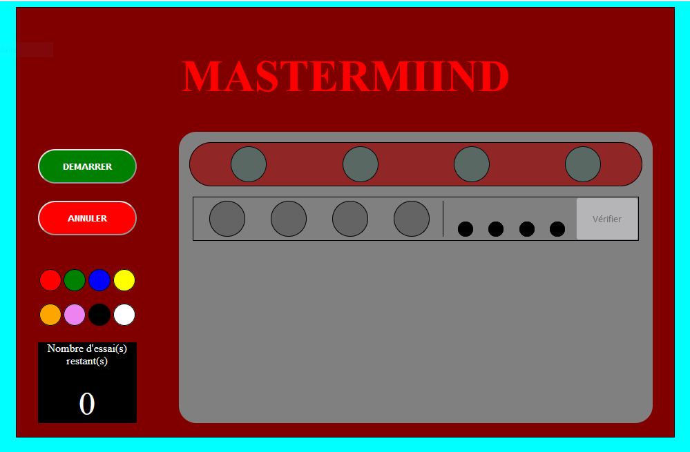
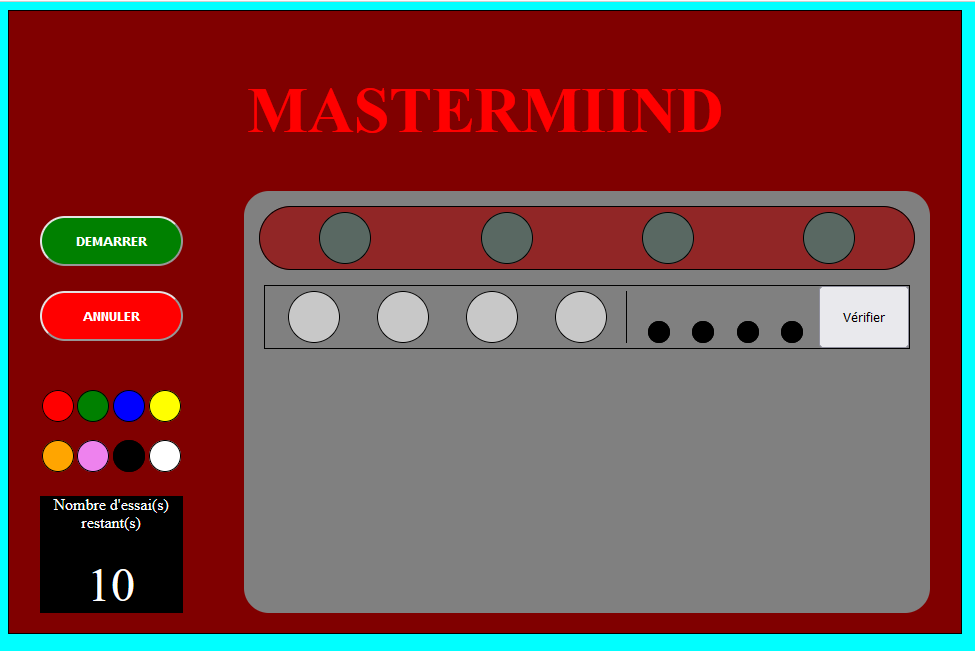
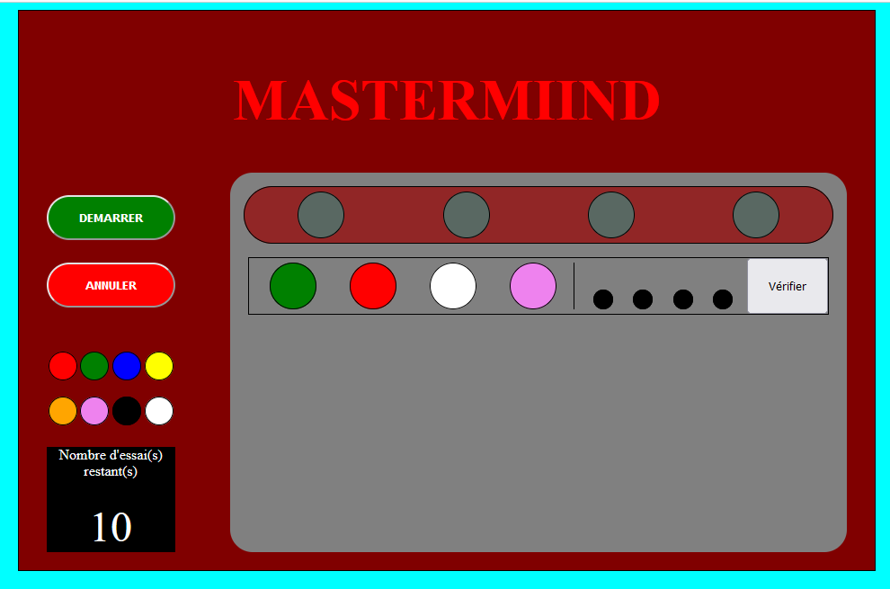
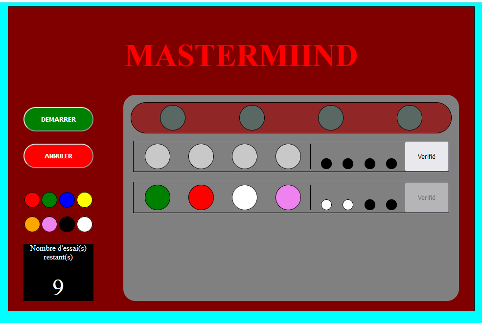
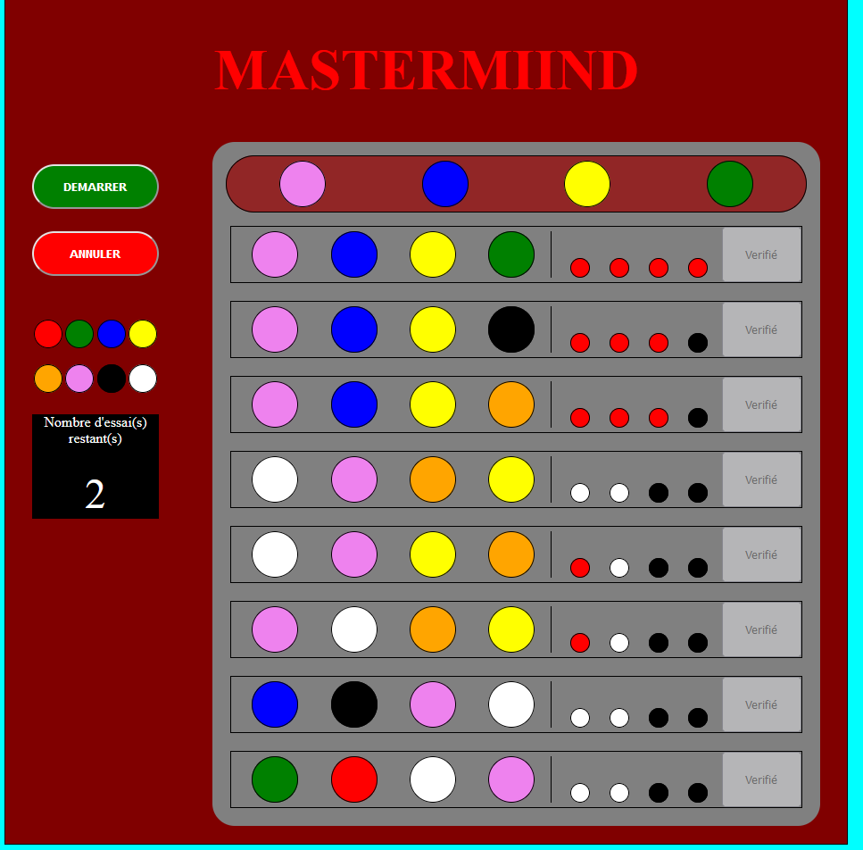
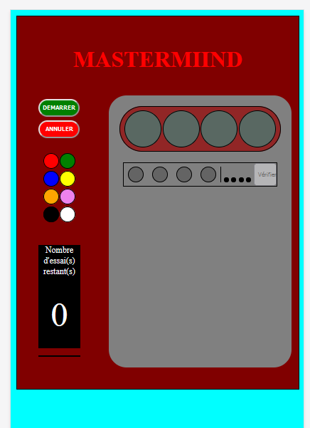

# Mastermind

Vous devrez reprendre votre algorithme du mastermind et l'intégrer en HTML/CSS

Vous devrez respecter un certains nombre de contraintes:

* L'écran de jeu est composé de 3 parties:
    * Un header contenant le titre
    * une colonne d'information contenant:
        * 2 boutons de gestions de la partie:
            * Démarrer (bouton vert)
            * Annuler (bouton rouge)
        * Les pions des différentes couleurs disponibles.
        * Un écran affichant le nombre de tentatives restantes.
    * le plateau de jeu se composant de:
        * Une ligne de pions représentant la combinaison à trouvé. La couleur des pions est bien entendu masqué tant que la partie n'est pas terminée.
        * Pour chaque proposition du joueur une nouvelle ligne de pions représentant:
            * la proposition du joueur
            * Le nombre de pions bien ou mal placés
            * Pour la ligne active un bouton permettant de vérifier la proposition.

Déroulement d'une partie:

Au chargement de la page, le plateau de jeu est inactif. Il ne contient que la ligne de la combinaison à trouver et la première ligne de proposition du joueur. Sur cette dernière, les pions sont grisés pour indiquer que le plateau de jeu est inactif. 

Il ne devient actif qu'après un click sur le bouton `Démarrer`.

Un message indique alors à l'utilisateur qu'il va démarrer une partie de mastermind et qu'il lui reste 10 essais. Le nombre d'essai s'affiche

à partir de là, il devient possible de faire glisser (drag'n'drop) les pions de couleurs vers le plateau de jeu pour faire sa proposition

Suite au click sur le bouton vérifier, la proposition du joueur se décale d'un cran vers le bas avec l'affichage du resultat (pion blanc = "mal placé", pion rouge = "bien placé"), le bouton "Vérifier" devient inactif sur cette ligne, le nombre d'essai restants se décrémente et la première ligne revient à la normal pour permettre une nouvelle proposition. 
**!!! Attention: la vérification ne doit être possible que si la proposition est complète.**

La partie se poursuit ainsi jusqu'à ce que la combinaison soit trouvée ou que le nombre d'essai atteigne 0.

Le bouton annuler permet d'arréter une partie en cours et de revenir à l'écran d'accueil avec le plateau inactif.
Le bouton Démarrer ne permet de lancer une partie que si aucune partie n'est en cours. Si une partie est déjà lancée, demander à l'utilisateur de terminer sa partie ou de l'annuler s'il veut en faire une nouvelle.

Voici un aperçu possible pour une version mobile:

