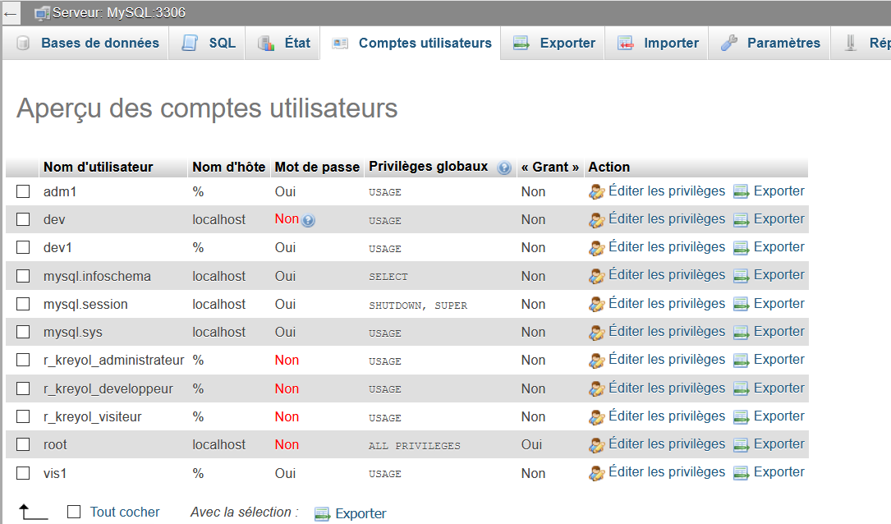

# Créer la base de données > Utilisateurs, privilèges et rôles > Rôles

Les rôles sont une nouveautés de MySQL 8, ils n'existaient pas dans les versions précédentes. 

Un rôle définit un ensemble de privilèges. Plutôt que d'attribuer des privilèges un à un pour chaque utilisateur, on va pouvoir le faire en une seule fois. 

La création d'un rôle suit 3 étapes :

1. Création du rôle
2. Définition des privilèges 
3. Affectation du rôle aux utilisateurs	

Il est possible de définir des rôles :

* soit au niveau du serveur 
* soit au niveau d'une base 

## 1. Création du rôle

On utilise l'instruction `CREATE ROLE`, suivi du nom souhaité :

	CREATE ROLE nomdurole

**Exemple** 

    CREATE ROLE r_gescom_visiteur

Ce 1er exemple va créer le rôle nommé _r\_gescom\_visiteur_. 

Bonne pratique : adoptez une convention de nommage pour les rôles, par exemple <code>r_nombase_nomrole</code>.

Dans PhpMyAdmin (niveau serveur > onglet _Comptes utilisateurs_), le rôle apparaît parmi la liste des utilisateurs :

On remarque alors : 

* La présence du signe `%` comme nom d'hôte : ici le rôle est spécifié pour tous les serveurs; or il est plus prudent en termes de sécurité de spécifier un serveur, qui sera le serveur local, `localhost`, de cette manière :

		CREATE ROLE 'r_gescom_visiteur'@'localhost'
  
* L'absence de mot de passe : techniquement, un rôle est un utilisateur bloqué dont le mot de passe a expiré.
* La mention `USAGE` dans la colonne _Privilèges globaux_ : nous n'avons pas encore attribué de privilège(s) au rôle (cliquer sur le lien _Editer les privilèges_ pour le vérifier), en l'état le rôle est donc inexploitable.

> L'option `IF NOT EXISTS` est supportée : par exemple `CREATE ROLE IF NOT EXISTS r_gescom_visiteur`.

On remarque alors que, malgré l'emploi de l'option  : 

## 2. Définition des privilèges 

Pour accorder des privilèges à un rôle, on procède de la même façon que pour les utilisateurs, avec la commande `GRANT` sauf qu'on indique le nom du rôle au lieu du nom d'utilisateur : 

	GRANT privilege 
	ON base.table 
	TO 'r_base_nomrole'@'localhost'

**Exemple 1** 

	GRANT select 
	ON gescom.suppliers 
	TO 'r_gescom_visiteur'@'localhost'

Ici, les utilisateurs possèdant le rôle _r\_gescom\_visiteur_ pourront lire des données (`select`) dans la table _suppliers_ de la base _gescom_.

**Exemple 2**

	GRANT ALL 
	ON gescom.* 
    TO r_gescom_admin

Ici, on accorde tous les droits sur la base _gescom_ (donc comme pour _root_) au rôle _r\_gescom\_admin_. 

## 3. Affectation du rôle à un utilisateur	

Dernière étape, attribuer un rôle à un utilisateur avec la syntaxe :

	GRANT nom_role 
    TO 'utilisateur'@'localhost'

**Exemple 1 **

	GRANT r_gescom_visiteur 
    TO 'dave_loper'@'localhost'

L'utilisateur _dave\_loper_ se voit attribuer le rôle _r\_gescom\_visiteur_. 

On peut accorder en seule une fois plusieurs rôles à un utilisateur :

	GRANT nom_role1, nom_role2 
    TO 'utilisateur1'@'localhost'	 

On peut aussi accorder un seul rôle à plusieurs utilisateurs : 

	GRANT nom_role
    TO 'utilisateur1'@'localhost', 'utilisateur2'@'localhost'	

et, encore plus fort, plusieurs rôles à plusieurs utilisateurs : 

	GRANT nom_role1, nom_role2 
    TO 'utilisateur1'@'localhost', 'utilisateur2'@'localhost'	 

## 4. Création de plusieurs rôles

Il est possible de créer plusieurs rôles en une seule fois; le nom des rôles est indiqué à la suite et séparé par une virgule  :

	CREATE ROLE r_gescom_nom1, r_gescom_nom2, r_gescom_nom3

## 5. Vérification des rôles et privilèges

Pour afficher les rôles et privilèges attribués à un utilisateur :

	SHOW GRANTS FOR utilisateur

**Exemple**

	SHOW GRANTS FOR dave_loper

On peut utiliser la même commande pour montrer les privilèges accordés à un rôle :

	SHOW GRANTS FOR nom_role

**Exemple**

	SHOW GRANTS FOR r_gescom_visiteur 

## 6. Attribution d'un rôle par défaut 

Si vous vous connectez, aucun rôle actif n'a encore été attribué à cet utilisateur, comme le confirme la commande :

	SELECT current_role();

qui indique :

| current_role() |
+----------------+
| NONE           |

Il faut donc assigner un rôle à l'utilisateur, via la commande `SET DEFAULT ROLE` :

**Exemple 1**

Attribuer tous les rôles à un utilisateur : utilisation de l'option `ALL` :  

	SET DEFAULT ROLE ALL TO utilisateur@localhost;

**Exemple 2**

Attribuer un seul rôle à l'utilisateur : indiquer le nom du rôle : 

	SET DEFAULT ROLE nom_role TO utilisateur@localhost;

<table>
<thead>
<tr>
<th>Instruction</th>
<th>Usage</th>
<th>Exemple</th>
</tr>
</thead>
<tbody>
<tr>
<td><code>SET ROLE</code></td>
<td>Attribuer un seul rôle à l'utilisateur <strong>de façon temporaire (session de connexion)</strong>.</td>
<td><code>SET ROLE r_nom TO utilisateur</code></td>
</tr>
<tr>
<td><code>SET DEFAULT ROLE</code></td>
<td>Attribuer un seul rôle à l'utilisateur : indiquer le nom du rôle : </td>
<td><code>SET DEFAULT ROLE nom_role TO utilisateur@localhost;</code></td>
</tr>
<tr>
<td><code>SET DEFAULT ROLE ALL</code></td>
<td>Attribuer tous les rôles à un utilisateur : utilisation de l'option `ALL`</td>
<td><code>SET DEFAULT ROLE ALL TO utilisateur@localhost;</code></td>
</tr>
</tbody>
</table>

## 7. Suppression de privilèges

Pour retirer des privilèges d'un rôle, cela se passe de la même façon que pour un utilisateur : 

**Exemple**

	REVOKE INSERT, UPDATE, DELETE 
    ON gescom.suppliers 
    FROM r_gescom_visiteur

Cet exemple supprime pour le rôle _r\_gescom\_visiteur_ les droits d'insérer, modifier et supprimer des données dans la table _suppliers_ de la base _afpa\_gescom_.  

## 8. Supprimer un rôle

	DROP ROLE nom_du_role

## Gestion dans PhpMyAdmin

* Au niveau du serveur seul : l'onglet _Comptes Utilisateurs_ montre la liste des utilisateurs. Différents liens (_Editez les privilèges_, _Ajouter un utilisateur_) accèdent à des écrans dans lesquels on peut configurer tout ce que l'on souhaite.     
* Au niveau d'une base de données : l'onglet _Privilèges_ affiche les utilisateurs de la base sélectionnée et les rôles/privilèges spécifiques à celle-ci. 
* Au niveau d'une table : l'onglet _Privilèges_ indique les utilisateurs de la table et les rôles/privilèges attribués pour celle-ci. 

## Ce qu'il faut retenir 

* Un rôle est un utilisateur avec un mot de passe expiré
* Un utilisateur peut posséder plusieurs rôles (y compris plusieurs par défaut)
* 

## Ressources 

* [Documentation](https://dev.mysql.com/doc/mysql-security-excerpt/8.0/en/roles.html)
* [Tutoriel (EN)](https://www.mysqltutorial.org/mysql-roles)

    