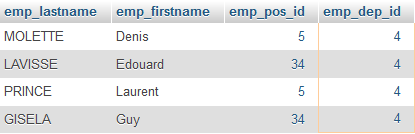

# Les sous-requêtes

## 1. Présentation

Le résultat d'une requête peut servir dans une clause de restriction (`WHERE`) d'une autre requête, cette seconde requête est désignée sous le terme **sous-requête** ou encore **requête imbriquée**. 

**Exemple** 

Ecrivons une requête qui affiche le nom, le prénom, le numéro de poste et de département des employés dont le numéro de département est dans (`IN`) la table _departments_ et dont le nom de département est dans (`IN`) _Maintenance_ : 

	SELECT emp_name, emp_firstname, emp_pos_id, emp_dep_id
    FROM employees
    WHERE emp_dep_id IN
          -- sous-requete ici : 
          (SELECT dep_id FROM departments WHERE dep_name = 'Maintenance')

Résultat : 4 personnes travaillent dans le département _Maintenance_ : 

Astuce : pour mettre au point une sous-requête et s'assurer qu'elle retourne le bon jeu de résultats, testez-la indépendamment dasn l'onglet SQL de PhpMyAdmin.
  

### 2. L'opérateur `IN`

L'opérateur `IN` permet d'utiliser/comparer des données qui se trouvent dans (`IN`) :

* soit une liste de données écrite "en dur", 
* soit le résultat d'une autre requête SQL, 

dans les deux cas sont inclus au sein même de la requête.  

#### 2.1 - Avec une liste de données

**Exemple**

Trouvez les produits dont la couleur est 'bleu', 'rouge' ou 'vert', c'est-à-dire les valeurs de la colonne `pro_color`) : 

	SELECT pro_id, pro_name, pro_color 
    FROM products
	WHERE pro_color IN ('bleu', 'rouge', 'vert')

Résultat :

Relevez que la requête est équivalente à celle-ci :

	SELECT pro_id, pro_name, pro_color 
    FROM products
	WHERE pro_color = 'bleu' 
    OR pro_color = 'rouge' 
    OR pro_color = 'vert'  

#### 2.2 - Avec une sous-requête

Ici, la liste de données dans laquelle on recherche est le résultat de l'exécution d'une 2ème requête : cette seconde requête est apellée _sous-requête_ ou encore _requête imbriquée_.  

**Exemple 1**

    SELECT emp_lastname, emp_firstname, emp_pos_id, emp_dep_id
    FROM employees
    WHERE emp_dep_id IN
          -- sous-requete ici : 
          (SELECT dep_id FROM departments WHERE dep_name = 'Maintenance')

Les plus perspicaces l'auront remarqué, il s'agit bien ici de l'exemple que celui donné dans le paragraphe <i>Présentation</i>.
 

### 3. L'opérateur `NOT IN`

L'opérateur `NOT IN` constitue l'inverse de `IN`, c'est-à-dire que l'on obtiendra des résultats (pour le 1er `SELECT`) qui ne sont pas dans ceux de la sous-requête (2ème `SELECT`).

**Exemple**

Reprenons l'exemple du paragraphe _Présentation_ et remplaçons l'instruction `IN` par `NOT IN` : nous obtiendrons tous les employés dont le numéro de département n'est pas celui dont le nom est _Maintenance_, c'est-à-dire que la sous-requête retourne tous les départements autres que _Maintenance_ :     

	SELECT emp_lastname, emp_firstname, emp_pos_id, emp_dep_id 
    FROM employees
    WHERE emp_dep_id NOT IN
                   -- sous-requete ici : 
                   (SELECT dep_id FROM departments WHERE dep_name = 'Maintenance')

103 résultats, sur un total de 107 employés; les 4 absents sont bien sûr ceux qui travaillent dans le département _Maintenance_.
    

### 4. L'opérateur `ALL`

L'opérateur `ALL` - "tout" - retourne tous les résultats pour le 1er `SELECT` qui se trouvent dans ceux de la sous-requête (2ème `SELECT`).  

**Exemple** 

La requête suivante affiche les informations des employés dont le numéro de département est dans la table _departments_ et dont le nom de département est _Maintenance_ : on remarque qu'il s'agit de la même requête que l'exemple du paragraphe _Présentation_ avec `IN`.

	SELECT emp_lastname, emp_firstname, emp_pos_id, emp_dep_id
    FROM employees
    WHERE emp_dep_id = ALL
                   -- sous-requete ici : 
                   (SELECT dep_id FROM departments WHERE dep_name = 'Maintenance')

On remarque le signe `=` pour affecter le résultat de la sous-requête à une colonne (`em_dep_id`) de la clause de restriction (le `WHERE`) : on peut aussi mettre les signes inférieur ou supérieur comme dans l'exemple ci-dessous :

**Exemple**

Sélectionnons les employés qui gagnent moins que la moyenne (fonction `AVG`) des salaires de tous les employés réunis :  

    SELECT emp_lastname, emp_firstname, emp_salary 
    FROM employees
    WHERE emp_salary < ALL
                   -- sous-requete ici : 
                   (SELECT AVG(emp_salary) FROM employees) 
    ORDER BY emp_salary DESC

Résultats : le salaire moyen est de 30737.710561 € (résultat de la sous-requête), 78 salariés gagnent moins que cette moyenne.

Notez que cette requête permet donc d'obtenir en une seule fois le même résultat qu'avec les deux suivantes :

	SELECT AVG(emp_salary) 
    FROM employees;
    
avec laquelle on obtient donc _30737.710561_, et :     

    SELECT emp_lastname, emp_firstname, emp_salary 
    FROM employees
    WHERE emp_salary < 30737.710561
    ORDER BY emp_salary DESC

> [Complément](https://sql.sh/cours/where/all) 

### 5. L'opérateur `ANY` ou `SOME`

La commande `ANY` (alias de `SOME`) permet de comparer avec un opérateur conditionnel une valeur avec au moins une des valeurs de la sous-requête.

> [Complément](https://sql.sh/cours/where/any)

**Exemple**

    SELECT emp_lastname, emp_firstname, emp_salary  
    FROM employees
    WHERE emp_dep_id = ANY
          -- sous-requete ici : 
          (SELECT dep_id FROM departments WHERE dep_name = 'Maintenance')

Résultats : .

Les opérateurs conditionnels possibles sont : 

<table>
<thead>
<tr>
   <th>Opérateur</th> 
   <th>Signe</th>     
</tr>
</thead>
<tbody>
<tr>
   <td>Egalité</td> 
   <td> = </td>   
</tr>
<tr>
   <td>Supérieur</td> 
   <td> > </td>  
</tr>
<tr>
   <td> Inférieur </td> 
   <td> < </td>
</tr>
<tr>
   <td>Supérieur ou égal</td> 
   <td> >= </td>  
</tr>
<tr>
   <td>Inférieur ou égal</td> 
   <td> <= </td>
</tr>
<tr>
   <td>Différent</td> 
   <td> != ou <> </td>   
</tr>
<tr>
   <td>Différent</td> 
   <td> != ou <> </td>   
</tr>
</table>
  
### 6. Résumé

Certaines combinaisons d'instructions vues ici sont similaires :

<table>
<thead>
<tr>
   <th>Instruction</th> 
   <th>Retourne</th>
   <th>Equivalent</th>  
</tr>
</thead>
<tbody>
<tr>
   <td><code>IN</code></td> 
   <td>Un résultat parmi ceux de la sous-requête</td>
   <td><code> = ANY</code> / <code> = SOME</code></td>
</tr>
<tr>
   <td><code>= ANY</code> / <code>= SOME</code></td> 
   <td>Au moins une valeur parmi les résultats de la sous-requête.</td>
   <td><code>IN</code></td>
</tr>
</table>

    