# Cas Gescom : les requêtes

Ecrivez les requêtes pour les questions suivantes :

1. Afficher dans l'ordre alphabétique et sur une seule colonne les noms et prénoms des employés qui ont des enfants, présenter d'abord ceux qui en ont le plus.

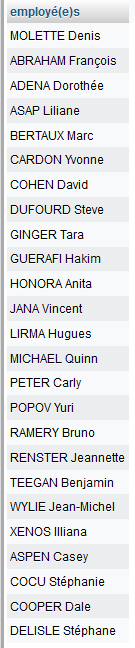

2. Y-a-t-il des clients étrangers ? Afficher leur nom, prénom et pays de résidence.

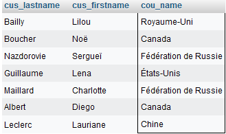

3. Afficher les villes de résidence des clients.

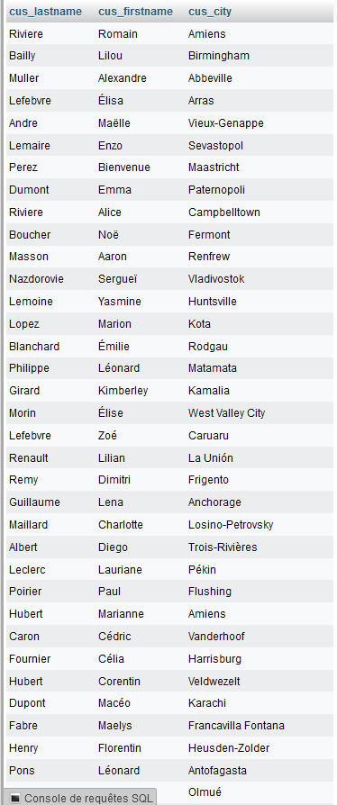

4. Afficher les clients dont les fiches ont été modifiées.

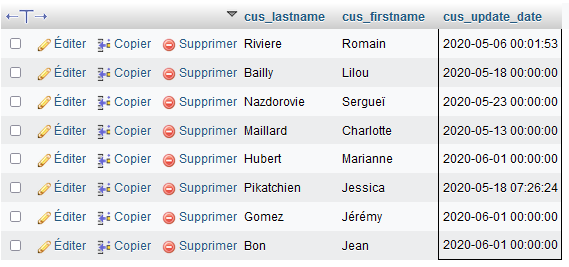

5. La commerciale Coco Merce veut consulter la fiche d'un client, mais la seule chose dont elle se souvienne est qu'il habite une ville genre 'divos'. Pouvez-vous l'aider ?  

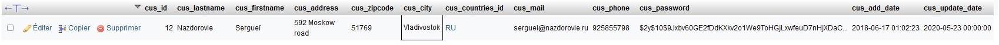

6. Quel est le produit vendu le moins cher ?

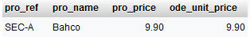

7. Afficher les produits commandés par Madame Pikatchien.

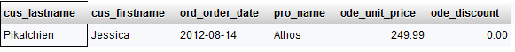

8. Lister les produits qui n'ont jamais été vendus.

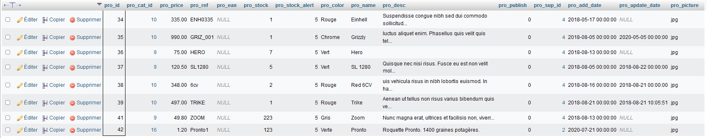

9. Afficher l'organigramme hiérarchique de l'entreprise.

version 1
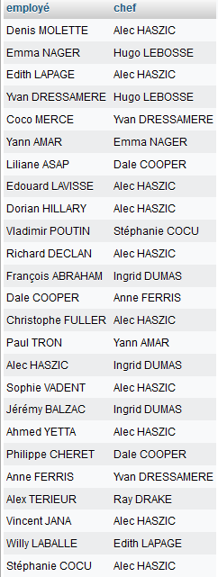

version 2
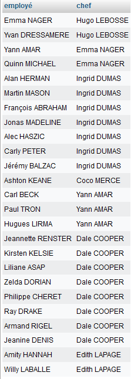
 
10. Afficher le catalogue des produits par catégorie. Le nom des produits et de la catégories doivent être affichés.

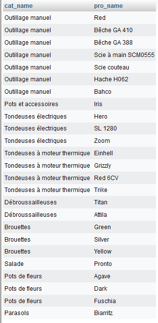

11. Quel produit a reçu la remise la plus élevée ?

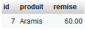

12. Lister les commandes dont le total est inférieur à 100 €.

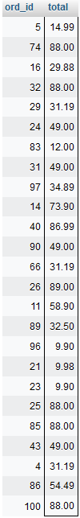

13. Combien y-a-t-il de clients canadiens ? Afficher les résultats dans une colonne intitulée 'Nb clients Canada'. 

14. Quel produit marche le mieux ?

15. Quelle est la plus grande quantité commandée pour un seul produit et quel est ce produit ?   

16. Afficher le détail des commandes de 2020.

17. Afficher les coordonnées des fournisseurs pour lesquels des commandes ont été passées.

18. Quel est le chiffre d'affaires de 2020 ?

19. Quel est le panier moyen ?

20. Où le chiffre d'affaires à l'export est-il le plus élevé ?  

21. Lister le total de chaque commande par total décroissant (Afficher numéro de commande, date, total et nom du client).

22. La version 2020 du produit _barb004_ s'appelle désormais _Camper_ et, bonne nouvelle, son prix subit une baisse  de 10%.

23. L'inflation en France en 2019 a été de 1,1%, appliquer cette augmentation à la gamme de parasols.

24. Supprimer les produits non vendus de la catégorie "Tondeuses électriques" (ces produits sont : 36, 37 et 41 de la catégorie 9). 
