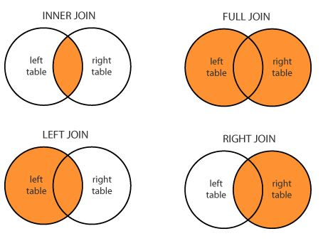
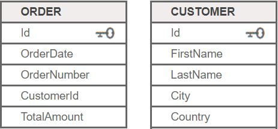
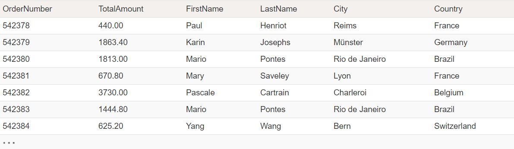

# FORMALISER DES REQUÊTES SQL

- `SELECT`
- `FROM`
- `WHERE`
- `ORDER BY`
- `GROUP BY`
- `HAVING`
- `JOIN`


#### La Syntaxe 
```sql
SELECT **NOMS DE COLONNES OU EXPRESSIONS**
FROM **NOMS DE TABLES**
WHERE **CONDITIONS DE RECHERCHE**
GROUP BY **NOMS DE COLONNE DU SELECT**
HAVING **CONDITION DE RECHERCHE**
ORDER BY **NOM OU POSITION DE COLONNE DANS L'ORDRE SELECT**
```
Exemples : 
*Lister le contenu de la table EMPLOYES*
```sql 
SELECT * FROM EMPLOYES
``` 
*Lister le nom et le salaire des employés de la table EMPLOYES*
```sql 
SELECT NOM, SALAIRE FROM EMPLOYES
```


- `ALL`
- `DISTINCT`

L'option `ALL` est prise par défaut, toutes les lignes sélectées figurent dans le résultat.
L'option `DISTINCT` permet de ne conserver qu'un exemplaire de chaque ligne en double

```sql
SELECT [ALL] nom col1 FROM nomtable
``` 
par opposition à 
```sql
SELECT DISTINCT nomcol1 FROM nomtable
```


### `SELECT` conditionnelle avec `WHERE` 

La clause WHERE permet de préciser les conditions de recherche sur les lignes de la table. 

Conditions de recherche de la clause WHERE :
Pour spécifier la condition de recherche dans la clause WHERE, on utilise
indifféremment l’un des opérateurs conditionnels ci-après :

| Description | Opérateurs conditionnels |
|:---------|-------------|
| Opérateurs de comparaison | **=**, **<>**, **!=**, **>**, **>=**, **!>**, **<**, **<=**, **!<** |
| Comparaisons de plage | `BETWEEN` et `NOT BETWEEN` |
| Comparaisons de listes | `IN` et `NOT IN` |
| Comparaisons de chaîne de caractères | `LIKE` et `NOT LIKE` |
| Valeurs inconnues | `IS NULL` et `IS NOT NULL` |

Exemple avec `WHERE` et `OR` : *Rechercher dans la table EMPLOYES, les données concernant les employés qui travaillent dans le départements A00 ou E01*
```sql
SELECT * FROM EMPLOYES WHERE WDEPT = 'A00' OR WDEPT = 'E01'
```


### Les fonctions du `SELECT`
#### La clause `ORDER BY`
La clause ORDER BY permet de préciser une séquence de tri pour le résultat d'une
requête.
• `ASC` séquence croissante (valeur par défaut)
• `DESC` séquence décroissante

Exemple : *Lister le contenu de la table employé, trié par département croissant et nom décroissant*

```sql
SELECT *FROM EMPLOYES
ORDER BY WDEPT ASC, NOM DESC
``` 

#### La clause `GROUP BY`
Ces options permettent de définir et de traiter des groupes.
Un groupe est formé à partir d'un ensemble de lignes d'une table ayant une ou plusieurs caractéristiques communes. 

Exemple : *Quel est le salaire moyen et le salaire minimum des employés à l'intérieur de chaque département pour les n° employés > 00010.*
```sql
SELECT WDEPT, AVG (SALAIRE), MIN (SALAIRE) FROM EMPLOYES
WHERE NOEMP > 00010
GROUP BY WDEPT
```

#### La clause `HAVING`
La clause `HAVING` est utilisée en conjonction avec la clause `GROUP BY`.
La clause `HAVING` agit comme critère de sélection pour les groupes renvoyés avec la clause `GROUP BY`.


Exemple : *Quel est le salaire moyen et le salaire minimum des employés à l'intérieur de chaque département pour les n° employés > 00010 ? Lister uniquement les groupes pour lesquels la moyenne est supérieure a 16 000*

```sql
SELECT WDEPT, AVG (SALAIRE), MIN (SALAIRE) FROM EMPLOYES
WHERE NOEMP > 00010
GROUP BY WDEPT
HAVING AVG (SALAIRE) >= 16000
```

Il ne faut pas confondre les clauses `WHERE` et `HAVING`.

- `WHERE` permet de sélectionner des lignes avant la formation des groupes.
- `HAVING` permet de ne retenir que certains des groupes constitués par la clause `GROUP BY`. 

#### L’opération de jointure - `JOIN`

- Une jointure sql `JOIN` combine l'enregistrement de deux tables.
- Une jointure `JOIN` localise les valeurs de colonne liées dans les deux tables.
- Une requête peut contenir zero, une, ou plusieurs operations de jointures.
- `INNER JOIN` = `JOIN`; le mot clé `INNER` est facultatif.

**Les differents types**
- `JOIN` : Sélectionne des enregistrements ayant des valeurs correspondantes dans l'ensemble des tables.
- `FULL JOIN` : Sélectionne tous les enregistrements correspondant aux enregistrements de gauche ou de droite.
- `LEFT JOIN` : Sélectionne l'enregistrement de la première table (la plus à gauche) avec les enregistrements correspondants de la droite.
- `RIGHT JOIN` : Sélectionne l'enregistrement de la deuxième table (la plus à droite) avec les enregistrements de table correspondants de gauche.

 

**Syntaxe d'une jointure**


```sql
SELECT *column-names*
  FROM *table_name1* JOIN *table_name2* 
    ON *column_name1* = *column_name2*
 WHERE *condition*
```


Exemple : *Lister touters les commandes avec les informations clients*



```sql
SELECT OrderNumber, TotalAmount, FirstName, LastName, City, Country
FROM [Order] JOIN Customer
ON [Order].CustomerId = Customer.Id
```

Resultat :
