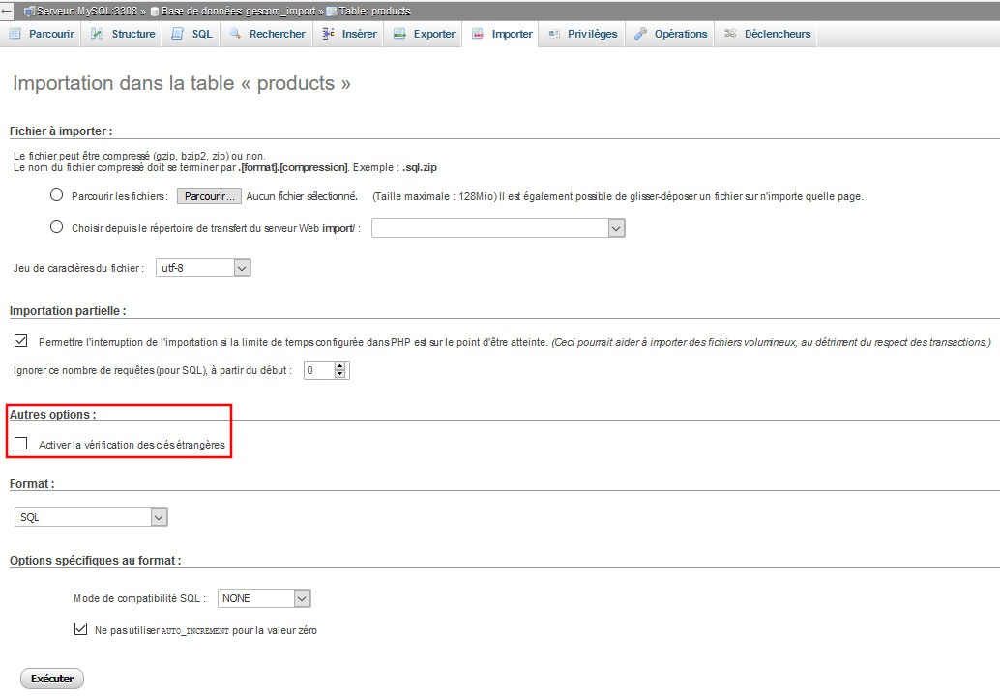

# Alimenter la base de données

A partir d'une structure de base de données existante et de cas de tests, vous devez peupler les tables avec des données respectant l'intégrité référentielle de la base.

Vous créez des scripts de peuplement vous permettant par la suite de réaliser des [tests de non-régression](https://dico.developpez.com/html/1141-Gestion-de-projet-tests-de-non-regression.php).

 

## Objectifs

Mettre en oeuvre le Langage de Manipulation des Données (LMD) :

* insertion (avec l'instruction `INSERT INTO`)
* utiliser l'outil d'importation des données.

 

## Cheminement

Dans un premier temps, vous allez vous approprier [le langage SQL LMD](lmd.html), Langage de Manipulation de Données (ou DML en anglais). Pour découvrir cette partie du langage SQL, lisez la ressource où vous apprendrez comment ajouter, modifier et supprimer des lignes dans les tables de la base de données.

Puis, à partir de la structure de la base de données existante :

* vous alimentez la base de données (`INSERT INTO`).
* vous expérimentez les fonctions d'import/export.

 

## Travail à réaliser

Grâce aux instructions du langage DML que vous venez de découvrir, vous allez pouvoir ajouter, modifier et supprimer des lignes dans les tables d'une base de données pour peupler les tables avec des commandes SQL.

**Des bugs peuvent se présenter sur l'importation des fichiers de données, vous devrez rechercher des solutions.**

 

### Exercice 1

Téléchargez et installez la structure (tables vides) de la base de données [gescom](scripts/gescom_v1_structure_2020_05_20.sql).  

 

### Exercice 2 

Un temps de réflexion s'impose : **la structure de la base de données vous impose de remplir les tables dans un ordre défini, afin de respecter les contraintes de clés étrangères** : Quel est l'ordre à adopter ? Argumenter.

 

### Exercice 3 

Insérez les données des tables [products](scripts/gescom_v1_products_data_2020_05_20.csv), [orders_details](scripts/gescom_v1_orders_details_2020_05_20.sql) et [countries](scripts/gescom_v1_countries_data_2020_05_20.csv).
	
Pour ce faire, décochez la case _Activer la vérification des clés étrangères_ dans l'onglet _Importer_ de PhpMyAdmin : 

 

### Exercice 4

Exportez les données de la table _orders\_details_ au format CSV. 

 

### Exercice 5 
            
Créez les scripts d'alimentation des autres tables. Les valeurs devront bien sûr respecter les problématiques d'intégrité référentielle.

 