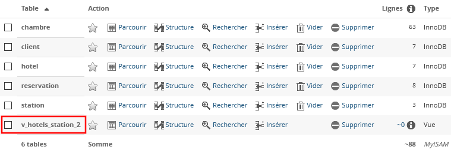
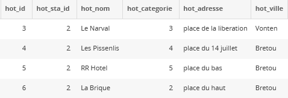

<!-- HB, 28/04/2020 -->

# Les vues

## Présentation

Pour faire très simple, une vue est une requête à laquelle on a donné un nom. Une vue est en quelque sorte une table virtuelle, et se manipule donc comme une table. 
 
Cela confère des avantages : 

* Maintenabilité et réutilisabilité : une vue évite la (re)saisie fastidieuse de requêtes complexes et/ou leur modification (structure, colonnes, jointures...) à de multiples endroits de votre code puisque votre application ne fait appel qu'au nom de la vue, pas à la requête qu'elle contient.
* Sécurité : une vue permet de masquer aux développeurs le schéma de la base (noms des tables et colonnes, relations). Les développeurs ne manipulent que le nom de la vue, sans être obligés de connaître la requête qu'elle contient. En outre, les privilèges (cf. dernier paragraphe de cette page) sur une vue peuvent être définis différemment de ceux attribués aux tables utilisées par la vue.

Une vue sert uniquement à afficher des données (instruction `SELECT`) et n'accepte pas d'arguments (le code ne peut envoyer de valeurs/variables).

## Fonctionnement

### Création d'une vue

    CREATE VIEW nom_de_la_vue
    AS
    SELECT * FROM nom_table
    WHERE...

**Exemple**

A partir de la base [hotel](bases_sql/hotel.sql), créons (onglet _SQL_ de PhpMyAdmin) une vue nommée `v_hotels_station_2` qui affiche la liste des hôtels situé dans la station 2 (trop dur !) : 

	CREATE VIEW v_hotels_station_2
    AS
    SELECT * FROM hotel
    WHERE hot_sta_id = 2

> Pour éviter des conflits entre le nom d'une vue et d'une table, préfixer le nom des vues par *v_* est une bonne pratique courante.

**Résultat :**

On peut désormais observer, dans l'onglet _Structure_ de PhpMyAdmin, la présence de la vue, au même titre que les tables : 

### Utilisation d'une vue

Une vue s'utilise de la même façon qu'une table, c'est-à-dire avec les instructions `SELECT...FROM` :

    SELECT * FROM nom_de_la_vue

**Exemple**

Appelons la vue que nous venons de créer :

	SELECT * FROM v_hotels_station_2

**Résultat :**

## Utilisation avec PHP

**Exemple**

Affichons notre vue `v_hotels_station_2` en PHP : on utilise pour cela la méthode `query` de l'objet `PDO`, de la même façon que pour une requête classique : 

	$aHotels = $oPdo->query("SELECT * FROM v_hotels_station_2");

    // Contenu du tableau de résultats
	var_dump($aHotels);

    // Affichage du contenu avec une boucle
	foreach ($aHotels as $o) 
	{
    	echo"- ".$o->hot_nom." ";
	}
 
## Gestion des vues

Voici quelques requêtes utiles pour administrer les vues.

### Modifier une vue

*Solution 1*

    ALTER VIEW v_nomvue 
    AS 
    [NOUVELLE REQUETE]

*Solution 2*

    CREATE OR REPLACE VIEW v_nomvue
    AS
    [NOUVELLE REQUETE]       

### Supprimer une vue  

    DROP VIEW v_nomvue 
    
on peut spécifier l'option `IF EXISTS` :
 
    DROP VIEW IF EXISTS v_nomvue 

### Lister les vues existantes dans une base

    SELECT * 
    FROM information_schema.views
    WHERE table_schema = 'nomdelabase' 
 
### Définir des privilèges sur une vue

> Pré-requis : cours sur les rôles (séance suivante si pas abordé en T.B.). 
 
    GRANT 
    CREATE VIEW, 
    SHOW VIEW 
    ON `nom_base`.* TO 'utilisateur'@'adresse_ip'    

Les privilèges sur une vue peuvent être définis différemment de ceux attribués aux tables utilisées par la vue.

## Mise en pratique

Créez les vues demandées et interrogez-les pour vérifier qu'elles correspondent bien aux attentes. 

### Exercice 1 : base _hotel_

1. Afficher la liste des hôtels avec leur station. 
2. Afficher la liste des chambres et leur hôtel
3. Afficher la liste des réservations avec le nom des clients
4. Afficher la liste des chambres avec le nom de l'hôtel et le nom de la station
5. Afficher les réservations avec le nom du client et le nom de l'hôtel

### Exercice 2 : base _papyrus_

Réalisez les vues suivantes à partir de la base [papyrus](bases_sql/papyrus.sql). 

1. `v_GlobalCde` correspondant à la requête : 
_A partir de la table `Ligcom`, afficher par code produit, la somme des quantités 
commandées et le prix total correspondant : on nommera la colonne 
correspondant à la somme des quantités commandées, QteTot et le prix total, 
PrixTot_. 

2. `v_VentesI100` correspondant à la requête : _Afficher les ventes dont le code produit est le I100 (affichage de toutes les colonnes de la table Vente)_. 
 
3. A partir de la vue précédente, créez `v_VentesI100Grobrigan` remontant toutes les ventes 
concernant le produit _I100_ et le fournisseur _00120_. 