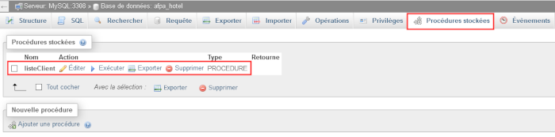
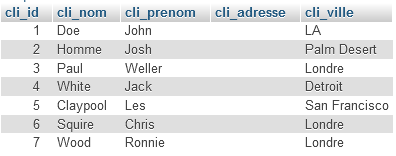
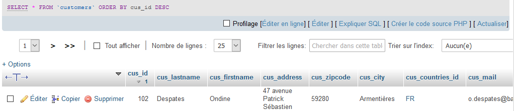
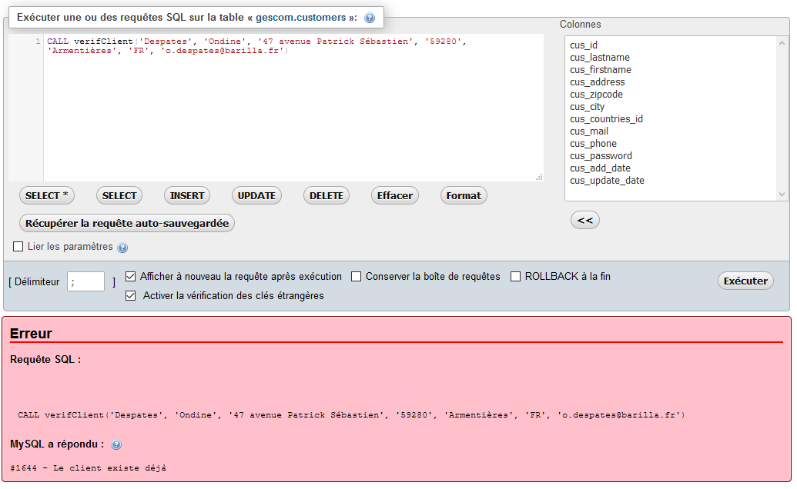

# Programmer des procédures stockées
    
## Objectifs

A l'issue de cette séance, vous serez capable de coder une procédure stockée.

## Définition

Une procédure stockée permet d'enregistrer sur le serveur un ensemble de requêtes SQL en vue d'une exécution répétitive et auquel on a donné un nom. Les procédures stockées peuvent accepter des arguments en entrée et en sortie, ainsi qu'une certaine logique algorithmique (déclaration et affectation de variables, conditions, gestion d'erreurs). Pour faire simple, une procédure stockée n'est ni plus ni moins qu'une fonction utilisateur composée de requêtes SQL.

Elles offrent une méthode efficace pour encapsuler les instructions : le réseau est moins sollicité et les informations transitant se limitent aux paramètres de la procédure.

## Cheminement

> Exemples écrits à partir de la base *hotel*. 

### Création d'une procédure stockée

La syntaxe d'une procédure stockée est la suivante :

	DELIMITER |
       
	CREATE PROCEDURE nomProcedure()
	BEGIN
   		/* +++ INSTRUCTIONS SQL +++ */
	END |
	
	DELIMITER ;

* Lignes 1 et 8 : Le délimiteur permet de spécifier un caractère (qui servira de caractère de fin pour les instructions SQL - le point-virgule - comprises dans le bloc `BEGIN...END`, c'est-à-dire les requêtes à exécuter. En effet, si on met le point-virgule traditionnel cela provoque une erreur car le point-virgule terminant l'instruction complète de la procédure stockée est situé après `END`. Le choix du caractère servant de nouveau délimiteur est libre (`|`, `$$`, `!!`, `//`...) mais ne doit pas interférer avec la syntaxe SQL, ce qui explique parfois un double caractère (`$$`...).   
* Ligne 3 : instruction de création de la procédure, suivie du nom qu'on veut lui donner.
* Ligne 4 : l'instruction `BEGIN` indique le début des instructions à exécuter
* Ligne 5 : on spécifie les instructions SQL à exécuter : requêtes et/ou logique algorithmique.
* Ligne 6 : instruction de fin d'exécution.    
* Ligne 8 : on rétablit le délimiteur originel, le point-virgule.  

**Exemple**

Créons (onglet SQL de PhpMyAdmin) une procédure stockée nommée `listeClient()` destinée à afficher la liste des clients : 

	DELIMITER |

	CREATE PROCEDURE listeClient()
	BEGIN
   		SELECT * FROM client;
	END |
	
	DELIMITER ;

> Il convient bien entendu de nommer les procédures avec pertinence et l'usage d'une convention, par exemple camelCase). 

La procédure est désormais visible dans l'onglet _Procédures stockées_ du niveau base de données :

### Utilisation

Pour exécuter une procédure stockée, il faut procéder à un appel (onglet SQL de PhpMyAdmin) grâce à l'instruction `CALL` suivie du nom de la procédure :

	CALL nom_procedure

**Exemple**

	CALL listeClient

a pour résultat : 

### Paramètre en entrée 

Les procédures stockées peuvent accepter des paramètres en entrée. Dans l'exemple, on déclare en argument en entrée le paramètre `p_ville` et son type (`VARCHAR(50)`) via l'instruction `IN`. 

Ce paramètre va se comporter comme une variable dans la requête (ici dans une clause `WHERE`), il faudra donc lui passer une valeur lors de l'appel à la procédure. 

Une bonne pratique est de distinguer les paramètres en entrée par un préfixe (par exemple `p_`), afin d'éviter toute ambiguïté avec un nom de colonne homonyme. 

	DELIMITER |
	
	CREATE PROCEDURE listeClientParVille(IN p_ville VARCHAR(50))
	
	BEGIN
	   SELECT cli_id, cli_nom, cli_prenom, cli_adresse, cli_ville 
	   FROM client
	   WHERE cli_ville = p_ville;
	END |
	
	DELIMITER ;

Appel en passant une valeur au paramètre `ville` : 
	
	CALL listeClientParVille('Londre')

### Procédure stockée avec plusieurs paramètres entrants

Le principe est le même que pour un seul paramètre : on liste les différents paramètres avec leur type en argument de la procédure : 

	DELIMITER |
	
	CREATE PROCEDURE ajoutClient(
        IN p_nom VARCHAR(50), 
        IN p_prenom VARCHAR(50), 
        IN p_adresse VARCHAR(50),   
        IN p_ville VARCHAR(50)
    )
	   
	BEGIN
	   INSERT INTO client (cli_nom, cli_prenom, cli_adresse, cli_ville) VALUES (p_nom, p_prenom, p_adresse, p_ville);
	END |

	DELIMITER ;

Appel avec passage des valeurs (l'ordre et le type doivent être respectés par rapport aux arguments) :

	CALL ajoutClient('Dave', 'Loper', '30 boulevard Cyril Hanouna', 'Amiens')

### Procédure stockée avec paramètre(s) en sortie

Un paramètre en sortie est déclaré... en entrée mais avec la mention `OUT`. 

il s'agit d'un paramètre "sortant", dont la valeur sera établie au cours de la procédure et qui pourra ensuite être utilisé en dehors de cette procédure.

**Exemple**

	DELIMITER |
	
    -- remarquez l'absence de sens (mention IN par défaut)
	CREATE PROCEDURE calculTotal(
        p_produit_id VARCHAR(50), 
        OUT p_total INT(10)
    )
	   
	BEGIN
	   SELECT SUM(ode.ode_unit_price * ode.ode_quantity) INTO p_total
	   FROM orders_details as ode
	   JOIN products as p on p.pro_id = ode.ode_pro_id
	   JOIN orders as ord on ord.ord_id = ode.ode_ord_id
	   JOIN customers as c on c.cus_id = ord.ord_cus_id
	   WHERE p.pro_id = p_produit_id;
	END |

	DELIMITER ;

Le mot-clé `INTO` placé après la clause `SELECT` permet d'assigner les valeurs sélectionnées par ce `SELECT`  à des variables, au lieu de simplement afficher les valeurs sélectionnées.
Dans le cas présent, la valeur du `SUM()` est assignée à `p_total`.

Pour pouvoir l'utiliser, il est nécessaire que le `SELECT` ne renvoie qu'une seule ligne, et il faut que le nombre de valeurs sélectionnées et le nombre de variables à assigner soient égaux :

**Exemple**

	CALL calculTotal(7, @total);
	SELECT @total AS 'prix total';

**Exemple avec plusieurs paramètres sortants**

	DELIMITER |
	
	CREATE PROCEDURE calculTotalProduit(
        p_produit_id VARCHAR(50), 
        OUT p_nom_produit VARCHAR(50), 
        OUT p_total INT(10)
    )
	   
	BEGIN
	   SELECT p.pro_name, SUM(ode.ode_unit_price * ode.ode_quantity) INTO p_nom_produit, p_total
	   FROM orders_details AS ode
	   JOIN products AS p ON p.pro_id = ode.ode_pro_id
	   JOIN orders AS ord ON ord.ord_id = ode.ode_ord_id
	   JOIN customers AS c ON c.cus_id = ord.ord_cus_id
	   WHERE p.pro_id = p_produit_id;
	END |

	DELIMITER ;

**Appel de la procédure**

	CALL calculTotalProduit(19, @produit, @total);
	SELECT @produit AS produit, @total AS 'prix total';

### Procédure stockée avec paramètre(s) en entrée/sortie

Un paramètre en entrée/sortie est déclaré avec la mention `INOUT`. L'argument sera utilisé pendant la procédure, verra éventuellement sa valeur modifiée par celle-ci, et pourra être utilisé à l'extérieur de la procédure.

**Exemple**

	DELIMITER |
	
	CREATE PROCEDURE calculMontantFacture(
		IN p_order_id INT(10),
    	INOUT p_total INT(10)
    )
	   
	BEGIN
		SELECT p_total + (ode.ode_unit_price * ode.ode_quantity) INTO p_total
		FROM orders_details AS ode
		JOIN orders AS o ON o.ord_id = ode.ode_ord_id
		JOIN customers AS c ON c.cus_id = o.ord_cus_id
		WHERE o.ord_id = p_order_id;
	END |

	DELIMITER ;

Cette procédure nous permet de calculer le montant total d'une commande. L'intérêt du paramètre en `INOUT` c'est que l'on va pouvoir appeler cette procédure plusieurs fois de suite avec le même paramètre et obtenir, par exemple, le montant total dépensé par un client.

**Exemple**

	SET @prix = 0; -- On initialise @prix à 0

	CALL calculMontantFacture (13, @prix); -- Achat de Rouquine
	SELECT @prix AS prix_intermediaire;

	CALL calculMontantFacture (24, @prix); -- Achat de Cartouche
	SELECT @prix AS prix_intermediaire;

	CALL calculMontantFacture (42, @prix); -- Achat de Bilba
	SELECT @prix AS prix_intermediaire;

	CALL calculMontantFacture (61, @prix); -- Achat de Mimi
	SELECT @prix AS total;

## Procédure stockée avec déclaration de variable(s)

Dans une procédure stockée, on peut avoir besoin de déclarer une (ou plusieurs) variable(s) et affecter une valeur à celle(s)-ci :  

* `DECLARE` permet d'initialiser la variable (obligatoire)
* `SET` affecte une valeur à une variable.   

**Exemple**

Dans la procédure suivante, la variable `v_ville` est déclarée - avec son type `VARCHAR (50)` - au sein du bloc `BEGIN...END`. On lui assigne ensuite une valeur - dans notre cas _Amiens_ - et cette variable est ensuite utilisée dans une requête (ici `INSERT`) :    

	DELIMITER |
	
	CREATE PROCEDURE ajoutFournisseur(
        IN p_nom VARCHAR(50), 
        IN p_countries_id CHAR(2),  
        IN p_address VARCHAR(150),
        IN p_zipcode VARCHAR(5),  
        IN p_contact VARCHAR(100),  
        IN p_phone VARCHAR(10),  
        IN p_mail VARCHAR(75)
    )
	   
	BEGIN
       DECLARE v_ville VARCHAR (50);
       SET v_ville = 'Amiens';   

	   INSERT INTO suppliers(sup_name, sup_city, sup_countries_id, sup_address, sup_zipcode, sup_contact, sup_phone, sup_mail) VALUES (p_nom, v_ville, p_countries_id, p_address, p_zipcode, p_contact, p_phone, p_mail);
	END |

	DELIMITER ;

**Exercice**

Ecrivez l'appel de la procédure `ajoutFournisseur()` pour un fournisseur basé en France. 

## Procédure stockée avec conditions

Les procédures stockées supportent les conditions avec les instructions `IF...THEN...ELSE`. Ces blocs de conditions doivent être terminées par l'instruction `END IF`.
 
**Exemple**

La procédure `verifClient()` va d'abord vérifier que le client n'existe pas déjà dans la table _customers_ avant de l'enregistrer.      
    
    DELIMITER $$

    DROP PROCEDURE IF EXISTS verifClient $$

    CREATE PROCEDURE verifClient(IN p_nom VARCHAR(50), 
                                 IN p_prenom VARCHAR(50), 
                                 IN p_adresse VARCHAR(150),
                                 IN p_cp VARCHAR(5),
                                 IN p_ville VARCHAR(50),
                                 IN p_countries_id CHAR(2),
                                 IN p_mail VARCHAR(255),
                                 IN p_phone VARCHAR(10), 
                                 IN p_password VARCHAR (60)
                                 )  

    BEGIN

      -- On déclare une variable p_existe qui stockera le résultat d'une requête 
      DECLARE p_existe varchar(50); 

      SET p_existe = (SELECT p_nom 
                      FROM customers 
                      WHERE cus_lastname = p_nom 
                      AND cus_firstname = p_prenom 
                      AND cus_address = p_adresse 
                      AND cus_zipcode = p_cp 
                      AND cus_city = p_ville 
                      AND cus_countries_id = p_countries_id 
                      AND cus_mail = p_mail
                      AND cus_phone = p_phone
                      AND cus_password = p_password  
                      );

      IF ISNULL(p_existe) 
      THEN
         -- la variable p_existe vaut NULL, le client n'existe pas en base
         -- on peut l'ajouter 
         INSERT INTO customers (cus_lastname, cus_firstname, cus_address, cus_zipcode, cus_city,  cus_countries_id, cus_mail, cus_phone, cus_password, cus_add_date) VALUES (p_nom, p_prenom, p_adresse, p_cp, p_ville, p_countries_id, p_mail, p_phone, p_password, NOW() );
       ELSE
          -- la variable p_existe n'est pas NULL, donc le client existe déjà en base
          -- on lève une erreur personNalisée avec l'instruction SIGNAL SQLSTATE (code 45000)           
          SIGNAL SQLSTATE '45000' SET MESSAGE_TEXT = 'Le client existe déjà';
       END IF;
    END $$

    DELIMITER ;

Testons avec un nouveau client : 

	CALL verifClient('Despates', 'Ondine', '47 avenue Patrick Sébastien', '59280', 'Armentières', 'FR', 'o.despates@barilla.fr', '0102030405', 'az3rty');

Vérifier que ce client a bien été ajouté :

	SELECT * FROM customers ORDER BY cus_id DESC;

et avec un client déjà présent :
	 
    CALL verifClient('Despates', 'Ondine', '47 avenue Patrick Sébastien', '59280', 'Armentières', 'FR', 'o.despates@barilla.fr', '0102030405', 'az3rty');

Cette fois, on obtient le message d'erreur spécifié dans la procédure :

## Requêtes utiles

* Lister les procédures stockées : `SHOW PROCEDURE STATUS;`
* Supprimer une procédure : `DROP PROCEDURE nom_procedure;`

## Mise en pratique

Réalisez les exercices suivants sur la base _papyrus_ (que vous adorez tous) :

### Exercice 1 : création d'une procédure stockée sans paramètre 

* Créez la procédure stockée **Lst_fournis** correspondant à la requête n°2 _afficher le code des fournisseurs pour lesquels une commande a été passée_. 
* Exécutez la pour vérifier qu'elle fonctionne conformément à votre attente.  
* Exécutez la commande SQL suivante pour obtenir des informations sur cette procédure stockée :

		SHOW CREATE PROCEDURE nom_procedure;

### Exercice 2 : création d'une procédure stockée avec un paramètre en entrée  

Créer la procédure stockée **Lst_Commandes**, qui liste les commandes ayant un libellé particulier dans le champ `obscom` (cette requête sera construite à partir de la requête n°11). 

### Exercice 3 : création d'une procédure stockée avec plusieurs paramètres 

Créer la procédure stockée **CA_Fournisseur**, qui pour un code fournisseur et une année entrée en paramètre, calcule et restitue le CA potentiel de ce fournisseur pour l'année souhaitée (cette requête sera construite à partir de la requête n°19). 

On exécutera la requête que si le code fournisseur est valide, c'est-à-dire dans la table `FOURNIS`. 

Testez cette procédure avec différentes valeurs des paramètres. 

## Requêtes utiles

### Lister les procédures stockées :

	SHOW PROCEDURE STATUS

### Supprimer une procédure :

	DROP PROCEDURE nom_procedure

## Pour aller plus loin

* [OpenClassrooms](http://sdz.tdct.org/sdz/rocedure-stockee.html)
* [Developpez.com](https://jcrozier.developpez.com/tutoriels/web/php/utilisation-avancee-procedures-stockees-mysql)
