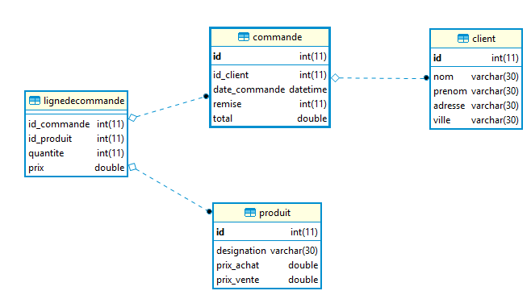

# Phase 1 : Bien débuter : les déclencheurs

## Pré-requis

Les déclencheurs ne peuvent s'appliquer que sur des tables dont le moteur de stockage est transactionnel. 

Le moteur de stockage par défaut lorsqu'une table est créée est `MyIsam`, qui ne supporte pas les transactions. L'autre moteur de stockage le plus utilisé et qui supporte les transaction est le moteur `InnoDB`, il faut donc utiliser celui-ci. 

Pour changer le moteur de stockage d'une table, exécuter la requête 

	ALTER TABLE nom_table ENGINE=nom_du_moteur

Dans notre cas : 

	ALTER TABLE nom_table ENGINE=InnoDB

> Facultatif : en savoir plus sur [les moteurs de stockage](https://www.supinfo.com/articles/single/44-etude-plusieurs-moteurs-stockage-mysql).

## Définition 

Un déclencheur - ou trigger en anglais - est une procédure stockée spéciale qui s'exécute automatiquement lorsqu'un événement se produit dans la base de données. Les événements sont des instructions `INSERT`, `UPDATE` ou `DELETE` qui s'activent au déclenchement (avant ou après) d'un événement valide, que des lignes de table soient affectées ou non (donc pas d'instruction d'appel telle que `CALL` pour les procédures stockées).

> Dans d'autres systèmes de bases de données (SQL Server, Oracle, PostGres), il est possible d'effecuer une commande d'annulation (instruction `ROLLBACK`), dans un trigger, mais pas dans MySql ce qui pose un problème lorsqu'on veut effectuer ce type d'opération. Il existe néanmoins des alternatives plus ou moins pratiques.     

## Création d'un déclencheur

Schéma type d'un déclencheur :

	CREATE TRIGGER nom 
	[MOMENT] [EVENEMENT]  
	ON [table] 
	FOR EACH ROW
	BEGIN
	   -- [requête] 
	END

## Cas pratique

### Création de la base de données de test.

Uitlisez [ce script](commande-produit.sql) pour créér la base de données.

Dans cette base de données, la table `commande` possède un champ `total` pour stocker le total de la commande.

Lorsque vous ajoutez ou modifiez des produits dans la commande (avec la table `lignedecommande`), vous devez penser à recalculer le total de la commande et mettre à jour le champ `total`.

C'est exactement pour ca que les déclencheurs ont été créés.

Nous pourrions mettre en place un déclencheur que la table table `lignedecommande`, qui va se charger de recalculer le total puis mettre à jour la table commande.

	CREATE TRIGGER maj_total AFTER INSERT ON lignedecommande
	FOR EACH ROW
	BEGIN
		DECLARE id_c INT;
		DECLARE tot DOUBLE;
		SET id_c = NEW.id_commande; -- nous captons le numéro de commande concerné
		SET tot = (SELECT sum(prix*quantite) FROM lignedecommande WHERE id_commande=id_c); -- on recalcul le total
		UPDATE commande SET total=tot WHERE id=id_c; -- on stock le total dans la table commande
    END;

### Travail à réaliser

1. Mettez en place ce trigger, puis ajoutez un produit dans une commande, vérifiez que le champ total est bien mis à jour.

2. Ce trigger ne fonctionne que lorsque l'on ajoute des produits, les modifications ou suppressions ne permettent pas de recalculer le total. Comment pourrait-on faire ?

3. Un champ remise était prévu dans la table commande. Comment pourrait-on le prendre en compte ?

## Autres instructions 

* `OLD` et `NEW` : lors de l'exécution d'un trigger, les mots-clés `NEW` et `OLD` sont créés de façon implicite et virtuelle afin de pouvoir manipuler l'état des données avant (`OLD`) et après (`NEW`) son exécution. La syntaxe est `OLD.nom_colonne` / `NEW.nom_colonne`. `OLD` et `NEW` représentent donc la table sur laquelle le déclencheur s'applique.
* `DECLARE` : déclare une variable
* `SET` : affecte une valeur à une variable (une variable commence par le signe `@`)
* `IF…THEN` : écriture de conditions

## Requêtes utiles 

* Pour vérifier l'existence d'un déclencheur, utiliser la commande `SHOW TRIGGERS;` qui affiche la liste des déclencheurs existants dans le système. 

* Modification et suppression : il n'est pas possible de modifier un déclencheur; la solution est donc le supprimer puis le recréer avec de nouvelles règles applicables. Utilisez la commande de suppression `DROP TRIGGER nom_trigger;`

