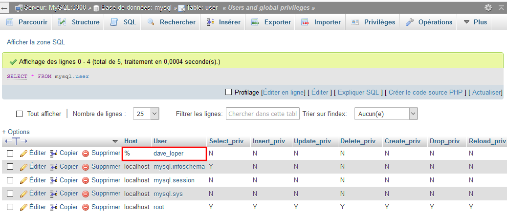

# Créer la base de données > Utilisateurs, privilèges et rôles > Utilisateurs

## 1. Création d'un utilisateur

La création d'un utilisateur se fait grâce à l'instruction `CREATE USER`. La syntaxe complète est la suivante : 

    CREATE USER 'nom_utilisateur'@'adresse_ip' IDENTIFIED BY 'mot_de_passe';

qui signifie créer un utilisateur nommé `nom_utilisateur` autorisé à se connecter depuis l'adresse IP (ordinateur) indiquée et identifié par le mot de passe renseigné. Dans la grande majorité des cas, `'adresse_ip'` aura pour valeur `localhost`, c'est-à-dire l'équivalent de l'adresse IP `127.0.0.1`.
 
**Notez que les valeurs doivent être encadrées par des guillemets simples : '.** 

**Exemple 1**

> Dans le monde réel (que vous rejoindrez bientôt), il convient bien entendu de créer des mots de passe respectant les bonnes pratiques de sécurité !

Création d'un utilisateur nommé _dave\_loper_ avec le mot de passe _1Ksable_ :

	CREATE USER 'dave_loper' IDENTIFIED BY '1Ksable';

La requête suivante permet de lister les utilisateurs :    

	SELECT * FROM mysql.user; 

On remarque :

* que l'utilisateur _dave\_loper_ a bien été créé
* le signe `%` dans la colonne _hosts_ : aucun serveur spécifique n'ayant été spécifié lors de la création de l'utilisteur, celui-ci.    

**Exemple 2**

Création d'un utilisateur nommé _dave\_loper_ avec le mot de passe _1Ksable_ en spécifiant :

> L'instruction `CREATE USER` supporte l'option `IF NOT EXISTS`. 

	CREATE USER IF NOT EXISTS 'dave_loper'@'localhost' IDENTIFIED BY '1Ksable';

Si on affiche à nouveau la liste des utilisateurs, on remarque alors la présence de 2 utilisateurs _dave\_loper_, et ce malgré l'emploi de l'option `IF NOT EXISTS` :

Ceci s'explique par le fait que les serveurs `%`et `localhost` spécifiés ne sont pas les mêmes, ce qui aboutit à 2 utilisateurs différents.   

## 2. Afficher l'utilisateur courant

	SHOW current_user(); 

affiche : `root@localhost`.

## 3. Changer un mot de passe

Pour changer le mot de passe d'un utilisateur, utilisez la syntaxe recommandée depuis MySQL 8 :

	ALTER USER 'utilisateur'@'localhost' IDENTIFIED BY '2Ksable';

Pour les versions antérieures, employez celle-ci :

	SET PASSWORD FOR 'utilisateur'@'localhost' = PASSWORD('2Ksable');	

> L'option `PASSWORD`, qui permet le hachage du mot de passe, a été supprimée sous MySql 8 (retourne une erreur de syntaxe).

## 4. Renommer un utilisateur

	RENAME USER 'ancien'@'localhost' TO 'nouveau'@'localhost'; 

La commande conserve le mot de passe, les privilèges et le rôle de l'utilisateur en question. 

## 5. Suppression d'un utilisateur

	DROP USER 'utilisateur'@'localhost';

> Ne supprimez pas l'utilisateur _root_, ce serait le drame (une réinstallation complète, une !).

    