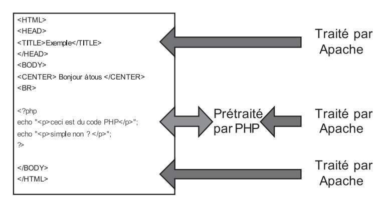
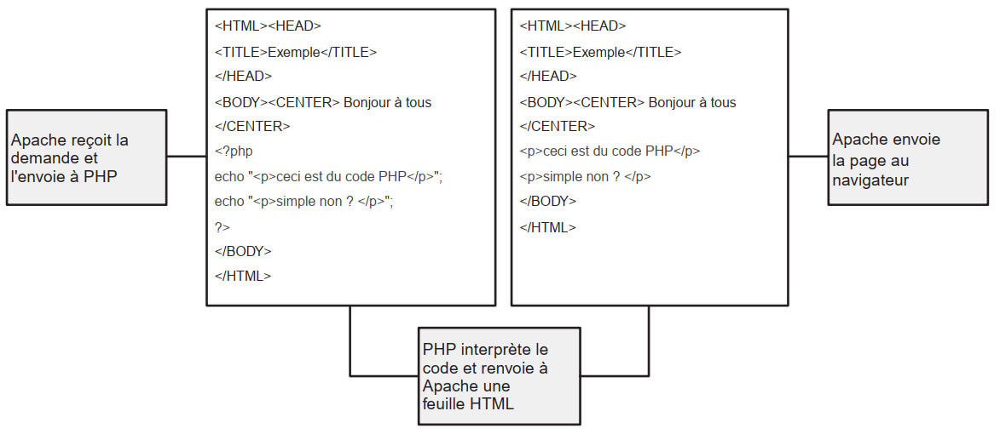

# PHP 01 - Les bases du langage

## Introduction 

**Le PHP, alias _PHP Hypertext Preprocessor_, est un langage de scripts s'exécutant du côté du serveur (comme l'ASP.Net), permettant de générer spécifiquement des pages dynamiques en code HTML.**

* PHP est un langage multi-plateformes disponible dans plusieurs environnements tels qu'Unix, Windows mais surtout Linux. 
* PHP permet de gérer facilement une base de données (souvent MySQL) 
* Robuste et puissant, il ne ralentit presque pas le serveur à moins d'un très grand trafic 

La première version a été mise au point par Rasmus Lerdorf, le langage s'appelait alors, en 1994, _PHP/FI_. 
Cette première version n'avait de grandes ambitions que de pouvoir insérer quelques traitements simples dans une page HTML.

Il est aujourd'hui devenu un langage de programmation de référence dont le succès ne cesse de croître. Ce succès est dû au bon compromis entre puissance et simplicité. Il permet également de gérer une base de données (souvent MySQL). 

PHP est un langage open source (sources et documentation disponibles gratuitement). 

## Pré-requis

* Installation d'un serveur local tel que Wamp

## Structure d'un programme

Pour que le serveur puisse comprendre qu'il va devoir interpréter un script en PHP, il faut : 

* que le fichier contenant le script porte l'extension `.php`, par exemple _index.php_.
* dans le script, indiquer le début du code PHP avec la balise `<?php` et la fin avec la balise `?>` :  

		<html>	
		<body>
		  <?php 
		    ... 
		    Script à exécuter 
		    ... 
		  ?> 
		</body>
		</html>

* pour être exécuté, ce fichier doit être placé sur un serveur de type <abbr title="Apache MySql PHP">A.M.P.</abbr>, par exemple dans le répertoire `C:/wamp/www`, puis lancé (une fois le serveur démarré) via une url, par exemple, sous Wamp : _http://localhost/monscript.php_. 

Dans un script PHP, les parties, identifiées par `<?php … ?>`, seront traitées par l'interpréteur PHP : 

## Les fonctions de base et les pièges à éviter

### L'instruction `echo`

La première instruction que vous allez utiliser en PHP est `echo` : elle permet d'afficher (écrire) à l'écran une chaîne, une variable, un entier etc. :  

	<html>
	<body>
	  <?php 
	      echo"Bonjour le monde"; 
	  ?> 
	</body>
	</html>

> IMPORTANT : une instruction/ligne de code PHP doit toujours se terminer par un point-virgule (comme en Javascript et bien d'autres langages). 

**Exercice**

* Créer un fichier nommé _bonjour.php_
* Pour rappel, pour être exécuté, ce fichier doit être placé dans `le répertoire `C:/wamp/www` 
* Lancer le ficher : `http://127.0.0.1/bonjour.php`

### PHP et HTML

Le langage PHP est un langage qui peut écrire du HTML (mais aussi du CSS ou même du Javascript) de façon dynamique (on parle de générer du flux HTML)  :

**Exemple 1**	

    <?php
	echo"<h1>Bonjour le monde</h1>"; 

Il peut aussi très bien être inséré entre des balises HTML :   

**Exemple 2**	

    <h1><?php echo Bonjour le monde"; ?></h1>     

Entre les 2 solutions, la bonne pratique consiste à :

* s'il y a plus de code PHP que de HTML : c'est le PHP qui écrit le HTML (comme dans l'exemple 1 ci-dessus)
* a contrario, si on doit mettre de temps en autre une instruction PHP : le code PHP est à insérer entre les balises HTML (exemple 2 ci-dessus) 

## Les variables en PHP

* Les variables sont précédées du signe dollar `$`, sauf les constantes et métaconstantes (ces 2 types seront expliquées plus loin). 
* Les règles de nommages sont les mêmes qu'en Javascript : pas d'espaces, pas d'accents, ne peut commncer par un nombre
* Les noms de variables sont sensibles à la casse (majuscules différentes des minuscules) 

### Les types 

En PHP, le type de la variable est déterminé au moment de son initialisation, pas de sa déclaration.

	$a = 12 ; 		// un entier
	$b = "Bonjour"; // une chaîne de caractères

PHP supporte les types suivants : 

* le type `int` (ou `integer`) pour les entiers
* le type `float`, `double` ou `real` pour les nombres décimaux 
* le type `string` pour les chaînes de caractères ;
* le type `boolean`, pour les valeurs booléennes : vrai (`true`) ou faux (`false`) 
* le type `Array` pour les tableaux
* le type `Object` pour les objets

### Concaténation 

Peut-être aussi écrit `echo 'Bonjour le monde'`; (utilisation d'apostrophes au lieu des guillemets doubles) si vous n'utilisez pas de variables à l'intérieur de l'instruction comme vous pouvez le voir ci-dessous. 

A l'intérieur des guillemets doubles, vous pouvez insérer du code HTML, ainsi qu'une variable : à l'affichage à l'écran, la variable sera remplacée par sa valeur car la chaîne est entourée par des guillemets doubles (ce n’est pas le cas lorsque la chaîne est entourée par des apostrophes). 

	$bonjour = "Bonjour le monde"; 
	echo "<b>$bonjour</b>"; 

**Remarque :** 
Si vous souhaitez afficher un guillemet double dans une fonction `echo` encadrant elle-même la chaîne par des guillemets doubles, vous devez utiliser le caractère `\`.

Exemple: 

	echo "Affichage d'un \" "; 

De la même façon vous pouvez inclure les caractères spéciaux suivants afin de gérer notamment une meilleure lisibilité de votre code source (touches `CTRL`+`U` dans un navigateur) :

* `\n` : saut de ligne 
* `\r` : fin de ligne 
* `\t` : tabulation 

**Exemple**

	echo "Bonjour le monde\n"; 

> Vous pourrez parfois rencontrer l'instruction `print` qui permet également d'afficher quelque chose. Bien que proche de `echo`, `print` connaît quelques subtilités de fonctionnement, il est donc recommandé d'utiliser `echo` (dont l'exécution est en outre légèrement plus rapide).   

### Commentaires
 
Les commentaires en PHP sont signalés de la même façon qu'en Javascript : 

* `//` pour commenter une seule ligne
* `/*` et `*/` pour commenter un bloc de plusieurs lignes

## Les opérateurs

### Opérateurs arithmétiques 

* `$a + $b` : addition
* `$a - $b` :	soustraction
* `$a * $b` :	multiplication
* `$a / $b` :	division
* `$a % $b` :	modulo (reste de la division de a par b)
* `$a++` : incrément (Equivalent à `$a = a$ +1`)
* `$a--` : décrément (Equivalent à `$a = a$ -1`)
 
### Opérateurs chaînes de caractères 

Le point `.` réalise une concaténation de deux chaînes de caractères 

    $a = "Winter"; 
    echo $a . " is coming !"; 

Le résultat affiche à l'écran le message : `Winter is coming !`

### Opérateurs d'affectation 

L'opérateur d'affectation de base est = .Qui indique que l'on affecte la valeur à droite de l'opérateur à la valeur de gauche. L'opérateur = peut-être combiné aux opérateurs arithmétiques 

* `$a = 0` : `$a` vaut 0
* `$a = ($b=5) +7` : `$a` vaut 12 (5+7)
* `$a += 4` : `$a` vaut 16 (équivalent à `$a = $a+4`)
* `$a -= 20` : `$a` vaut -4 (équivalent à $a = $a-20`)

Il est possible d'affecter deux valeurs en une seule fois : `$a = $b = 1` affecte 1 aux deux valeurs. 

### Opérateurs de comparaison 

* `$a == $b` : vrai si `$a` est égal à `$b`
* `$a === $b` : vrai si `$a` est égal à `$b` et que `$a` et `$b` sont de même type
* `$a != $b` : vrai si `$a` différent de `$b`
* `$a < $b`	: vrai si `$a` est strictement inférieur à `$b`
* `$a > $b`	: vrai si `$a` est strictement supérieur à `$b`
* `$a <= $b` : vrai si `$a` est inférieur ou égal à `$b`
* `$a >= $b` : vrai si `$a` est supérieur ou égal à `$b`

### Opérateurs logiques 

* `$a and $b` : vrai si `$a` et `$b` sont vraies (ET)
* `$a or $b` : vrai si une des deux valeurs `$a` ou `$b` est vraie (OU)
* `$a xor $b`	: vrai si une des deux valeurs `$a` ou `$b` est vraie, mais pas les deux (OU Exclusif)
* `$a && $b` : vrai si `$a` et `$b` sont vraies (ET)
* `$a || $b` : vrai si une des deux valeurs `$a` ou `$b` est vraie (OU)

### Opérateur ternaire 

Un opérateur **ternaire** permet de faire la même chose qu'une condition `if` mais avec une écriture plus condensée.

> L'utilisation de cette syntaxe est peu recommandée car sa lisibilité est moins facile que des conditions écrites avec `if...else`.  

La syntaxe d'une conditon ternaire est la suivante : 

	(instructions conditionnelles) ? instructions si vrai : instructions si faux

Par exemple, pour tester qu'une personne est majeure, la condition classique serait :

	if ($age>=18)
	{
	   $reponse = "majeur";
	}
	else
	{
       $reponse = "mineur";
	}

La condition ternaire pour faire la même chose s'écrit :  

    (($age >= 18) ? $reponse="majeur" : $reponse="mineur"); 

qui se lit est-ce que `$age >= 18` , si oui, `$reponse = "majeur"`, si non, `$reponse = "mineur"`

Soit dans un exemple complet :

    $age = 25; 

    (($age >= 18) ? $reponse="majeur" : $reponse="mineur"); 
    
    echo "Vous êtes ".$reponse. "."; 

Dans cet exemple, `$reponse` vaut `"majeur"` car `$age` est supérieur à 18. L'affichage à l'écran sera donc : `Vous êtes majeur`. On peut même économiser la variable `$reponse` et un peu de code en le réécrivant directement dans une instruction `echo` comme ci-dessous :

    $age = 25;
 
    echo "Vous êtes ".(($age >= 18) ? "majeur" : "mineur"). "."; 

## Les variables

> En PHP, toutes les variables sont précédées du signe `$`, 

Les variables peuvent être de **5 types** et n'ont pas besoin d'être déclarées.

* Les chaînes de caractères (variables alphanumériques)
* Les entiers (variables numériques)
* Les tableaux
* Les objets
* Le type booléen

Quelques généralités importantes sur les variables.

* La portée d'une variable
* Les variables variables
* Les variables en provenance d'un formulaire
* Forcer le type d'une variable
* Les variables système

### Les chaînes de caractères (variables alphanumériques)

Leur valeur peut contenir des chiffres, des lettres ou des symboles. 

Exemple d'utilisation :
    
    $variable = "Afpa";

La valeur de la variable pourra être affichée très simplement. Exemple :

    echo $variable;

Le `;` (point-virgule) marque la fin d'une instruction et doit être utilisé à la fin de chacune d'entre elles. Si vous l'omettez, le serveur retournera une erreur.

### Les entiers (variables numériques) 

Une variable numérique peut contenir, soit un nombre entier, soit une décimale. 

Exemple :

	$var1 = 123;
	$var2 = 14.35;

### Les tableaux 

> Le fonctionnement des tableaux en PHP est proche de celui des tableaux en Javascript. 
 
Un tableau est l'équivalent d'un ensemble (liste) de valeurs. 

On trouvera donc par exemple :

	$couleur[0] = "red";
	$couleur[1] = "blue";
	$couleur[2] = "white";
	$couleur[3] = "black";

> Important : En PHP (comme dans la plupart des langages informatiques), le premier élément d'un tableau est numéroté 0 et non 1.

Lorsqu'on affecte une valeur, on peut oublier l'indice. Par contre, pour récupérer cette valeur, on sera obligé de le préciser. 

**Exemple :**

	$couleur[] = "red";
	$couleur[] = "blue";
	$couleur[] = "white";
	$couleur[] = "black";

	// pour afficher la valeur "white", on écrira :
	echo $couleur[2]

> Une séquence complète sera consacrée aux tableaux et aux fonctions PHP permettant de les manipuler.  

### Les objets 

> Une séquence complète sera consacrée aux objets et à la Programmation Orientée Objet (P.O.O.).   

### Le type booléen 

Une variable de type booléen ne preux prendre que 2 valeurs : `true`, pour _vrai_ ou `false`, pour _faux_.

Pour déclarer une variable comme booléenne, il suffit de ui attribuer l'une de ces 2 valeurs :   

	$var1 = false;
    $var2 = true;

### La portée d'une variable 

Une variable définie au sein d'une fonction n'est pas accessible en dehors de celle-ci. De même une variable définie en dehors d'une fonction n'est pas accessible par celle-ci. On appelle cela la portée d'une variable. 

Pour donner accès à une variable le PHP met à votre disposition deux déclarations : `global` et `static` 

	$a = $b = 2;
 
	function somme() { 
       $c = $a + $b; 
	   echo "$c"; 
	} 

	somme(); 

Dans cette exemple, la valeur affichée sera 0 car les deux variables `$a` et `$b` ne sont pas connues à l'intérieur de la fonction `somme()`. 

Pour les utiliser dans la fonction, il faut les déclarer comme variables globales 

	$a = $b = 2; 
	
	function somme() { 
	  global $a, $b; 
	  $b = $a + $b; 
	} 

	somme(); 

	echo $b." ";  

L'instruction `static` sert dans le corps de la fonction à conserver la valeur d'une variable 

	function Test() { 
	   $a=0; 
	   echo $a." "; 
	   $a++; 
	} 

	// Appel de la fonction (2 fois)
	Test(); 
	Test(); 

Dans cette exemple nous faisons appel à une fonction qui initialise la variable `$a` à 0, puis incrémente celle-ci après un affichage. Le problème est qu'à chaque appel de la fonction celle-ci repasse à 0, car la variable n'est pas stockée et s'initialise à chaque rappel de la fonction 
 
    function Test1 () 
    { 
       static $a=0; 
       echo "$a "; 
       $a++;
    } 

    // Appel de la fonction (3 fois)
    Test1(); 
    Test1(); 
    Test1(); 

Cette fois la variable reste stockée et affiche 0 puis 1,2,3... 

[Documentation](http://php.net/manual/fr/language.variables.scope.php#language.variables.scope.static)

### Les "variables variables" 

Il est possible de créer une variable à partir de la valeur d'une autre variable; c'est-à-dire que la variable créée prend le nom de la valeur d'une première variable. Ceci se fait en préfixant le nom de la 1ère variable par deux signes `$`. 

Un exemple pour bien comprendre :   

	$var1 = "bonjour";
	$$var1 = "le monde"; 

La seconde ligne créé une variable du nom de la valeur de `$var1`, c'est-à-dire qu'on a désormais une variable `$bonjour`, à laquelle on a affecté la valeur `le monde`.    
    
Vérifions : `echo $bonjour;` affiche _le monde_.  

### Les variables superglobales 

Les [variables superglobales](https://www.php.net/manual/fr/language.variables.superglobals.php) sont des variables internes qui sont toujours disponibles, quel que soit le contexte (elles peuvent toutefois être désactivées - une à une - par la configuration du PHP).  

Les superglobales sont préfixées à la fois par les signes `$` et `_` (trait souligné ou _underscore_).

Une superglobale se comporte comme un tableau :

	$_GET["societe"] = "Afpa";
    echo $_GET['societe"]; // Affiche 'Afpa' 

Liste des superglobales PHP :

* `$_SERVER` : contient des informations sur la configuration PHP et script (fichier) en cours d'exécution
* `$_GET` : retourne une paire clé/valeur passée par une requête HTTP de type GET (notamment dans les URL)
* `$_POST` : retourne une paire clé/valeur passée par une requête HTTP de type POST (notammeent dans un formulaire)
* `$_FILES` : retourne les informations d'un fichier chargé dans un formulaire (champ de type `file`)  
* `$_COOKIE` : définit et/ou retourne les informations contenues dans un cookie
* `$_SESSION` : définit et/ou retourne les informations d'une session
* `$_REQUEST` : donne les informations d'une requête HTTP de type _GET_ ou _POST_, quand on ignore dans quel type la requête HTTP a été envoyée (équivalent de `$_GET` et `$_POST`)    

### Forcer le type d'une variable 

Il peut-être intéressant de forcer le type d'une variable dans certaines situations. Pour cela, on utilise la fonction `settype()` :

	$a = 15.125863;
	settype($a, "integer"); 
    echo $a; 

`$a` vaut désormais 15, car la valeur décimale initiale a été convertie en un entier (perte des décimales). 

Vous pouvez aussi forcer le type en : 

* `integer` ou `int` : conversion en entier 
* `string` : conversion en chaîne 
* `real` : conversion en double 
* `array` : conversion en tableau 
* `object` : conversion en objet 

Il est possible de convertir une chaîne sans l'affecter par les expressions `strval`, `intval` et `doubleval` 

Exemple :
 
	$a = 6.32172; 
	$b = intval($a); 
	$c = doubleval($a); 
	echo $a - $b - $c; 

Ce qui donne : `6.32172 - 6 - 6.32172` 

## Les constantes 

Une constante est une variable dont la valeur ne change **jamais** dans toute l'application; elle n'est donc définie qu'une seule fois et à un seul endroit dans le code. 

Une variable constante est déclarée via la fonction `define("NOM_DE_LA_VARIABLE", valeur)` qui prend en argument le nom de la varibale et sa valeur. Par convention, le nom de la variable s'écrit **en majuscules**.    

L'exemple classique est la valeur de l'euro, qui donc ne change jamais; ici `EURO` sera le nom de la variable constante :

	define("EURO", 6.55957);
    echo EURO; // affiche 6.55957
 
### Les métaconstantes et les fonctions de débogage

En PHP, il existe une dernière catégorie de constantes, appelées métaconstantes, qui permettent d'obtenir des informations sur le fichier et la ligne courante.  

Celles-ci peuvent donc être utiles au débogage :

* `__FILE__` : indique dans quel fichier on se trouve (peut être utilisé hors des classes, dans n'importe quel fichier PHP). Dans la même veine, `__LINE__` donne le numéro de ligne.
 
Exemple : `echo"Fichier : ".__FILE__", ligne : ".__LINE__;`   

**La fonction `var_dump()`**

La fonction `var_dump()` permet d'afficher des informations (nom, type, valeur, longueur/nombre d'éléments si tableau) sur n'importe quelle variable, tous types compris (scalaire, tableau, objet...) :

	$myVar = "bonjour";
	var_dump($myVar);

donne :  

	C:\wamp\www\bonjour.php:3:string 'bonjour' (length=7)

**La fonction `error_log()`**

La fonction `error_log()` permet d'ajouter volontairement des informations (messages d'erreurs personnalisés) au fichier `php_error.log` contenant les logs natifs de PHP, situé dans `C:/wamp/logs` :

    $myVar = "KO";

    if ($myVar == "OK") 
    {	
       echo"C'est bon ";
    } 
    else 
    {
        echo"Ouh la la pas bien ! "; // Message affiché dans la page web
        error_log("Ouh la la pas bien"); // Message enregistré dans le fichier 'C:/wamp/logs/php_error.log' 
    } 

> ATTENTION, la fonction `error_log()` ne doit pas contenir de code HTML ou autre.

Ouvrez le fichier `C:/wamp/logs/php_error.log` et descendez jusqu'au dernier message, vous devriez y trouver un _Ouh la la pas bien_ qui ne nous renseigne cependant pas sur la localisation de l'erreur. 

Dans le script précédent, remplacez les 2 lignes du `else` par les gnes suivantes et relancez votre script :

		echo"Ouh la la pas bien ! "; // Message affiché dans la page web
        $message = "Ouh la la pas bien ".__FILE__." ".__LINE__;        
        error_log($message); 
  
Cette fois, le message d'erreur enregistré dans php_error.log indique le chemin complet du fichier _bonjour.php_ et le numéro de ligne du code exécuté. On eput ainsi construire un système de gestion/logs d'erreurs.

### Les variables système 

Les variables système sont des variables dont la valeur est définie par le serveur. Vous n'avez pas à affecter cette valeur et ne pouvez pas la modifier. 

**Toutes ces variables sont contenues dans la superglobale `$_SERVER`.**

Exemples :
 
* `echo $_SERVER["SERVER_NAME"];` : affiche le nom de l'hôte (= serveur), `localhost` pour Wamp
* `var_dump($_SERVER)` : affiche toutes les variables du tableau `$_SERVER`

> Testez ces 2 exemples

Parmi les variables du tableau `$_SERVER`, celles-ci vous seront utiles : 

| Variables  | Description  | Exemples de valeur  |  
|------------|--------------|---------------------|
| `DOCUMENT_ROOT` | Adresse physique du répertoire contenant le répertoire par défaut.  | `c:/wamp/www` |
| `HTTP_ACCEPT_LANGUAGE`  | Pays d'origine du visiteur sous forme de code de 2 lettres.  | `fr` |
| `HTTP_REFERER` | L'adresse de la page (si elle existe) qui a conduit le client à la page courante  | `http://localhost/jarditou/liste.php` |
| `HTTP_USER_AGENT` | Nom et version du navigateur utilisé par le visiteur (client) | `Mozilla/5.0 (Windows NT 10.0; Win64; x64) AppleWebKit/537.36 (KHTML, like Gecko) Chrome/70.0.3538.77 Safari/537.36` |
| `REMOTE_ADDR` | Adresse IP du visiteur qui consulte la page. | `200.10.41.214` |
| `SCRIPT_FILENAME` | Le chemin absolu jusqu'au script courant  | `c:/wamp/www/jarditou/index.php` | 
| `SERVER_ADDR` | Adresse IP du serveur  | (sous Wamp : `127.0.0.1` en IPv4 ou `::1` en IPv6 |
| `SERVER_NAME` | Le nom du serveur hôte qui exécute le script suivant. Si le script est exécuté sur un hôte virtuel, ce sera la valeur définie pour cet hôte virtuel   | `localhost` |
| `SERVER_PORT` | Le port de la machine serveur utilisé pour les communications. Par défaut, c'est '80'; en utilisant SSL, par exemple, il sera remplacé par le numéro de port HTTP sécurisé. | `80` |
| `REQUEST_METHOD` | Méthode de requête utilisée pour accéder à la page  | `GET`, `POST` |
| `QUERY_STRING` | La chaîne de requête, si elle existe, qui est utilisée pour accéder à la page | `page=1&categorie=2` |
| `DOCUMENT_ROOT ` | Chemin depuis la racine (root) vers le fichier (document) | `C:/wamp/www` |
| `REQUEST_URL` | L'URL qui a été fournie pour accéder à cette page | `/admin/index.php?to=phpinfo` |
| `SCRIPT_NAME` | Contient le nom du script courant. Cela sert lorsque les pages doivent s'appeler elles-mêmes | `/admin/index.php` |
| `REQUEST_TIME` | Heure de début de la requête (= timestamp = timbre de temps), exprimé en secondes depuis le 01/01/1970) | `1542022030` |

[Documentation](http://php.net/manual/fr/reserved.variables.server.php)

### Les fonctions `printf` et `sprintf`

Les fonctions `printf` et `sprintf` servent au formatage de chaînes. 

**Exemples** 

	<html>
	<body>
    <?php
      $euro = 6.55957;
      printf("%.2f FF ",$euro);
      
      $money1 = 68.75;
      $money2 = 54.35;
      $money = $money1 + $money2;
      
      echo $money; // affiche 123.1;
      
      echo "affichage sans printf : ".$money." ";
      
      $monformat = sprintf("%01.2f", $money);
      
      echo $monformat; // affiche 123.10
      
      echo "affichage avec printf : ".$monformat." ";
      
      $year = "2002";
      $month = "4";
      $day = "5";
      
      $date = sprintf("%04d-%02d-%02d", $year, $month, $day);
      
      echo $date" "; // affichera "2002-04-05"
      echo "affichage avec sprintf : ".$date" ";
    ?>

## Exercice

Ecrivez un script qui affiche l'adresse IP du serveur et celle du client.