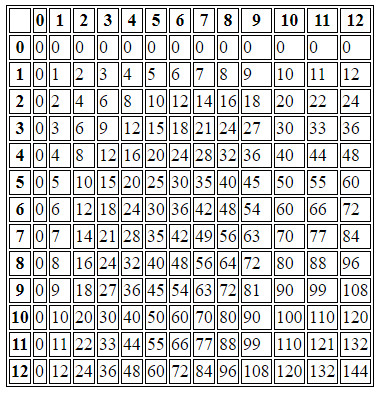

# PHP 03 - Les boucles

## Instruction `for`

L'instruction for est très proche de while dans le principe, mais reste plus compacte dans son code. 

La syntaxe générale est : 

	for (iInitialisation de variable; condition; incrémentation) 
	{ 
	    instructions ; 
	} 

Exemple : 

	for ($a = 1; $a < 10; $a++) { 
	    echo $a." "; 
	} 

Dans cet exemple la boucle exécute `echo $a` jusqu'à atteindre `$a = 9` avec une incrémentation à chaque passage. 
 
## Instruction `foreach`

> L'instruction `foreach` sera abordée dans la séquence suivante sur les tableaux. 

## Instruction `while` 

L'instruction `while` est une boucle qui s'exécute tant que la condition est vraie.

La syntaxe générale est : 
	
	while ( condition ) { 
    	Instuctions ; 
	} 

Exemple : 

	$a = 1; 

	while ($a < 10) { 
    	echo $a." ";  
    	$a++; 
	} 

Le résultat sera un affichage de 1 à 9. 

## Instruction `do .. while` 

L'instruction `do .. while` est similaire à `while` à une exception près, la condition est vérifiée à la fin de la boucle.

	$a = 0; 

	do { 
	    echo $a." ";  
	} while ($a > 0); 

Une autre façon d'utiliser cette boucle est de réaliser une boucle sans fin. 

	do { 
	    if ($a < 5) { 
	        echo "a inférieur à 5"; 
	        break; 
	    } 
	    if ( ) ....... 
	} while (1); 

Pour sortir de la boucle il faut qu'une des conditions soit remplie, ce qui aura pour effet d'exécuter l'instruction `break;` qui permet de sortir de la boucle. 

## Exercices

### Exercice 1

Ecrire un script PHP qui affiche tous les nombres impairs entre 0 et 150, par ordre croissant : 1 3 5 7...

### Exercice 2

2. Écrire un programme qui écrit 500 fois la phrase _Je dois faire des sauvegardes régulières de mes fichiers._

### Exercice 3

3. Ecrire un script qui affiche la table de multiplication totale de {1,...,12} par {1,...,12}, le résultat doit être le suivant :

