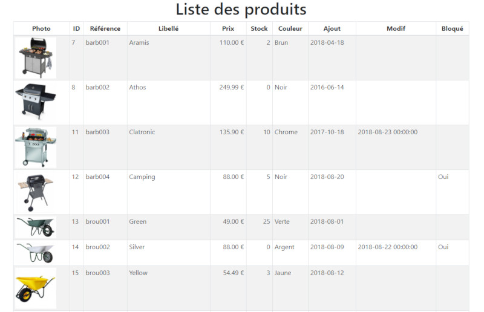

# PHP - 07 - PDO - Atelier 4 : Gestion CRUD avec PHP PDO

Qu'est-ce que le _CRUD_ ?

CRUD est un acronyme pour _Create, Read, Update Delete_ : 

* _Create_ : créer/ajouter un enregistrement dans une table de la base de données = `INSERT INTO`
* _Read_ : lire un ou des enregistrement(s) = `SELECT` 
* _Update_ : mettre à jour/modifier un ou des enregistrement(s) `UPDATE` 
* _Delete_ : supprimer un ou des enregistrement(s) = `DELETE`

## Objectif  

De nombreux sites utilisent le principe dit du _maître-détail_, des écrans qui permettent de gérer des listes d'objets de toutes sortes (exemples : des options, des subdivisions, etc.). Il en existe différents types. Le maître-détail comprend deux parties : 

* un écran de liste, contenant le résumé des informations de tous les objets de la liste
* un écran de détail, qui décompose champ par champ les informations d'un élément de la liste.

## Présentation du résultat final

La première page du site doit afficher la liste des produits se trouvant dans la base de données : 

Le nom du produit (libellé) doit être cliquable (lien HTML) pour permettre d'afficher le formulaire de détail ci-dessous : 

 
* Le lien _Retour à la liste_ nous permet de revenir à la page du sommaire.
* Le lien _Modifier_ nous permet d'afficher le formulaire de modification ci-dessous :

## Exercice 1 : Création d'une bibliothèque de connexion

Certaines fonctions comme la connexion à votre base de données personnelle peuvent être utilisées par toutes les pages de votre site. 

Pour vous faciliter la tâche et alléger ces pages, il convient d'écrire ces fonctions dans un fichier externe (cf. Atelier 1) qui sera ensuite inclus dans tous les scripts à venir. 

On crée de cette façon le fichier `connexion_bdd.php` avec le code suivant :

	<?php
	function connexionBase()
	{
	   // Paramètre de connexion serveur
	   $host = "localhost";
	   $login= "root"; 	// Votre loggin d'accès au serveur de BDD 
	   $password="";	// Le Password pour vous identifier auprès du serveur
	   $base = "jarditou";	// La bdd avec laquelle vous voulez travailler 

	   try 
       {
	        $db = new PDO('mysql:host=' .$host. ';charset=utf8;dbname=' .$base, $login, $password);
	        return $db;
	    } 
        catch (Exception $e) 
        {
	        echo 'Erreur : ' . $e->getMessage() . ' ';
	        echo 'N° : ' . $e->getCode() . ' ';
	        die('Connexion au serveur impossible.');
	    } 
	}
	?>

A ce niveau, si vous déclenchez une erreur, celle-ci sera interceptée par l'instruction `catch`, le texte associé à celle-ci sera affiché, puis le `die()` arrêtera l'exécution du script. 

Le message d'erreur pourra être personnalisé pour chaque erreur (serveur, bdd, etc…) ou encore tracé dans un fichier log. 

La fonction `connexionBase()` envoie ensuite l'identifiant de connexion à la base personnelle directement à la page qui a demandé la connexion. Pour cela, on utilise la fonction `return()`.
 
## Exercice 2 : Détails des enregistrements
 
Cette page doit afficher tout le détail d'un produit, la clé primaire du produit (`pro_id`) est transmise dans l'url via la méthode `GET`.

Reprenez le squelette de la page ci-dessous

     <!DOCTYPE html>
	 <html lang="fr">
	 <head>
         <meta charset="UTF-8">
	     <title>Atelier PHP N°4 - page de détail</title>
	     <?php	 
	     require "connexion_bdd.php"; // Inclusion de notre bibliothèque de fonctions
	 
	     $db = connexionBase(); // Appel de la fonction de connexion
	     $pro_id = $_GET["pro_id"];
	   $requete = "SELECT * FROM produits WHERE pro_id=".$pro_id;
	 
	    $result = $db->query($requete);
	 
	    // Renvoi de l'enregistrement sous forme d'un objet
	    $produit = $result->fetch(PDO::FETCH_OBJ);
	   ?>
	 
	   </head>
	   <body> 
	   <?php echo $produit->pro_libelle; ?> référence <?php echo $produit->pro_ref; ?>
	    
	   <?php echo $produit->pro_description; ?>
	    
	   <?php echo $produit->pro_prix; ?>
	   </body>
	 </html>

* Ligne 7 : nous incluons la bibliothèque `connexion_bdd` au script.	
* Ligne 9 : la connexion est maintenant établie grâce à la fonction `connexionBase()`. 
* Ligne 10 : récupération de la variable `$pro_id` transmise en paramètre dans le lien sur le libellé de produit, donc via `$_GET`. 

Ce principe restera valable pour l'ensemble de nos pages. Le reste du script ne doit pas poser de problème.

Cette page sera enregistrée sous le nom `detail.php`.

Faites un essai avec un id existant et un id inexistant. L'url doit se terminer par la forme suivante : `?id=7` 
 
## Exercice 3 : Affichage de la liste des enregistrements

Ecriture d'une requête SQL pour la liste
Une fois ces modifications effectuées, nous allons voir l'affichage de la liste des liens. 
Il nous faut pour cela créer une requête SQL spécifique qui remontera une liste d'enregistrements et non plus un objet unique. Elle a la forme suivante : 

	SELECT pro_id, pro_cat_id, pro_ref, pro_libelle
	FROM produits 
	WHERE ISNULL(pro_bloque) 
	ORDER BY pro_d_ajout DESC

Nous ne voulons pas ici trouver tous les champs de la ligne comme précédemment (`SELECT *`).
 
Si le nombre de colonnes était très important, et si le nombre d'enregistrements trouvés était très important, cette requête prendrait beaucoup trop de place en mémoire. 

Nous restreindrons donc notre choix à quelques champs (`pro_id`, `pro_cat_id`, `pro_ref` et `pro_libelle`). Il suffit alors de spécifier leurs noms, séparés par des virgules.

Le critère contenu dans la clause `WHERE` diffère lui aussi de celui que nous avons déjà créé. Il s'agit ici de trouver tous les enregistrements dont l'affichage est autorisé. Nous allons pour cela vérifier la valeur du champ `pro_bloque`. Si celle-ci est égale à `NULL`, nous rapatrierons les champs voulus de l'enregistrement. La clause a donc la forme `WHERE ISNULL(pro_bloque)`.

Enfin, nous allons décider d'un ordre de tri pour les différents enregistrements trouvés. Nous répertorions ceux-ci par ordre chronologique décroissant, le plus récent apparaissant en premier. 
On utilise pour cela la clause `ORDER BY` associée au champ date. L'attribut `DESC` précise que le tri doit être décroissant (date d'ajout la plus récente en premier). 

Nous allons maintenant utiliser cette requête pour écrire la liste de nos différents articles dans un tableau HTML. Ce qui fera l'objet d'une nouvelle page `liste.php` :

	<!DOCTYPE html>
    <html lang="fr">
	<head>
    <meta charset="UTF-8">
	<title>Atelier PHP N°4 - Affichage de la liste</title>
	</head>
	<body> 
    

	<?php
	require "connexion_bdd.php"; // Inclusion de notre bibliothèque de fonctions
	$db = connexionBase(); // Appel de la fonction de connexion
	$requete = "SELECT pro_id, pro_ref, pro_libelle FROM produits WHERE ISNULL(pro_bloque) ORDER BY pro_d_ajout DESC";
	 
	$result = $db->query($requete);
	
    if (!$result) 
    {
	    $tableauErreurs = $db->errorInfo();
        echo $tableauErreur[2]; 
	    die("Erreur dans la requête");
	}
	   
    if ($result->rowCount() == 0) 
    {
	   // Pas d'enregistrement
	   die("La table est vide");
	}
	      
    echo "<table>";
	 
	while ($row = $result->fetch(PDO::FETCH_OBJ))
	{
	    echo"<tr>";
	    echo"<td>".$row->pro_id."</td>";
	    echo"<td>".$row->pro_ref."</td>";
	    echo"<td><a href=\"detail.php?id=".$row->pro_id."\" title=\"".$row->pro_libelle."\"></a></td>";
        echo"</tr>";
	}
	 
	echo "</table>"; 
	?>
	</body>
	</html> 
 
* Ligne 7 : on commence notre page avec un _container_ Bootstrap 
* Lignes 9-10 : on charge et on utilise la librairie de connexion à la base de données 
* Ligne 12 : on exécute une requête SQL pour obtenir la liste des enregistrements de la table _produits_
* Ligne 14 : on stocke le résultat de la requête, qui est un tableau d'objets, dans la variable `$result`   
* Ligne 15-22 : 2 conditions; si la variable `$result` vaut `NULL` (utilisation du signe `!` pour exprimer le contraire) ou n'a pas de résultat (méthode `rowCount` ligne 20), on affiche un mesage d'erreur pour chaque cas.
* Ligne 24 : on ouvre un tableau HTML car les résultats - les informations sur les produits de notre liste - vont être affichés sous cette forme.
* Ligne 26 : on débute une boucle `while` : tant qu'un enregistrement est présent dans la variable `$result`, on va afficher des informations. La présence d'un enregistrement est vérifiée grâce à la fonction `fetch(PDO::FETCH_OBJ)` qui lit le premier enregistrement trouvé par la requête SQL, puis le supprime puis lit le suivant et ainsi de suite... Quand il n'y a plus d'enregistrement disponible, elle renvoie la valeur 0, ce qui provoque l'arrêt de la boucle. Il est possible de remplacer l'instruction `while` par [`foreach`](http://php.net/manual/fr/control-structures.foreach.php).
* Lignes 28-32 : le reste de la boucle ne concerne que l'affichage formaté en HTML (ici des lignes et cellules de tableau donc) des informations des produits : pour chaque enregistrement, nous construisons une ligne de tableau contenant une colonne par cellule. 

A noter la construction qui va créer le lien vers l'url de la page détail d'un produit réalisée dans l'exercice 2 : on a fait un lien HTML grâce à la balise `<a>` en lui passant la propriété `pro_id` de l'objet en cours de lecture. 

> Le code ci-dessus est volontairement simplifié par rapport à la copie d'écran : moins de colonnes/informations sur les produits, absence des photos, dates non formatées... mais vous devrez cependant bien prendre en compte ces points dans la réalisation de vos pages.

## Exercice 4 : Création d'un formulaire d'ajout

Afin de pouvoir alimenter votre base de données, vous devez créer un formulaire et l'appeler par exemple `produits_ajout.php`.

* Ce formulaire doit permettre de saisir toutes les informations, c'est-à-dire chaque colonne de la table _produits_.

* Nous verrons ultérieurement comment charger le fichier photo. Pour le moment, contentez-vous de renseigner seulement l'extension avec un simple champ de type texte. 
 
* Un clic sur le bouton _Envoyer_ déclenche l'appel de la page `produits_ajout_script.php`.

Ce script effectue les actions suivantes :

1. Récupération et vérification des informations transmises par le formulaire
2. Enregistrement des données dans la base
3. Redirection vers la liste. Cette redirection s'effectue à l'aide de la fonction `header("Location:liste.php");`

A vous de jouer !