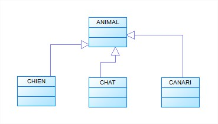
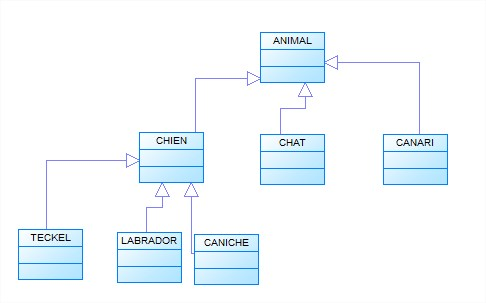

# PHP - 12 : Programmation orientée objet (P.O.O.)

> Demander [une présentation](reveal_poo/index.html) à un formateur.

## Préambule

Il existe plusieurs moyens de conceptualiser un programme informatique. L’approche classique consiste à considérer un programme comme une série d'instructions exécutées séquentiellement, ce qu'on a l'habitude d'appeler "programmation procédurale".

PHP, comme d'autres langages de programmation, est un lagage "orienté objet". C'est là plus qu'un concept à la mode. C'est une véritable philosophie de la programmation. La programmation orientée objet est une façon d'élaborer des programmes informatiques qui tend à refléter la manière dont les objets à gérer sont assemblés et en communication dans le monde réel. Ainsi, une voiture est un ensemble complexe de composants en interactions les uns avec les autres mais elle forme un tout cohérent, capable d’agir (démarrer, freiner…), et doté de caractéristiques propres (sa couleur, son numéro d’immatriculation, sa vitesse…).

Pour parvenir à ce type de représentation du monde réel, la logique de programmation orientée objet s’appuie sur quelques principes qu’il s’agit ici de découvrir, avant de pouvoir les mettre en œuvre. Bien entendu, comme toute technologie, la programmation orientée objet introduit un nouveau vocabulaire, correspondant aux concepts sousjacents, auquel il faudra bien se familiariser…
Nous aborderons les sujets suivants :

- l'organisation des programmes en éléments appelés classes et l'utilisation de ces **classes** pour définir des **objets** manipulables par programmation,
- la définition d'une classe sous les deux aspects de sa **structure**: le **comportement** qu'elle doit avoir et ses attributs, ses **données**,
- les relations entre les classes comme **l’héritage**, qui permet à une classe bénéficier des fonctionnalités d'une autre classe,
- les différents types **d’association entre objets**.

## Penser en terme d'objet

### Présentation des notions d'encapsulation, de classe et d'objet

**Un objet est un ensemble cohérent rassemblant des données et du code travaillant sur ces données**. Le premier principe de l’orienté objet, **l’encapsulation**, se rapporte à cet **ensemble indissociable de données et traitements sur les données**.

**Une classe peut être considérée comme un moule à partir duquel on peut créer des objets**, chaque objet représentant un objet du monde réel à gérer par le programme. Ainsi, une classe `Vehicule` décrit les données et les actions que peut exécuter toute voiture et chaque voiture à gérer sera un exemplaire (une ‘instance’) de cette classe `Vehicule`.

**Une classe décrit la structure interne d'un objet** : les **données** qu'il regroupe, les **actions** qu'il est capable d'assurer sur ses données.

**Le développeur écrit donc le code des classes, mais à l’exécution, ce sont les objets, instances des classes, qui réalisent les opérations.**

    class Vehicule
    {
        public $_marque;
        public $_puissanceFiscale;
        public $_vitesseMax;
        protected $_vitesseCourante;

        public function demarrer()
        {
        }
        public function accelerer(int $nbKm)
        {
        }
        public function avancer(int $nbKm)
        {
        }
        public function reculer(int $nbKm)
        {
        }
    }

Prenons l'exemple d'une classe donc `Vehicule`, caractérisée par 4 données (ces données sont apelées **attributs**) :

* sa marque, `$_marque`
* sa puissance fiscale, `$_puissanceFiscale`
* sa vitesse maximale, `$_vitesseMax` 
* sa vitesse courante, `$_vitesseCourante`

Toutes ces données sont **représentatives d'un véhicule particulier**, autrement dit, chaque objet véhicule aura sa propre copie de ses données : on parle alors **d'attribut d'instance**.

Si un programme doit manipuler deux véhicules, il instanciera deux objets depuis cette classe `Vehicule`; **l'instanciation permet de passer de la classe (moule à objets) à l'exemplaire (objet)** ; on peut considérer que l’instanciation est l'opération qui 'donne vie' à l'objet ; en PHP, on instancie un objet grâce au mot-clé `new`.

Le même raisonnement s'applique directement aux méthodes. Prenons par exemple la méthode `demarrer()`. Il est clair qu'elle s'applique individuellement à chaque véhicule. En outre, cette méthode va clairement utiliser ou modifier les attributs d'instance de l'objet auquel elle va s'appliquer, par exemple la `vitesseCourante` du véhicule en question. C'est donc une **méthode d'instance**.

Nous constatons que la création/instanciation d'un nouvel objet est constituée de deux phases :

* une phase du ressort de la classe (et du système d'exploitation) : allouer de la mémoire pour le nouvel objet et lui fournir un contexte d'exécution,
* une phase du ressort de l'objet : initialiser ses attributs d'instance.

En langage PHP ces opérations sont réalisées dans une **méthode spéciale** : le constructeur de la classe, qui est appelé automatiquement par l'opérateur `new`.

Le constructeur doit être déclaré avec la méthode suivante : `__construct()` et peut recevoir des arguments.

> Le constructeur est facultatif en PHP (mais obligatoire dans certains langages).

### Exemple

    class Vehicule
    {
        public $_marque;
        public $_puissanceFiscale;
        public $_vitesseMax;
        protected $_vitesseCourante;

        // Définition du constructeur de la classe Vehicule
        function __construct($marque, $puissanceFiscale, $vitesseMax, $vitesseCourante)
        {
            $this->_marque = marque;
            $this->_puissanceFiscale = puissanceFiscale;
            $this->_vitesseMax = vitesseMax;
            $this->_vitesseCourante = 0;
        }
    }

**Exemple d'instanciation :**

    // Instanciation d'un vehicule
    $maVoitureDeFonction = new Vehicule("Lotus", 11, 230, 90);

### Présentation des notions d'héritage et de hierarchie de classes

Le deuxième principe de l'orienté objet, **l'héritage**, est **que l'on peut définir des classes à partir d'autres classes, ce qui évite de tout réécrire** quand des classes ont des caractéristiques ou des actions en commun.

L'héritage est un concept majeur de la programmation orientée objet; c'est un mécanisme permettant à une classe d'hériter de (de pouvoir utiliser) toutes les méthodes et attributs d'une autre classe.

Prenons un exemple. Si notre problème concerne les animaux, nous pouvons créer une classe que nous appellerons `Animal`.

Si nous devons considérer les chiens, les chats et les canaris, nous créerons trois classes dérivées de la classe `Animal` : les classes `Chien`, `Chat` et `Canari`. Peu importe que cette division ne soit pas pertinente dans l'univers réel. Il suffit qu'elle le soit dans celui du problème à traiter. Nous représenterons cette division de l'univers de la façon suivante :

Un chien est bien un animal particulier ; on dit que la classe Chien **hérite**, **étend** ou **dérive** de la classe `Animal`; Ainsi la classe Animal est une généralisation des classes Chien, Chat et Canari.

L'héritage dénotant une relation de généralisation / spécialisation, on peut traduire toute relation d'héritage par la phrase : « La classe dérivée **est une** version spécialisée de sa classe de base ».

On parle également de **relation est-un** pour traduire le principe de généralisation / spécialisation. Ici, un chien est bien un animal, une sorte d’animal.

Bien entendu, chacune des classes symbolisées ci-dessus est dotée d'attributs et méthodes mais en y regardant de plus près, un animal, comme un chien ou un chat est capable de `seNourrir()`, `seDeplacer()` et est doté au moins d'un `nom`. Avec le mécanisme d’héritage, **ces attributs et méthodes communs seront décrits uniquement dans la classe `Animal` chacune des classes dérivées en héritant automatiquement**. Il ne reste à écrire dans les classes spécialisées que ce qui est réellement spécifique : `ronronner()` et `miauler()` pour un `chat`, `aboyer()` pour un `chien`, ou encore `siffler()` pour un `canari`, par exemple.

Nous pouvons, si nécessaire, créer encore de nouvelles classes dérivées, par exemple

Il est d'usage de représenter ainsi la hiérarchie des classes, sous forme d'arbre inversé. La classe la plus générale se trouve à la racine (en haut, puisque l'arbre est inversé).

#### Réutilisation des objets

Grâce à PHP vous pouvez par exemple créer une classe pour représenter les "Boutons de commande".
Lors du développement de la classe BoutonDeCommande, on pourra définir pour elle les fonctions suivantes :  
• le texte identifiant le rôle du bouton,  
• la taille du bouton,  
• des aspects spécifiques de son apparence (ombré, 3D …).

## [Les classes](bases/01-classes.html)

## [Les attributs](bases/02-proprietes.html)

## [Visibilité](bases/03-visibilite.html)

## [Les accesseurs et les mutateurs](bases/04-accesseurs_et_mutateurs.html)

## [Le constructeur](05-bases/constructeur.html)

### Convention de nommage

Voici une petite série récapitulative de conseils et de réflexes à mettre en oeuvre en développement orienté objet afin d'uniformiser et de standardiser le code. Ces astuces syntaxiques ne sont pas des techniques personnelles puisque ce sont des conventions éprouvées par des spécialistes des langages orientés objet. Malgré tout, ne le prenez pas comme des paroles d'évangile. Vous êtes libres d'adopter les conventions et règles syntaxiques de votre choix.

- Préfixer les noms de méthodes et d'attributs privés avec un underscore afin de les distinguer plus rapidement à la relectue du code.
- Placer les attributs et méthodes en accès privé ou bien en accès protégé si l'on souhaite dériver la classe dans le futur.
- Utiliser autant que possible les conventions de nommage pour les accessors et les mutators ( getNomAttribut() et setNomAttribut() ).

## Encapsulation

Un objet rassemble en lui-même (au sein de la classe) ses données (les attributs, représentant l'état de l'objet), et le code capable d'agir dessus (les méthodes) : on dit que les attributs et les méthodes sont **encapsulées**, on a des variables avec une visibilité et il faut appeler la classe pour pouvoir accéder à ces variables (elles ne peuvent pas l'être directement).

[Pour en savoir plus](https://www.pierre-giraud.com/php-mysql-apprendre-coder-cours/oriente-objet-encapsulation-public-protected-private/)

## [Le mot-clé `static`](bases/06-static.html)

## [Les méthodes](bases/07-methodes.html)

## [L'héritage](bases/08-heritage.html)

## [Polymorphisme](bases/09-polymorphisme.html)

## Conclusion

Il faut bien noter que nous avons abordé dans cette séquence uniquement les bases.
La programmation orientée objet présente en effet des notions beaucoup plus avancées (clonage, itérateurs, classes abstraites, interfaces, traits, design patterns, introspection, héritage multiple dans certains langages...).

## Exercices

### Exercice 1

1 - Dans un dossier nommé `POO`, créez un dossier `classes/` dans lequel vous créez un fichier _Personnage.class.php_.

2 - Créez une classe `Personnage` qui comprend les attributs suivants:

- nom
- prenom
- age
- sexe

3 - Lisez la partie **Installer PhpUnit** du fichier _index.md_ dans le dossier **PHP_Unit_Test**.

4 - Dans le dossier _POO_, créez un nouveau dossier appelé _tests_, téléchargez la ressource [test.zip](PHP_Unit_Test/test.zip), décompressez l'archive et placez le fichier `PersonnageTest.php` dans votre dossier _test_. Lisez ensuite la partie **Executer un test** du cours **Tester le code** et lancer les tests.

5 - Créez un nouveau fichier `PersonnageDefault.class.php` et definissez une classe `PersonnageDefault` qui reprend votre classe `Personnage` et modifiez la de sorte qu'à la création d'un Personnage par défaut, celui-ci ait pour nom "Loper", pour prénom "Dave", son age est de 18 ans et son sexe "masculin".

6 - Placez le fichier `PersonnageDefaultTest.class.php` dans le dossier test et exécutez-le.

## Exercice 2

- Réalisez [l'exercice suivant](Exercice_POO_Employe.md)

[P.O.O. avancée](PHP_POO_avancee.html)

