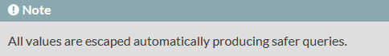

# CodeIgniter - 06 - Sécurité

## Injection SQL

Les méthodes `query()`, `insert()`, `update()` etc. de la librairie [database](https://www.codeigniter.com/userguide3/database/query_builder.html#updating-data) protègent automatiquement les valeurs passées aux requêtes contre l'injection SQL. 

Si l'on regarde, par exemple, la documentation de la méthode [`insert()`](https://codeigniter.com/user_guide/database/query_builder.html#inserting-data), on peut lire ceci :

> Attention, [cette syntaxe](https://www.codeigniter.com/userguide3/database/queries.html#query-bindings) n'a rien à voir avec une protection contre l'injection SQL, bien que cela ressemble aux requêtes préparées PDO. Il s'agit juste d'une facilité d'écriture des requêtes.

## XSS 

Le filtrage XSS n'est pas implémenté par défaut dans CodeIgniter. La documentation reste confuse à ce sujet (variables de configuration et méthodes obsolètes).   

Si on saisit du Javascript, par exemple `` dans un champ de formulaire ou en paramètre d'url, ce champ est transmis tel quel.   
	    
Il est important de comprendre que le XSS est un problème à l'affichage (sortie = output) plus que lors de la saisie (entrée = input). En entrée, si les données doivent être enregistrées en base, les méthodes de la librairie `database` traiteront le problème grâce à l'échappement automatique.

La bonne méthode est la suivante :

* pour afficher une valeur saisie dans un formulaire, passer un second argument `TRUE` aux méthodes `$this->input->post()` :

        $lechamp = $this->input->post("lechamp", TRUE);

Si dans une vue on souhaite afficher la variable `$lechamp`, CodeIgniter affichera alors :

	[REMOVED]alert("Salut ça farte ?");[REMOVED]

Les balises `<script>` étant remplacées par `[REMOVED]`, le navigateur n'interprète plus les instructions Javascript. 
 
> Chrome présente des mécanismes de défense contre le XSS, l'exemple ci-dessus ne fonctionne donc pas.

<!--
https://stackoverflow.com/questions/33351669/xss-filtering-on-codeigniter-form -->

## CSRF

Pour régler le problème de CSRF, CodeIgniter propose de mettre la variable `$config['csrf_protection']` à la valeur `TRUE` dans le fichier _application/config/config.php_. 

> **ATTENTION** : Mettre `$config['csrf_protection']` à `TRUE` bloque les requêtes Ajax.  

<!-- CSRF https://riptutorial.com/codeigniter/topic/9857/securing-your-web-application
-->

## Le hachage des mots de passe

Pour le hachage des mots de passe, rien de particulier dans CodeIgniter, il suffit d'utiliser le couple de fonctions natives PHP `password_hash()` et `password_verify()` en entrée/sortie d'une valeur en base.

## Documentation

* [Security](https://www.codeigniter.com/userguide3/general/security.html).
* [Security Class](https://www.codeigniter.com/userguide3/libraries/security.html?highlight=security)