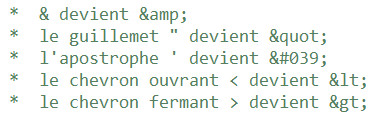
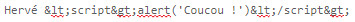

# La faille XSS

Le type d'attaque Cross-Site-Scripting - XSS en abrégé - consiste à exploiter l'interprétation HTML/Javascript par le navigateur lors de l'affichage de données. Si vous affichez dans la page une donnée non protégée, alors le navigateur pourra interpréter les variables affichées comme du HTML ou du Javascript.

## Pré-requis 

Créer une base de données qui doit contenir [cette table](users.sql).

## Problème

Injection de code Javascript (ou autre) dans les champs de formulaires ou via les paramètres d'url. Ces attaques peuvent entraîner des injections de code malicieux ou des vols de cookies (notamment ceux de sessions). 

## Exemples

### Exemple 1 : formulaire

Code HTML du formulaire :

    <form action="post.php" method="post">
		<input type="text" name="login" value="">
       	<button type="submit">Envoyer</button>
	</form>

Code PHP du traitement (il vous faut une table `users` avec des colonnes _id_, _login_, _password_, _role_ et bie sûr une connexion à une base) :

	$sql = "INSERT INTO users (login, password, role) VALUES ('".$_POST["login"]."', 'azerty', 'admin')";		

### Exemple 2 : url

Tapez cette url dans un navigateur :

	<a href="post.php?login=Dave <script>alert('Coucou !')">vers la page post<a> 

Pour le traitement, remplacer `$_POST` par `$_GET` dans le fichier `post.php` de l'exemple 1.

## Parades

Utilisez en même temps :

* L'échappement des caractères à risques avec la fonction PHP `htmlspecialchars()`, qui transforme les caractères spéciaux en entités HTML :

 
Appliquons cette fonction à notre formulaire :  

	$sLogin = htmlspecialchars($_POST["login"]);

`$sLogin` vaudra désormais :

* Bien filtrer les données (format, type, longueur) saisies par les utilisateurs dans les formulaires ou transmises par les urls
* Utiliser le connecteur PDO et les requêtes préparées 

> Google Chrome bloque automatiquement les tentatives XSS, mais pas Internet Explorer/Edge ni Firefox.  

## Framework et CMS

Les frameworks et CMS échappent automatiquement les saisies utilisateurs. 

## Exercices 

1. Reproduisez les exemples.

<!--
2. Cherchez comment CodeIgniter gère le XSS :

	* https://www.codeigniter.com/userguide3/general/security.html
	* https://www.codeigniter.com/userguide3/libraries/security.html?highlight=security
	* https://www.codeigniter.com/userguide3/database/queries.html#escaping-queries	  
-->

## Ressources

* [MDN](https://developer.mozilla.org/fr/docs/Glossaire/Cross-site_scripting)
* [CERT-FR](https://www.cert.ssi.gouv.fr/information/CERTA-2002-INF-001)
* [Exemples](https://beta.hackndo.com/la-faille-xss)
