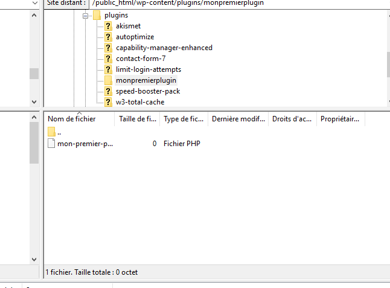
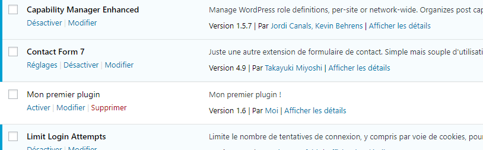

<!-- [HB, 27/10/2020] -->

# Création d'un plugin Wordpress

## Introduction

Dans ce tutoriel de plugin WordPress, vous apprendrez comment créer un plugin WordPress complet avec sa propre page d’administration. La raison la plus importante pour créer un plugin est qu’il vous permet de séparer votre propre code du code principal WordPress. Si quelque chose ne va pas avec votre plugin, le reste du site continuera généralement à fonctionner.

La modification du code WP principal peut être catastrophique. Avec les fonctionnalités de plugins plus avancées fournies par WordPress, vous êtes même en mesure de créer des plugins qui modifient la façon dont les fonctions principales fonctionnent sans modifier leur code.

## Que sont les plugins WordPress ?

Un plugin WordPress est un ensemble de code autonome qui améliore et étend la fonctionnalité de WordPress. En utilisant n’importe quelle combinaison de PHP, HTML, CSS, JavaScript/jQuery ou tout autre langage de programmation Web, un plugin peut ajouter de nouvelles fonctionnalités à n’importe quelle partie de votre site Web, y compris le panneau d’administration. Vous pouvez modifier le comportement par défaut de WordPress ou supprimer complètement les comportements indésirables. Les plugins vous permettent de personnaliser facilement et personnaliser WordPress pour répondre à vos besoins.

Étant donné que les plugins WordPress sont autonomes, ils ne modifient pas physiquement le code principal WordPress. Ils peuvent être copiés et installés sur n’importe quelle installation de WordPress. Un mode alternatif (et fortement découragé) de modification apportée à WordPress consiste à écrire de nouvelles fonctions dans le fichier WordPress functions.php, qui est stocké dans le dossier /wp-includes/  ou le fichier functions.php qui fait partie d’un thème. Cela pose un certain nombre de problèmes potentiels.

WordPress et ses thèmes reçoivent des mises à jour régulières. Et à moins d’utiliser le thème enfant WordPress, lorsque _functions.php_ est écrasé par une mise à jour, votre nouveau code sera supprimé et vous devrez l'écrire à nouveau. Si vous écrivez beaucoup de fonctions et l'une d'elles a une erreur que vous ne parvenez pas à déboguer, vous devrez peut-être remplacer l’intégralité du fichier par l’original, en supprimant toutes les modifications que vous avez effectuées. Si vos fonctions sont supprimées du fichier, votre site Web peut être couvert par des erreurs PHP où il essaie d’appeler les fonctions manquantes.

Les plugins ne sont jamais automatiquement écrasés ou supprimés lors de l’installation des mises à jour WordPress. Si votre plugin a des erreurs de codage, vous pouvez généralement le désactiver dans le Panneau d’administration alors que vous le réparez. Si votre plugin a une grave erreur, WordPress va parfois le désactiver automatiquement pour vous, ce qui permet à votre site de continuer à fonctionner.

## Que sont les hooks ?

1. Les plugins WordPress interagissent avec le code de base en utilisant des hooks (crochets). Il existe deux types de crochets différents.

2. Crochets d'action (Pour ajouter/supprimer des fonctions)
Filtres crochets (Pour modifier les données générées par les fonctions)

### Actions et crochets d’action

Lorsque vous visitez une page d’un site WordPress, une série de fonctions PHP (appelées actions) sont appelées à différents points, et elles sont associées aux raccourcis d'action. En utilisant les crochets d'action fournis par WordPress, vous pouvez ajouter vos propres fonctions à la liste des actions qui se déroulent lorsqu'un appel d’action est appelé, et que vous pouvez également supprimer des fonctions préexistantes à partir d'un crochet d'action. Les crochets d'action dictent lorsque les actions sont appelées. Avant la fermeture de la balise `</head>` de n'importe quelle page, le crochet d'action `wp_head()` est appelé et les actions attachées à `wp_head()` sont exécutées.

Les crochets d'action sont contextuels – certains sont appelés sur chaque page de votre site web, d'autres ne sont appelés que lorsque vous visualisez le Panneau de d'administration, etc. Une liste complète des gestes d’actions et le contexte dans lequel elles sont appelées peut être trouvé sur la page de [référence des API/Action](https://codex.wordpress.org/Plugin_API/Action_Reference) pour les plugins WordPress.

## Ajout de fonctions à un crochet d'action à l'aide de `add_action()`

Pour ajouter une fonction à un crochet d'action, votre plugin doit appeler la fonction WordPress nommée `add_action()`, avec au moins deux paramètres.

	// Hook to the 'init' action, which is called after WordPress is finished loading the core code
	add_action( 'init', 'add_Cookie' );
 
	// Set a cookie with the current time of day
	function add_Cookie() {
  		setcookie("last_visit_time", date("r"), time()+60*60*24*30, "/");
	}

## Exemple de code de plugin pour afficher le texte après le pied de page de chaque page

Ce plugin gère le crochet d'action `wp_footer()`, qui est appelé juste avant la balise `</body>` de fermeture de chaque page, et ajoute une nouvelle fonction nommée `mfp_Add_Text()`. Comme cela fait partie d'un plugin et non d'un thème, il continuera à fonctionner si vous activez un thème entièrement différent. Vous pouvez enregistrer cet exemple en tant que fichier PHP, le télécharger dans le dossier `wp/plugins/` et l'activer dans le Panneau d'administration pour voir la modification.

	<?php
	/*
	Plugin Name: Add Text To Footer
	*/
	 
	// Hook the 'wp_footer' action hook, add the function named 'mfp_Add_Text' to it
	add_action("wp_footer", "mfp_Add_Text");
	 
	// Define 'mfp_Add_Text'
	function mfp_Add_Text()
	{
	  echo "
After the footer is loaded, my text is added!
";
	}

Résultat final :

> REMARQUE : vous pouvez appeler `add_action()` avant de définir votre propre fonction car PHP évalue tout le script avant de l'exécuter. L'écriture des appels `add_action()` en haut du fichier dans l'ordre où ils sont exécutés, puis la définition de vos fonctions dans le même ordre ci-dessous rend le fichier plus facile à lire.

## Suppression de fonctions à partir d'un crochet d'action à l'aide de `remove_action()`

Pour supprimer une action d'un crochet d'action, vous devez écrire une nouvelle fonction qui appelle `remove_action()`, puis appeler la fonction que vous avez écrite à l'aide de `add_action()`. L'exemple ci-dessous rendra cela plus clair.

Vous devez donner à `remove_action()` au moins deux informations en tant que paramètres.

	// Hook the 'init' action, which is called after WordPress is finished loading the core code, add the function 'remove_My_Meta_Tags'
	add_action( 'init', 'remove_My_Meta_Tags' );
	
	// Remove the 'add_My_Meta_Tags' function from the wp_head action hook
	function remove_My_Meta_Tags()
	{
	  remove_action( 'wp_head', 'add_My_Meta_Tags');
	}

* Le premier paramètre requis est le nom du crochet d'action auquel la fonction est accrochée
* Le deuxième paramètre requis est le nom de la fonction que vous souhaitez supprimer
* Le troisième paramètre (optionnel) est la priorité de la fonction d'origine. Ce paramètre doit être identique à la priorité définie à l'origine lors de l'ajout de l'action au crochet d'action. Si vous n'avez pas défini de priorité dans votre fonction personnalisée, n'incluez pas le paramètre.

**Exemple**

Imaginez que vous ne voulez pas que le texte ajouté au pied de page dans l’exemple précédent apparaisse un lundi. L'une des façons de le faire est d’utiliser la fonction de la date de PHP pour obtenir le jour en cours, suivie d’une instruction conditionnelle si ... puis ... pour vérifier si le jour en cours est lundi, puis appeler `remove_action()` s’il s’agit d’un lundi. Vous appelez la fonction en utilisant `add_action()`, en accrochant tout crochet d'action qui se produit avant l'action que vous souhaitez affecter. Si vous essayez d'accrocher un crochet d'action qui se produit après `wp_footer` dans cet exemple, l'action ne sera pas supprimée du crochet car elle a déjà été exécutée.

	<?php 
	// Hook the 'wp_footer' action, run the function named 'mfp_Add_Text()'
	add_action("wp_footer", "mfp_Add_Text");
	 
	// Hook the 'wp_head' action, run the function named 'mfp_Remove_Text()'
	add_action("wp_head", "mfp_Remove_Text");
	 
	// Define the function named 'mfp_Add_Text('), which just echoes simple text
	function mfp_Add_Text()
	{
	  echo "
After the footer is loaded, my text is added!
";
	}
	 
	// Define the function named 'mfp_Remove_Text()' to remove our previous function from the 'wp_footer' action
	function mfp_Remove_Text()
	{
	  if (date("l") === "Monday") {
	    // Target the 'wp_footer' action, remove the 'mfp_Add_Text' function from it
	    remove_action("wp_footer", "mfp_Add_Text");
	  }
	}

## Filtres et crochets filtrants

Une fonction de filtre vous permet de modifier les données résultantes qui sont renvoyées par des fonctions existantes et doivent être accrochées à l’un des crochets de filtre. Les crochets de filtre disponibles sont différents des crochets d'action. Ils se comportent de manière similaire aux crochets d'action en ce sens qu'ils sont appelés à différents points du script et sont contextuels. Une liste complète des crochets de filtre et le contexte dans lequel ils sont appelés se trouvent sur la page [de référence des API/filtres](https://codex.wordpress.org/Plugin_API/Filter_Reference) pour les plugins WordPress.

## Ajout de filtres à l'aide de `add_filter()`

Pour ajouter une fonction de filtre à n’importe quel crochet de filtre, votre plugin doit appeler la fonction WordPress nommée `add_filter()`, avec au moins deux paramètres.

	// Hook the 'the_content' filter hook (content of any post), run the function named 'mfp_Fix_Text_Spacing'
	add_filter("the_content", "mfp_Fix_Text_Spacing");
	
	// Automatically correct double spaces from any post
	function mfp_Fix_Text_Spacing($the_Post)
	{
	 $the_New_Post = str_replace("  ", " ", $the_Post);
	 
	 return $the_New_Post;
	}

* Le premier paramètre requis est le nom du crochet de filtre que vous souhaitez raccorder
* Le deuxième paramètre requis est le nom de la fonction de filtre que vous souhaitez exécuter
* Le troisième paramètre (optionnel) est la priorité de la fonction que vous souhaitez exécuter. Vous pouvez attacher n’importe quel nombre de fonctions de filtre différentes à un crochet de filtre. La priorité par défaut est 10, mettant votre fonction personnalisée après toutes les fonctions intégrées. Une fonction avec une priorité de 11 s’exécute ensuite, et ainsi de suite.
* Le quatrième paramètre (facultatif) est le nombre d'arguments, c'est-à-dire le nombre de paramètres que votre fonction de filtre personnalisé peut prendre. La valeur par défaut est 1.

## Exemple de plugin pour modifier l’extrait d’une publication

WordPress a une fonction qui récupère lextrait d'une publication nommée `get_the_excerpt()`, qui est également un crochet de filtre. La fonction pour afficher réellement l'extrait appelle `get_the_excerpt()` pour le récupérer, c'est là que le filtre est appliqué et l'extrait est modifié avant d'être affiché. Ce plugin définit une fonction de filtre qui prend l'extrait comme son seul paramètre d'entrée, ajoute du texte devant lui et renvoie la nouvelle valeur chaque fois que `get_the_excerpt()` est appelé. Comme la valeur de retour de la fonction `get_the_excerpt()` est le texte d'extrait réel, elle est automatiquement entrée en tant que paramètre de fonctions `$old_Excerpt` lorsqu'il est appelé en utilisant `add_filter()`. La fonction que vous définissez doit renvoyer la nouvelle valeur.

	<?php
	/*
	Plugin Name: Add Excerpt 
	*/
	
	// Hook the get_the_excerpt filter hook, run the function named mfp_Add_Text_To_Excerpt
	add_filter("get_the_excerpt", "mfp_Add_Text_To_Excerpt");
	
	// Take the excerpt, add some text before it, and return the new excerpt
	function mfp_Add_Text_To_Excerpt($old_Excerpt)
	{
	  $new_Excerpt = "<b>Excerpt: </b>" . $old_Excerpt;
	  return $new_Excerpt;
	}

Résultat final : suppression de filtres à l'aide de `remove_filter()`

La suppression d'un filtre est beaucoup plus simple que de supprimer une action car vous pouvez appeler la fonction `remove_filter()` sans définir une nouvelle fonction. Pour cet exemple, nous ajouterons une fois de plus une situation conditionnelle très simple et supprimez le texte si le jour actuel est un jeudi.

	// Hook the get_the_excerpt filter hook, run the function named mfp_Add_Text_To_Excerpt
	add_filter("get_the_excerpt", "mfp_Add_Text_To_Excerpt");
	
	// If today is a Thursday, remove the filter from the_excerpt()
	if (date("l") === "Thursday") {
	  remove_filter("get_the_excerpt", "mfp_Add_Text_To_Excerpt");
	}
	
	// Take the excerpt, add some text before it, and return the new excerpt
	function mfp_Add_Text_To_Excerpt($old_Excerpt)
	{
	  $new_Excerpt = "<b>Excerpt: </b>" . $old_Excerpt;
	  return $new_Excerpt;
	}

Maintenant que vous avez une compréhension de base des crochets et des filtres, créez un simple plugin WordPress qui ajoute un nouveau lien et une page au panneau de contrôle Admin.

## Étape 1 – Enregistrement de votre plugin

La première étape pour créer votre plugin WordPress est de créer un dossier pour stocker tous vos fichiers. Les plugins sont enregistrés dans le dossier suivant: _/wp-content/plugins/_. Le dossier que vous créez nécessite un nom unique et descriptif pour s'assurer qu'il ne contredit aucun autre plugin. Connectez-vous à votre compte d'hébergement avec un client FTP . Dans le répertoire principal de WordPress, accédez au contenu wp, puis aux plugins. Dans le dossier des plugins, créez un nouveau dossier nommé _my-first-plugin_.

+++ TODO : format de l'image pas bon, faire une copie d'écran en png +++

Pour rendre les choses beaucoup plus faciles pour vous-même dans le futur, il est préférable de séparer les différents fichiers qui composent votre plugin WordPress et de leur donner leurs propres sous-dossiers plutôt que d’avoir tous les fichiers de votre plugin dans le dossier principal. Lorsqu’un plugin se développe et devient complexe, il est beaucoup plus facile de trouver un fichier spécifique lorsque tout a sa propre place. Si votre plugin utilise un CSS (en anglais) personnalisé, vous créez un dossier CSS et enregistrez tous les fichiers CSS. Si votre plugin utilise JavaScript personnalisé, vous créez un dossier JavaScript.

## Étape 2 – Création du premier fichier

Le premier fichier de votre plugin est important. Il contient toutes les informations nécessaires à WordPress pour afficher votre plugin dans la liste des plugins, ce qui vous permet d'activer le plugin.

Dans votre dossier _my-first-plugin/_, créez un nouveau fichier PHP nommé my-first-plugin.php. C’est une bonne pratique de donner à ce premier fichier un nom similaire à celui que vous avez donné à votre dossier, mais il peut avoir n'importe quel nom que vous aimez. Ajoutez la balise PHP d'ouverture <?php à la première ligne. Vous n’avez pas besoin d'ajouter une balise de fermeture à la fin du fichier (pour comprendre pourquoi, lire la note sur cette page du manuel PHP). Ce fichier contiendra principalement les « commentaires d'en-tête » avec diverses informations qui seront lues/affichées par WordPress. Les commentaires de l’en-tête vont dans un commentaire en ligne multi-lignes, un par ligne et chaque ligne commence par un texte spécifique pour définir à quoi se réfère la ligne. Ceux-ci doivent uniquement passer dans ce premier fichier et ne doivent pas être dans un autre fichier.

Le premier commentaire que vous devez ajouter à _my-first-plugin.php_ est le nom de votre plugin. Commencez par écrire l'ouvreur de commentaire multi-lignes PHP `/*` sur la deuxième ligne du fichier, juste en dessous de l'étiquette PHP d'ouverture. Sur la troisième ligne, écrivez le `Plugin Name: My First Plugin`. Sur la quatrième ligne, fermez la section de commentaire avec `*/`. Votre fichier ressemble maintenant à ceci :

	<?php
	/*
	Plugin Name: Mon premier plugin
	*/

Enregistrez le fichier et téléchargez-le dans le dossier _my-first-plugin/_. Accédez à la page _Plugins_ du panneau d'administration de WordPress. Vous verrez maintenant un plugin dans la liste nommée _Mon premier plugin_ avec des liens vers _Activer_, _Editer_  et _Supprimer_ le plugin. Il existe quelques informations différentes que vous pouvez ajouter à ce point, comme une description du plugin, votre propre nom, un lien vers votre site web, la version actuelle de votre plugin, etc. Pour l'instant, nous n'ajouterons qu'une description et son nom. 

Éditez _my-first-plugin.php_ afin qu'il ressemble à l'exemple ci-dessous, téléchargez-le et écrasez l'ancien fichier lorsque demandé :

	<?php
	/*
	Plugin Name: Mon premier plugin
	Description: Mon premier plugin !
	Author: Moi
	*/

Une fois qu'il est téléchargé, actualisez la page _Plugins_ de la zone d'administration de WordPress et vous devriez maintenant voir votre plugin avec sa nouvelle description et _Par votre nom_.

+++ TODO : afficher l'image +++

## Étape 3 – Écriture des fonctions de votre plugin

Comme mentionné précédemment, la meilleure pratique lors du développement d’un plugin consiste à bien séparer votre code en fichiers et dossiers appropriés. Étant donné que le premier travail du premier fichier consiste à contenir les en-têtes de commentaires, il est logique de placer le reste du code du plugin dans des fichiers distincts dans leur propre sous-dossier, en utilisant les fonctions « include » de PHP pour y accéder. Tous les fichiers stockés dans les sous-dossiers sont appelés directement par notre code et uniquement par notre code, de sorte que les noms de sous-dossiers n’ont pas besoin de préfixe. Cependant, il est fortement recommandé de donner à tous vos fichiers, fonctions et variables un préfixe unique dans leur nom afin d’éviter tout conflit avec d’autres plugins. Dans ce cas, nous utilisons le mfp comme préfixe, ce qui signifie « My First Plugin ».

Dans le dossier principal de votre plugin, créez un nouveau dossier nommé inclus. Tout fichier qui est « inclus » par un autre fichier ira dans ce dossier. Créez un nouveau fichier PHP dans le dossier inclus et enregistrez-le sous mfp-functions.php. Donnez-lui le tag d'ouverture `<?php`  sur la première ligne. Ce nouveau fichier est l'endroit où toutes les fonctions de votre plugin seront stockées.

Revenez maintenant à _my-first-plugin.php_ dans le dossier principal de votre plugin. Nous devons inclure le fichier _mfp-functions.php_ afin d'utiliser les nouvelles fonctions. Puisque c'est le fichier principal du plugin, y compris _mfp-functions.php_, les fonctions sont disponibles pour tout autre fichier de votre plugin. Utilisez require_once pour vous assurer que le plugin ne fonctionne que si le fichier de fonctions est disponible. La façon la plus simple d'inclure les fichiers de votre dossier de plugin est en utilisant la fonction WordPress `plugin_dir_path(__ FILE__)`, qui donne le chemin d'accès complet au répertoire où notre plugin est stocké, puis utilisez un . (point) pour ajouter le nom du sous-dossier que nous avons créé plus tôt (inclus), suivi du nom du fichier que nous avons créé (_mfp-functions.php_).

Modifiez _my-first-plugin.php_ comme indiqué ci-dessous, puis enregistrez-le et téléchargez-le une fois de plus, écrasant la version précédente lorsque on vous pose la question.

	<?php
	/*
	Plugin Name: My First Plugin
	Description: This is my first plugin! It makes a new admin menu link!
	Author: Your Name
	*/
	
	// Include mfp-functions.php, use require_once to stop the script if mfp-functions.php is not found
	require_once plugin_dir_path(__FILE__) . 'includes/mfp-functions.php';
  

Retour à _mfp-functions.php_ dans le sous–dossier inclus.

C'est une excellente idée de regrouper des fonctions similaires et d'écrire un commentaire multi-lignes au-dessus de chaque groupe décrivant le groupe, suivi d’un court commentaire d’une seule ligne au-dessus de chaque fonction, le décrivant brièvement. De cette façon, vous n'avez pas à lire le code entier pour trouver une fonction et comprendre ce qu'il fait. Nous nommerons la fonction `mfp_Add_My_Admin_Link()`. La fonction ajoutera un nouveau lien de niveau supérieur au menu de navigation du panneau de contrôle administrateur.

Pour récapituler – l'écriture d'une nouvelle fonction implique les étapes suivantes :

* Écrivez un commentaire décrivant la fonction
* Nommez la fonction
* Écrivez la fonction

Dans _mfp-functions.php_, écrivez ce qui suit :

Dans notre fonction, nous devons utiliser la fonction intégrée de WordPress add_menu_page()pour donner à notre menu un nom, un titre et décider qui est autorisé à le voir. Ensuite, nous lui disons ce qu’il faut afficher lorsque vous accédez à la page. Vous pouvez également donner au menu une icône et définir sa position dans le menu de navigation du panneau d’administration – ces deux options sont facultatives, donc nous les laisserons hors de ce tutoriel. L'icône courante par défaut sera affichée sur le lien vers notre page. Notre lien apparaîtra au bas du menu de navigation du panneau d'administration. Toutes ces informations sont entrées en tant que paramètres de `add_menu_page()`.

Les quatre paramètres requis de `add_menu_page()` apparaissent sur leur propre ligne pour améliorer la lisibilité, dans cet ordre :

1. Le titre de la page que vous voyez après avoir cliqué sur le lien (affiché dans l'onglet de votre navigateur)
2. Le texte à afficher en tant que lien de menu (affiché dans la liste de navigation du panneau d’administration), ce devrait être le nom de votre plugin
3. La capacité pour l'utilisateur d'afficher le menu, dans cet exemple, seuls les utilisateurs disposant de la fonctionnalité `manage_options` peuvent accéder à la page (ne vous inquiétez pas pour le moment)
4. Le fichier à utiliser lors de l'affichage de la page réelle (nous allons créer cette suite), qui sera stocké dans le sous-dossier inclus et nommé _mfp-first-acp-page.php_. L'URL saisie ici est appelée « slug ».

Avant de continuer, il est important de noter qu'il existe une autre façon d'utiliser cette fonction. Le quatrième paramètre peut simplement être une chaîne de texte qui s'affiche dans l'url après _wp-admin/admin.php?Page=_. Si vous saissiez `my-plugin-page`, l'URL devient _wp-admin/admin.php?page=my-plugin-page_. Le cinquième paramètre doit alors être le nom d'une fonction qui produit quelque chose. Vous pouvez écrire une fonction qui se traduit par « Bienvenue sur la page 1 » par exemple. Il est beaucoup plus facile de créer un fichier PHP pour contenir votre page.

Modifiez _mfp-functions.php_, supprimez `//` Mon code va ici, remplacez-le par `add_menu_page()` et donnez-lui les paramètres comme indiqué ci-dessous :

	<?php
	/*
	 * Add my new menu to the Admin Control Panel
	 */
	 
	// Add a new top level menu link to the ACP
	function mfp_Add_My_Admin_Link()
	{
	      add_menu_page(
	        'My First Page', // Title of the page
	        'My First Plugin', // Text to show on the menu link
	        'manage_options', // Capability requirement to see the link
	        // 'includes/mfp-first-acp-page.php' // cette ligne ne fonctionne pas, la suivante corrige le bug
            plugin_dir_path(__FILE__).'/mfp-first-acp-page.php' // The 'slug' - file to display when clicking the link   
	    );
	}

Pour que cette fonction soit effectivement exécutée, nous devons utiliser la fonction WordPress nommée `add_action()` avec deux paramètres, comme décrit dans la section « Ajouter des fonctions à un crochet d'action » de ce didacticiel. Vous voudrez peut-être lire cette section avant de continuer.

Le premier paramètre est le crochet d'action que vous souhaitez cibler. Dans notre cas, le crochet d'action est admin_menu – cela signifie que notre fonction est exécutée lorsque le menu _Admin_ est généré.
Le deuxième paramètre est simplement le nom de la fonction à exécuter. La fonction que nous avons écrite s'appelle _mfp_Add_My_Admin_Link_. Notez que les parenthèses ne sont PAS utilisées ici. N'oubliez pas que PHP évalue le script entier avant de l’exécuter, vous permettant d'utiliser `add_action()` avant de définir la fonction nommée dans le paramètre 2.

Notre fichier final ressemble à ceci :

	<?php
	/*
	 * Add my new menu to the Admin Control Panel
	 */
	 
	// Hook the 'admin_menu' action hook, run the function named 'mfp_Add_My_Admin_Link()'
	add_action( 'admin_menu', 'mfp_Add_My_Admin_Link' );
	 
	// Add a new top level menu link to the ACP
	function mfp_Add_My_Admin_Link()
	{
	      add_menu_page(
	        'My First Page', // Title of the page
	        'Mon plugin', // Text to show on the menu link
	        'manage_options', // Capability requirement to see the link
	        // 'includes/mfp-first-acp-page.php' // cette ligne ne fonctionne pas, la suivante corrige le bug
            plugin_dir_path(__FILE__).'/mfp-first-acp-page.php' // The 'slug' - file to display when clicking the link  
	    );
	}

Téléchargez _mfp-functions.php_ dans le dossier inclus et écrasez l'ancien.

## Étape 4 – Création de la nouvelle page d'administration

Maintenant, nous pouvons créer la page à afficher lorsque vous cliquez sur le lien de votre panneau d'administration. Revenez dans le sous-dossier inclus et créez un nouveau fichier PHP nommé _mfp-first-acp-page.php_. Les tags d'ouverture de PHP ne sont pas nécessaires dans ce fichier car nous n'utilisons que le HTML. Écrivez le code HTML ci-dessous et téléchargez le fichier.

	

	  <h1>Salut!</h1>
	  
Ceci est mon plugin

	

Lors de la création de pages d'administration, WordPress recommande d'inclure votre propre HTML avec un `
` et de lui donner la classe « wrap », comme indiqué ci-dessus. Cela garantit que tout votre contenu apparaît au bon endroit, tout comme n'importe quelle autre page d'administration. Si vous ne l'enveloppez pas comme ça, la page peut devenir très désordonnée.

Revenez à votre liste de plugins dans le panneau d'administration de WordPress et activez le plugin. Une fois la page chargée, regardez le bas du menu de navigation du panneau d'administration. Il y a le nouveau lien intitulé « Mon premier plugin ». Cliquez dessus, et vous avez votre propre page de panneau d'administration !

## Conclusion

Félicitations, vous venez de créer votre premier plugin WordPress :

* vous avez ajouté un nouveau lien au menu admin
* vous avez affiché une nouvelle page dans le panneau d'administration. Il ne fait pas encore grand-chose, mais c'est un bon début. 

## Sources

<!-- 
[Créer un plugin WordPress rapidement et facilement](https://www.hostinger.fr/tutoriels/creer-un-plugin-wordpress/#Que-sont-les-hooks)
-->

    